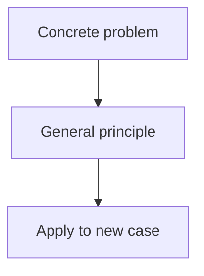

# Onboard a book or research paper as a new subject

Turn a large source document — a textbook or a research paper/survey (PDF) — into
a new subject in this platform — **token-aware**, so the whole document is never
loaded into context. You inspect its structure, slice it into small text files on
disk, and author one chunk at a time.

The document path is `$ARGUMENTS` (ask for it if missing).

## The core principle: one chunk in context at a time

A 250-page book is ~80k+ tokens of text; even a short paper is several thousand.
Never read the PDF body wholesale. Instead:

1. A script reads the PDF on disk and prints only its **structure** (zero body in
   context) — an embedded outline for books, or detected section headings for
   papers.
2. You plan a **chunk → module/lesson** mapping from that structure.
3. The script **slices** only the pages you chose into small `.txt` files
   (~7–12k tokens each).
4. You author each chunk by reading **just that one slice**, then move on. Context
   never accumulates the whole document.

## Before you start

The full `Subject`/`Module`/`Lesson`/`Step` shape — including a multi-module
skeleton — is reproduced below so you never need to open `src/types.ts` or grep an
existing subject file (e.g. `flash-attention-2.ts`, `deep-transformers-atlas.ts`)
just to recall the structure. Copy the skeleton, don't re-derive it:

```ts
import type { Subject } from '../types'
import topicMd from './md/<prefix>-topic.md?raw'

export const mySubject: Subject = {
  id: 'my-subject',             // lowercase-kebab, e.g. 'inference-engineering'
  title: 'My Subject',
  tagline: 'One sentence.',
  icon: '📦',                    // emoji
  accent: '#22d3ee',             // hex, distinct from existing subjects
  modules: [                     // ONE ARRAY ENTRY PER MODULE — copy this whole
                                  // block again for module 2, 3, ... (same shape,
                                  // new id/title/description/lessons each time)
    {
      id: '<prefix>-m1',          // <prefix>-m1, <prefix>-m2, ... sequential
      title: 'Module 1 title',
      description: 'One sentence on what this module covers and why.',
      lessons: [                  // 1+ lessons per module
        {
          id: '<prefix>-topic',   // globally unique across EVERY subject in the repo
          title: 'Lesson title',
          minutes: 10,
          xp: 60,
          steps: [
            { kind: 'read', title: 'Step title', markdown: topicMd },
            {
              kind: 'quiz',
              title: 'Step title',
              questions: [
                // >=2 options, answer = valid index, explanation > 20 chars
                { prompt: '...', options: ['...', '...'], answer: 0, explanation: '...(>20 chars)...' },
              ],
            },
            {
              kind: 'code',
              title: 'Step title',
              challenge: {
                prompt: '...markdown prompt...',
                starterCode: 'function f() { /* TODO — must FAIL the tests as-is */ }',
                solution: 'function f() { /* must PASS every test below */ }',
                tests: `test('name', () => { assertEqual(f(), expected); });`, // >=3 test(...) calls
              },
            },
            {
              kind: 'scenario',
              title: 'Step title',
              scenario: {
                intro: '...',
                stages: [
                  {
                    situation: '...',
                    question: '...',
                    options: [
                      // >=2 options, exactly one (or more) quality: 'best'
                      { label: '...', quality: 'best', feedback: '...' },
                      { label: '...', quality: 'bad', feedback: '...' },
                    ],
                  },
                ],
                debrief: '...',
              },
            },
          ],
        },
      ],
    },
    // Module 2 goes here: { id: '<prefix>-m2', title: ..., description: ..., lessons: [...] }
    // A multi-module subject is just this `modules` array with more entries — nothing
    // else about the file changes (one set of top-level imports covers every module).
  ],
}
```

Step kinds are `read | quiz | code | scenario` only — `visualizer` is a **closed
union** (`'two-pointers' | 'sliding-window' | 'binary-search'`) that a new subject
cannot extend without changing app code. Never emit a `visualizer` step.

This skeleton covers the shape you need for every run. Only open
[references/subject-schema.md](references/subject-schema.md) if something is
genuinely ambiguous (it also documents naming conventions and the full validation
rules, repeated in Step 4/6 below). Use `src/data/gpu.ts` as a fully-written example
and `src/data/md/gpu-why.md` for markdown voice if you want to see real prose.

## Book or paper? Pick the mode

- **Book** — a textbook with chapters, typically 100+ pages. Step 1's `outline`
  command returns an embedded chapter list. Mapping is **chapter → module**, one
  module per chapter — follow the **Workflow** below as written.
- **Research paper** — a conference/journal paper, survey, or technical report,
  typically 5–60 pages with numbered sections (Introduction, Method, Results, ...).
  `outline` is usually empty. Mapping is usually **whole paper → one module**, with
  lessons following the paper's own arc (motivation → approach → results →
  critique). Read [references/paper-workflow.md](references/paper-workflow.md) —
  it adapts Steps 1–2 and the authoring rules in Step 4; Steps 3, 5, 6 below are
  unchanged.

If unsure which mode applies, run Step 1 first: an empty outline plus a small page
count is a strong signal it's a paper.

## Workflow

### Step 0 — Create an isolated git worktree

Before touching any source files, create a dedicated branch and worktree so all
authoring is isolated from `main`. Derive the branch name from the document path:

```bash
DOC="$ARGUMENTS"
if echo "$DOC" | grep -qE "arxiv\.org/pdf/[0-9]"; then
  ARXIV_ID=$(echo "$DOC" | grep -oE "[0-9]{4}\.[0-9]+" | head -1)
  WT_NAME="onboard-paper-${ARXIV_ID}"
else
  STEM=$(basename "$DOC" .pdf | tr '[:upper:] _' '[:lower:]-' | tr -cd 'a-z0-9-' | cut -c1-40)
  WT_NAME="onboard-book-${STEM}"
fi
echo "Worktree branch: $WT_NAME"
```

Then call `EnterWorktree` with `name: $WT_NAME`. The session's working directory
switches to `.claude/worktrees/$WT_NAME` — all subsequent file reads, writes, and
edits happen on the new branch, not on `main`.

**Remember `$WT_NAME`** — you will need it again in Step 7 to merge back.

### Step 1 — Inspect the structure (no PDF body in context)

**First, get the PDF onto disk.** `slice_pdf.py` reads a **local file** — handing it
a URL fails with `PDF not found`. If `$ARGUMENTS` is a remote link (e.g. an arXiv
URL), download it **once** and use the local path for every command from here on
(outline, sections, slice). Do **not** pass the URL to the script.

```bash
DOC="$ARGUMENTS"
if echo "$DOC" | grep -qiE '^https?://'; then
  PDF="/tmp/onboard-src-$(echo "$DOC" | grep -oE '[0-9]{4}\.[0-9]+' | head -1).pdf"
  [ "$PDF" = "/tmp/onboard-src-.pdf" ] && PDF="/tmp/onboard-src.pdf"
  curl -sL "$DOC" -o "$PDF"
  file "$PDF" | grep -q 'PDF' && echo "Downloaded: $PDF" \
    || echo "WARNING: not a PDF — arXiv abstract pages need the /pdf/ URL, not /abs/"
else
  PDF="$DOC"   # already a local path
fi
echo "Local PDF: $PDF"
```

`$PDF` now holds the local path. Use it (not `$ARGUMENTS`) for the script below:

```bash
python .claude/skills/onboard-book/scripts/slice_pdf.py outline "$PDF"
```

This prints the page count, total token estimate, and the nested outline with
1-indexed page numbers. If `pypdf` is missing: `pip install pypdf`.

- **Book, outline present** — plan chapter boundaries directly from it.
- **Book, no outline** — fall back to slicing by fixed page ranges (e.g. every ~25
  pages) and skim the first lines of each slice to find real boundaries.
- **Paper (empty or very short outline)** — run
  `python .claude/skills/onboard-book/scripts/slice_pdf.py sections "$PDF"`
  for a best-effort list of detected section headings + page numbers, then jump to
  [references/paper-workflow.md](references/paper-workflow.md).

### Step 2 — Plan subject + chapter→module mapping

(Book mode. For paper mode, use
[references/paper-workflow.md §2](references/paper-workflow.md#2-subject--module--lesson-mapping)
instead, then continue at Step 3 below.)

Decide, from the outline alone:
- `Subject.id` (lowercase-kebab), `title`, `tagline`, an `icon` emoji, a distinct
  `accent` hex, and a short `prefix` for ids/files (e.g. `ie`).
- Which chapters map to which modules. Each chapter is usually one module; combine
  tiny chapters. Note each chunk's **start:end** page range (1-indexed, inclusive).

Confirm scope with the user if the book is large: pilot one module first, or build
all. Use `AskUserQuestion` for real choices (scope, whether to include code
challenges, how to use any glossary/appendix).

### Step 3 — Slice the chosen chunks to disk

Write slices into a gitignored scratch dir (add `.book-ingest/` to `.gitignore`):

```bash
# "$PDF" is the local path resolved in Step 1 (download a URL there first).
python .claude/skills/onboard-book/scripts/slice_pdf.py slice "$PDF" ./.book-ingest \
    ch1:16:39 ch2:40:71 glossary:210:231
```

For a pilot, slice only the pilot chapters; the same command extends to the rest
later. For a paper this is often just 1–3 slices total — see
[references/paper-workflow.md §3](references/paper-workflow.md#3-slicing).

### Step 4 — Author per chunk (one slice at a time)

For each module, `Read` only its slice file, then write:
- `src/data/md/<prefix>-<topic>.md` for each `read` step (tight, concrete; cite the
  source). **Extract exact passages and trim them to the core claim — don't
  paraphrase.** See "Quote the source, don't paraphrase" below. Write the
  surrounding voice per "Voice: write like *Head First*" below — conversational,
  visual, one hook per lesson, sparing Q&A callouts for the obvious misconception.
- The module's lessons in `src/data/<subject-id>.ts`, mixing `read` + `quiz` +
  `scenario`, plus a `code` step where there's genuine numeric work (see schema
  reference).

**Generating quiz questions: delegate, don't hand-write.** Once a lesson's `read`
step `.md` file(s) exist, call the `quiz-question-writer` agent (`Agent` tool,
`subagent_type: "quiz-question-writer"`) instead of drafting `QuizQuestion`
objects yourself. Pass it a **file path** — the `src/data/md/<prefix>-<topic>.md`
file(s) backing that lesson (or the slice file in `.book-ingest/` for the relevant
section) — plus, if only part of the file applies, which lesson/section to target.
It returns a `QuizQuestion[]` of 10 candidates; select/trim the subset that fits
each `quiz` step (a step can use fewer than 10 — split across multiple `quiz`
steps in the module if more lessons need coverage), and verify every selected
question is answerable from that lesson's `read` content before pasting it in.
This still must satisfy "Teach before you test" below and the validation rules.

Honor the validation rules: code challenges need ≥3 tests, a passing `solution`,
and a **failing** `starterCode`; quizzes need ≥2 options + a >20-char
`explanation`; scenario stages need ≥2 options incl. one `quality: 'best'`; all
lesson ids globally unique.

**Teach before you test.** Every quiz/scenario must be answerable from the `read`
content in the *same or an earlier lesson*. If a question relies on a term or fact
(e.g. "prefill is compute-bound", "the KV cache turns attention linear", "what a
foundation model is"), introduce that concept in a read step first — don't let a
glossary/vocabulary quiz be the first place a learner meets it. When in doubt, grep
the `md/` reads for the concept before quizzing it; if it's not taught, either teach
it or cut the question.

Do **not** re-read prior slices — finish a chunk, drop it from your working set,
move on.

**Draw it, don't just describe it.** A `read` step's markdown renders ```mermaid
fenced blocks as live diagrams (lazy-loaded, auto-themed to dark mode). Technical
sources carry structure in figures — reproduce that intent. After writing each read
step, find the 2–4 places where prose is weakest (fan-out, ordering, branching,
numeric transforms) and add a diagram anchored to that exact claim: a **sequence
diagram** when round-trips/ordering matter (cache hit/miss, handshakes), a
**flowchart** for topology and "what-fixes-what" ladders, a **funnel** (`flowchart
LR` with the math on each edge) for estimation, a **state diagram** for lifecycles.
Pick the type from what the text is doing; one concept per diagram; ≤7 nodes; label
the edges. See [references/diagrams.md](references/diagrams.md) for the
type-selection table, placement rules, the generation quality bar, and copy-paste
shapes.

**Or extract the real figure, when fidelity matters more than a redraw.** Some
source figures — a named architecture diagram like a paper's "Figure 1", a system
diagram — are worth reproducing exactly rather than redrawing in mermaid. Run
`python .claude/skills/onboard-book/scripts/slice_pdf.py figures "$PDF"` to list
embedded raster images per page, then `extract-figure` to pull one out (with
transparency flattened and optional palette quantization to shrink it). See
[references/figures.md](references/figures.md) for the full workflow, the
placeholder-token convention for referencing an extracted image from markdown, and
why a base64 data URI inlined directly in the `.md` file is the wrong way to do
this (it makes the file too large for the Read/Edit tools to reopen).

**Paper mode**: also read
[references/paper-workflow.md §4](references/paper-workflow.md#4-authoring-differences-from-books)
for citation style (`Section 3.2` / `Figure 2` / `Table 1`), turning figures into
diagrams vs. turning result plots into tables, and when a `code` challenge is (and
isn't) warranted.

**Optional: parallel authoring for many modules.** When there are 4+ modules and
the user wants speed, dispatch one agent per module instead of authoring
sequentially. Use `subagent_type: "general-purpose"` (fresh agents, not `fork`) —
a fresh agent never inherits this conversation's context, so it never sees this
skill's later commit/merge/push steps and can't reason its way into running them.
Even so, give every agent prompt the same hard-prohibition treatment described in
this repo's `CLAUDE.md` ("Scoping fork agents for parallel sub-tasks"): no git
commands, no editing `index.ts` or any file outside its own deliverables, no
build/test runs, and an explicit stop condition ("produce these files, then stop —
whether the overall task is finished is not your call").

Each agent's deliverables are:
1. The module's `src/data/md/<prefix>-*.md` files, written to their final location.
2. A scratch snippet at `.book-ingest/module-<prefix>-mN.snippet.ts` containing
   *only* the literal `import ... from '../src/data/md/<prefix>-*.md?raw'` lines it
   needs, followed by `export const lessons = [ /* this module's full Lesson[] */ ]`.

Never have parallel agents write directly to the shared `src/data/<subject-id>.ts`
or `index.ts` — concurrent writes to the same file race. After all agents finish,
read every snippet yourself and hand-assemble the final subject file (merge all the
import blocks at the top, one `modules` array entry per snippet's `lessons`) before
registering it in Step 5. This also gives you a single point to catch
cross-module issues — duplicate ids, the mermaid gotcha below, unverified code
challenges — before they ship.

### Step 5 — Register the subject

Edit `src/data/index.ts`: add `import { <subject> } from './<subject-id>'` and
append it to the `SUBJECTS` array.

### Step 6 — Validate

**Verify every `code` challenge's `solution` by actually running it**, before
assembling/registering — don't trust an agent's self-report that "the solution
passes its own tests" (a parallel-authoring agent can be wrong about its own work).
Paste the `solution` body, the `tests` body, and a minimal `test`/`assertEqual`
shim into a scratch file and run it with `node`:

```bash
node -e "
function assertEqual(a, b, msg) { if (JSON.stringify(a) !== JSON.stringify(b)) { console.error('FAIL:', msg); process.exitCode = 1; } else console.log('PASS:', msg); }
function test(name, fn) { fn(); }
<paste solution here>
<paste tests here>
"
```

Also confirm the `starterCode` actually fails at least one test (that's the "there
must be something to do" requirement) — swap it in for the solution and rerun.

```bash
npm run build            # tsc -b && vite build — type-checks the new subject
```

Then run the curriculum test. This repo has a **known vitest fork-worker hang**: a
run can print the `RUN v4.1.8` banner and then spin a `forks.js` worker at 100% CPU
forever. Follow this recipe exactly — most of the wasted time on past runs came from
fighting the hang the wrong way:

```bash
# 1. Reap any orphaned workers FIRST (plain pkill isn't always enough).
pkill -9 -f forks.js 2>/dev/null; pkill -9 -f vitest 2>/dev/null
# 2. ONE run, foreground, explicit path + --bail=1 (~600ms, exits cleanly).
npx vitest run --testTimeout=8000 --bail=1 src/data/curriculum.test.ts
```

Hard rules — violating these is what makes the hang look unkillable:

- **Run it ONCE, in the foreground, period — no exceptions for "just a filtered
  rerun."** Do **not** launch a second invocation for any reason (a `-t` filter to
  double-check one subject, a "quick" re-run to confirm) while the first may still
  be alive — concurrent runs compete and spawn orphan workers that peg a core and
  survive `pkill`, so every later run looks dead too. If you genuinely need a
  second look, `pkill -9 -f forks.js; pkill -9 -f vitest` again first, every time,
  even if you believe the first run already exited.
- **Don't background it and don't pipe through `tail`.** Backgrounding + `tail`
  buffering hides output until an EOF that never arrives, making a fast test look
  hung. Just run it foreground and read the result.
- **`--bail=1`** stops at the first failure and lets the process exit promptly
  instead of grinding through every code challenge (where the hang tends to bite).

**If a test fails in a subject you did NOT author** (e.g. a `dsa-…` code challenge),
it is almost certainly **pre-existing**, and `--bail=1` just stopped there first.
Confirm it's not yours before debugging:

```bash
git diff origin/main -- src/data/<that-subject>.ts   # empty diff = pre-existing, not your change
```

To check only your own subject's lessons compiled into the suite, grep your prefix
in the run output rather than relying on `-t "<subject-id>"` (the test titles aren't
keyed by subject id, so `-t` can match nothing and skip everything).

Full details: `docs/solutions/test-failures/vitest-run-hang-fork-worker-System-20260612.md`.

Then `npm run dev` and confirm the new subject appears in the sidebar **and that
every diagram renders** — mermaid runs client-side, so a broken graph shows a red
error box instead of an SVG and the build won't catch it. Open each read step that
has a diagram and glance at it.

**If the browser tool is unavailable** (e.g. a chrome-devtools MCP session is held
by another concurrent agent and errors with "browser is already running"), don't
skip the check — substitute a manual grep of every new `.md` file for the known
mermaid syntax footguns, especially the dotted-edge gotcha (see
[references/diagrams.md](references/diagrams.md)):

```bash
grep -n '\-\..*\.->' src/data/md/<prefix>-*.md   # flags `-.label.->` (missing spaces/quotes)
```

Anything this matches needs fixing before merge — it will render as a parse error,
not a missing edge.

### Step 7 — Commit, merge to main, push

All authoring is done and validation is green. Now land the work:

**7a. Commit in the worktree** (still on the `$WT_NAME` branch):

```bash
# Stage all new subject files and the updated index
git add src/data/<subject-id>.ts src/data/md/<prefix>-*.md src/data/index.ts
# If any read step extracted a real figure (see references/figures.md), also:
git add src/data/img/<prefix>-*.png
git commit -m "$(cat <<'EOF'
Onboard <title>: <one-line description>

Co-Authored-By: Claude Sonnet 4.6 <noreply@anthropic.com>
EOF
)"
```

Replace `<title>` with the subject's display name and `<one-line description>` with
a concise summary (e.g. "5 lessons, cosine-schedule code challenge, 3-stage scenario").

**7b. Return to `main` and merge**:

Call `ExitWorktree` with `action: "keep"` — this switches the session back to the
main repo root without deleting the worktree or its commits.

```bash
git merge --no-ff $WT_NAME
git push origin main
```

Use `--no-ff` to preserve the branch history in the merge commit.

**7c. Clean up**:

```bash
git worktree remove .claude/worktrees/$WT_NAME
git branch -d $WT_NAME
```

## Success criteria

- [ ] **Worktree created** (`EnterWorktree`) before any source files are touched.
- [ ] PDF inspected via the script; **its body was never read into context
      wholesale**.
- [ ] Chunk→module/lesson mapping decided from the structure (chapter→module for a
      book; the paper's own arc for a paper); slices written to `.book-ingest/`.
- [ ] Each module authored from a single slice (`.ts` lessons + `md/` read files).
- [ ] Read steps carry **diagrams** where the source did — right type, anchored to
      the prose, and confirmed rendering in `npm run dev` (see
      references/diagrams.md).
- [ ] Named source figures worth reproducing exactly (e.g. an architecture
      diagram) are **extracted** via `slice_pdf.py figures`/`extract-figure`, not
      redrawn, and referenced via the placeholder-token convention — never a
      base64 data URI inlined in the `.md` file (see references/figures.md).
- [ ] Read steps are written in the *Head First* voice — conversational, a concrete
      hook before the abstraction, no unbroken walls of prose, sparing Q&A callouts
      for the obvious misconception (see "Voice: write like Head First").
- [ ] No `visualizer` steps; code/quiz/scenario meet the validation rules.
- [ ] Subject registered in `src/data/index.ts`.
- [ ] `npm run build` clean and `npx vitest run --bail=1 … curriculum.test.ts`
      green for the subject (any failure is in a subject whose `src/data/*.ts` you
      did not change — verified via `git diff origin/main`).
- [ ] **Committed** on the worktree branch, **merged to `main`**, **pushed to
      `origin/main`**, worktree and branch removed.

## Building intuition through curriculum design

Intuition is understanding *why* something works, not just *what* it is. Readers
who finish a module should be able to predict behavior, explain trade-offs, and
apply the concept in new contexts.

### Voice: write like *Head First*

*Head First Design Patterns* opens with its own "How to Use This Book," explaining
that the brain treats novel, visual, conversational, emotionally-engaging content as
*important* and skims past flat, linear text. Every subject onboarded with this
skill — book, paper, or whitepaper — should write `read` steps the same way, not
just the `patterns` subject. Concretely:

1. **Visual, not linear.** Never run three-plus paragraphs of unbroken prose. Break
   it up with a table, an analogy, or a diagram (see diagrams.md) placed right where
   the claim is made.
2. **Conversational, personalized.** Write *to* the reader ("you"), not about an
   abstract third party. Prefer direct questions ("Why does the second sentence take
   longer to compute than the first?") over declarative-only sentences.
3. **Deeper processing over re-reading.** Open each read step with the problem or a
   question the reader has to sit with for a second — don't lead with the
   definition. Make them guess before you answer.
4. **Novelty and a little emotion.** One concrete, slightly surprising analogy (the
   "F1 car vs. bus fleet" move in `gpu-why.md`) beats five generic technical
   sentences. The hook should be memorable, not decorative.
5. **Multiple learning styles per lesson.** Don't let a whole module be all `read`.
   Mix `read` (visual/verbal) with `scenario` (situational judgment) and `code`
   (hands-on) within the same lesson where the content supports it.
6. **Redundancy across formats, not within one.** State the core idea once in prose,
   once in a diagram/table, and once more in a quiz `explanation` — three different
   modes, not the same sentence repeated.
7. **Answer the question every reader is silently asking.** When a concept has an
   obvious-but-wrong intuition, address it head-on with a blockquote right after the
   claim it complicates:
   ```markdown
   > **Wait — isn't that just X?** No: X assumes ..., this assumes the opposite.
   > The difference matters because ...
   ```
   Use this once or twice per read step, for the single most common misconception —
   not a Q&A box after every paragraph.
8. **80/20 coverage.** Teach what's needed to *use* the idea now, not the exhaustive
   reference treatment. Cut tangents and historical trivia that don't feed the
   following quiz/scenario/code step.
9. **Humor, used sparingly.** A wry aside is fine if it doesn't slow down the actual
   claim. Never force a joke onto a step that doesn't need one.

*Dry opener (avoid):*
> The visitor pattern lets you add new operations to existing object structures
> without modifying their classes.

*Head-First opener (prefer):*
> Every time marketing asks for "just one more report," you reopen every class in
> the object tree and add a method. What if you could write the new behavior
> *once*, somewhere else, and have the objects hand themselves to it instead?

### Intuition-building principles

**1. Anchor concepts in concrete examples.** Don't introduce an abstraction in
isolation. Start with a specific, concrete problem the reader recognizes, then
generalize from it. Example: teach the KV cache by first asking "why does the
second sentence take longer to compute than the first?" before naming the cache
itself.

**2. Progress from concrete → abstract → application.** Each lesson should move
through:
- **Concrete:** a specific, relatable example or scenario
- **Abstract:** the general principle or technique
- **Application:** working out what changes when you vary the inputs

Use `read` steps for concrete + abstract, `scenario` steps for "here's a situation,
what would you do?", and `code` steps for measurable application.

**3. Use diagrams as thinking tools, not decoration.** A diagram should **show
why**, not just what. A sequence diagram shows *when* events happen relative to
each other (why order matters). A flowchart shows *how decisions branch* (why one
path beats another). A funnel shows *why magnitudes matter* (why only one term
dominates). Avoid diagrams that merely illustrate a term; prioritize diagrams that
make a reasoning step visible.

**4. Build failure intuition explicitly.** Readers should know what *breaks* and
why, not just what works. When introducing a technique, pair it with a boundary
case or a failure mode:
- "Batch normalization helps training *when* you have large batches (why?)"
- "This optimization is unsound *when* these conditions hold (spot the trap)"
- "This assumption breaks *if* the data has this shape (why?)"

Include these in quizzes: "What's one case where this approach fails?" is more
valuable than "Which statement is true?"

**5. Reuse vocabulary consistently.** If you name a concept once, use the same term
every time. Synonyms confuse readers; clear repetition builds memory. If a concept
has multiple legitimate names (e.g., "attention head" vs. "query-key-value head"),
pick one and mention the alias once.

**6. Validate understanding with scenarios, not just recall.** Quiz questions
should require reasoning, not memorization. Instead of "What is X called?", ask
"Given this setup, what happens next?" Scenario steps are ideal: "You're building Y.
These constraints apply. Which design choice is best and why?" — readers predict
behavior, judge trade-offs, and apply the concept.

### Quote the source, don't paraphrase

The author has already done the hard work of phrasing intuition correctly. Use
exact excerpts from the source, trimmed but not rewritten, to preserve their
intent.

**Why excerpts beat paraphrase:**
- Paraphrasing introduces your own mental model, which may differ from the
  author's
- Direct quotes carry the author's rhythm and emphasis — they often explain *why*
  better than a summary
- Readers trust primary sources; a quote feels authoritative
- Trimming keeps the essential claim while removing side context

**How to excerpt efficiently:**
1. **Find the core sentence** — the one that makes the claim. Excerpt that first.
2. **Add minimal context** — the preceding sentence or phrase that makes it
   intelligible. Example: don't quote "the cache turns attention linear" without
   first saying what "linear" means in this context.
3. **Trim aggressively** — strike modifiers, examples, and asides that don't
   support the core claim. If "the KV cache, which was introduced in 2019 by
   Transformer-XL, fundamentally changes how attention scales" can be shortened to
   "the KV cache changes how attention scales," do it.
4. **Attribute clearly** — cite chapter/section/page for a book, or
   section/figure/table for a paper. Readers should be able to verify.

**Example (from a hypothetical inference book):**

*Instead of:*
> "The key-value cache is a mechanism that stores previously computed keys and
> values so that when processing the next token, the model doesn't have to
> recompute them."

*Use:*
> "The KV cache stores previously computed keys and values, eliminating
> recomputation on the next token." — *Chapter 2, p. 34*

The second is tighter and emphasizes causality (why it matters), while the first
loads the definition without the intuition.

### Authoring for intuition (practical checklist)

As you write each `read` step, ask yourself:

- [ ] **Does the reader *know* a concrete problem this solves?** If the first
      paragraph doesn't reference a recognizable setup (a real workload, a failing
      system, a human question), add one before the abstraction.

- [ ] **Can a reader *predict* what happens if you change a variable?** After
      reading, if I ask "what breaks if X doubles?", should they be able to reason
      through it, or just guess? If the latter, add a worked example or a scenario
      that forces prediction.

- [ ] **Are there 2–4 places where a diagram would *show why*?** Flag them. A
      diagram should let you skip a paragraph because "the picture makes it
      obvious". If a diagram just restates prose, drop it and rewrite the prose
      instead.

- [ ] **Is there a boundary case or failure mode?** Add one: "This works *unless*
      …" or "This breaks *when* …". Readers remember limits better than happy
      paths.

- [ ] **Have I used the same term every time?** Search the module for synonyms. If
      you find "attention head", "head", and "multi-head unit" all in the same
      read, pick one and replace. Consistency compounds over lessons.

- [ ] **Did I quote the source or paraphrase?** Search for sentences you wrote from
      scratch. If the source already says it better (and you can trim it to the
      core claim), replace with a direct excerpt + citation. Paraphrase only when
      the source's wording is too broad or off-target for your lesson goal.

### Intuition in quiz and scenario design

- **Quizzes**: Include one "which one breaks?" or "what's the edge case?" question
  per quiz. Favor explanations that start with "because …" (causal reasoning) over
  lists of facts.

- **Scenarios**: Scenarios are intuition-building gold. Present a real-world
  constraint or trade-off and ask readers to judge. "You have X resources and Y
  requirements. Which design?" is worth ten fact quizzes.

### Diagrams that build intuition

See [references/diagrams.md](references/diagrams.md) for the full taxonomy. Pick
the type that **shows the reasoning**:

- **Sequence**: shows time order and causality ("first X, then Y, *because* Z")
- **Flowchart**: shows decision logic and branching ("if this, then that path")
- **Funnel** (LR flowchart): shows magnitude and dominance ("these terms cancel,
  only this one matters")
- **State**: shows transitions and boundaries ("you move from state A to state B
  when …")

Place each diagram immediately after the prose it illuminates. A reader should see
the diagram while the relevant claim is fresh. Mermaid syntax:


## Notes

- Glossary/appendix → a term-matching `quiz` bank or a single reference `read`
  lesson.
- Worked example (book): the `inference-engineering` subject was built with
  exactly this flow (Foundations pilot from a 259-page book; slices were ~7–8k
  tokens each).
- Paper mode reuses this same script and authoring loop — see
  [references/paper-workflow.md](references/paper-workflow.md) for the
  section→lesson mapping and authoring differences.
