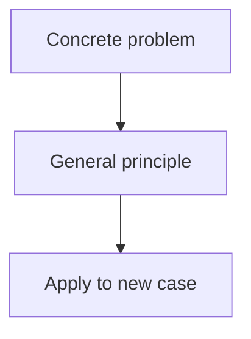

# Onboard a book as a new subject

Turn a large book (PDF) into a new subject in this platform — **token-aware**, so the
whole book is never loaded into context. You inspect the outline, slice it into
per-chapter text files on disk, and author one chapter → one module at a time.

The book/PDF path is `$ARGUMENTS` (ask for it if missing).

## The core principle: one chapter in context at a time

A 250-page book is ~80k+ tokens of text — never read the PDF body wholesale. Instead:

1. A script reads the PDF on disk and prints only the **outline** (zero body in context).
2. You plan a **chapter → module** mapping from that outline.
3. The script **slices** only the pages you chose into small `.txt` files (~7–12k tokens each).
4. You author each module by reading **just that one slice**, then move on. Context never
   accumulates the whole book.

## Before you start

Read [references/subject-schema.md](references/subject-schema.md) — the `Subject` data
contract, the validation rules, and the **closed `visualizer` union** (you may not add
visualizers; use `read` / `quiz` / `scenario` / `code` only). Use `src/data/gpu.ts` as the
structural template and `src/data/md/gpu-why.md` for markdown voice.

## Workflow

### Step 1 — Inspect the outline (no PDF body in context)

```bash
python .claude/skills/onboard-book/scripts/slice_pdf.py outline "$ARGUMENTS"
```

This prints the page count, total token estimate, and the nested outline with 1-indexed
page numbers. If `pypdf` is missing: `pip install pypdf`. If there's no embedded outline,
fall back to slicing by fixed page ranges (e.g. every ~25 pages) and skim the first lines
of each slice to find real boundaries.

### Step 2 — Plan subject + chapter→module mapping

Decide, from the outline alone:
- `Subject.id` (lowercase-kebab), `title`, `tagline`, an `icon` emoji, a distinct `accent`
  hex, and a short `prefix` for ids/files (e.g. `ie`).
- Which chapters map to which modules. Each chapter is usually one module; combine tiny
  chapters. Note each chunk's **start:end** page range (1-indexed, inclusive).

Confirm scope with the user if the book is large: pilot one module first, or build all.
Use `AskUserQuestion` for real choices (scope, whether to include code challenges, how to
use any glossary/appendix).

### Step 3 — Slice the chosen chapters to disk

Write slices into a gitignored scratch dir (add `.book-ingest/` to `.gitignore`):

```bash
python .claude/skills/onboard-book/scripts/slice_pdf.py slice "$ARGUMENTS" ./.book-ingest \
    ch1:16:39 ch2:40:71 glossary:210:231
```

For a pilot, slice only the pilot chapters; the same command extends to the rest later.

### Step 4 — Author per chapter (one slice at a time)

For each module, `Read` only its slice file, then write:
- `src/data/md/<prefix>-<topic>.md` for each `read` step (tight, concrete; cite the book).
  **Extract exact passages from the book and trim them to the core claim — don't paraphrase.**
  See "Quote the book, don't paraphrase" below.
- The module's lessons in `src/data/<subject-id>.ts`, mixing `read` + `quiz` + `scenario`,
  plus a `code` step where there's genuine numeric work (see schema reference).

Honor the validation rules: code challenges need ≥3 tests, a passing `solution`, and a
**failing** `starterCode`; quizzes need ≥2 options + a >20-char `explanation`; scenario
stages need ≥2 options incl. one `quality: 'best'`; all lesson ids globally unique.

**Teach before you test.** Every quiz/scenario must be answerable from the `read` content
in the *same or an earlier lesson*. If a question relies on a term or fact (e.g. "prefill is
compute-bound", "the KV cache turns attention linear", "what a foundation model is"),
introduce that concept in a read step first — don't let a glossary/vocabulary quiz be the
first place a learner meets it. When in doubt, grep the `md/` reads for the concept before
quizzing it; if it's not taught, either teach it or cut the question.

Do **not** re-read prior slices — finish a module, drop it from your working set, move on.

**Draw the chapter, don't just describe it.** A `read` step's markdown renders ```mermaid
fenced blocks as live diagrams (lazy-loaded, auto-themed to dark mode). Technical books carry
structure in figures — reproduce that intent. After writing each read step, find the 2–4
places where prose is weakest (fan-out, ordering, branching, numeric transforms) and add a
diagram anchored to that exact claim: a **sequence diagram** when round-trips/ordering matter
(cache hit/miss, handshakes), a **flowchart** for topology and "what-fixes-what" ladders, a
**funnel** (`flowchart LR` with the math on each edge) for estimation, a **state diagram** for
lifecycles. Pick the type from what the text is doing; one concept per diagram; ≤7 nodes;
label the edges. See [references/diagrams.md](references/diagrams.md) for the type-selection
table, placement rules, the generation quality bar, and copy-paste shapes.

### Step 5 — Register the subject

Edit `src/data/index.ts`: add `import { <subject> } from './<subject-id>'` and append it to
the `SUBJECTS` array.

### Step 6 — Validate

```bash
npm run build            # tsc -b && vite build — type-checks the new subject
npx vitest run --testTimeout=8000 src/data/curriculum.test.ts   # explicit path on purpose
```

Invoke vitest **with the explicit file path** (and `--testTimeout`): a bare `npx vitest run`
can hang a fork worker at 100% CPU in this repo. If a worker spins, kill it with
`pkill -9 -f forks.js`. Details: `docs/solutions/test-failures/vitest-run-hang-fork-worker-System-20260612.md`.

Then `npm run dev` and confirm the new subject appears in the sidebar **and that every
diagram renders** — mermaid runs client-side, so a broken graph shows a red error box instead
of an SVG and the build won't catch it. Open each read step that has a diagram and glance at it.

## Success criteria

- [ ] PDF inspected via the script; **its body was never read into context wholesale**.
- [ ] Chapter→module mapping decided from the outline; slices written to `.book-ingest/`.
- [ ] Each module authored from a single slice (`.ts` lessons + `md/` read files).
- [ ] Read steps carry **diagrams** where the book did — right type, anchored to the prose,
      and confirmed rendering in `npm run dev` (see references/diagrams.md).
- [ ] No `visualizer` steps; code/quiz/scenario meet the validation rules.
- [ ] Subject registered in `src/data/index.ts`.
- [ ] `npm run build` clean and `npx vitest run … curriculum.test.ts` green for the subject.

## Building intuition through curriculum design

Intuition is understanding *why* something works, not just *what* it is. Readers who finish
a module should be able to predict behavior, explain trade-offs, and apply the concept in
new contexts.

### Intuition-building principles

**1. Anchor concepts in concrete examples.** Don't introduce an abstraction in isolation.
Start with a specific, concrete problem the reader recognizes, then generalize from it.
Example: teach the KV cache by first asking "why does the second sentence take longer to
compute than the first?" before naming the cache itself.

**2. Progress from concrete → abstract → application.** Each lesson should move through:
- **Concrete:** a specific, relatable example or scenario
- **Abstract:** the general principle or technique
- **Application:** working out what changes when you vary the inputs

Use `read` steps for concrete + abstract, `scenario` steps for "here's a situation, what
would you do?", and `code` steps for measurable application.

**3. Use diagrams as thinking tools, not decoration.** A diagram should **show why**, not
just what. A sequence diagram shows *when* events happen relative to each other (why order
matters). A flowchart shows *how decisions branch* (why one path beats another). A funnel
shows *why magnitudes matter* (why only one term dominates). Avoid diagrams that merely
illustrate a term; prioritize diagrams that make a reasoning step visible.

**4. Build failure intuition explicitly.** Readers should know what *breaks* and why, not just
what works. When introducing a technique, pair it with a boundary case or a failure mode:
- "Batch normalization helps training *when* you have large batches (why?)"
- "This optimization is unsound *when* these conditions hold (spot the trap)"
- "This assumption breaks *if* the data has this shape (why?)"

Include these in quizzes: "What's one case where this approach fails?" is more valuable
than "Which statement is true?"

**5. Reuse vocabulary consistently.** If you name a concept once, use the same term every
time. Synonyms confuse readers; clear repetition builds memory. If a concept has multiple
legitimate names (e.g., "attention head" vs. "query-key-value head"), pick one and mention
the alias once.

**6. Validate understanding with scenarios, not just recall.** Quiz questions should
require reasoning, not memorization. Instead of "What is X called?", ask "Given this setup,
what happens next?" Scenario steps are ideal: "You're building Y. These constraints apply.
Which design choice is best and why?" — readers predict behavior, judge trade-offs, and
apply the concept.

### Quote the book, don't paraphrase

The author has already done the hard work of phrasing intuition correctly. Use exact
excerpts from the source, trimmed but not rewritten, to preserve their intent.

**Why excerpts beat paraphrase:**
- Paraphrasing introduces your own mental model, which may differ from the author's
- Direct quotes carry the author's rhythm and emphasis — they often explain *why* better
  than a summary
- Readers trust primary sources; a quote feels authoritative
- Trimming keeps the essential claim while removing side context

**How to excerpt efficiently:**
1. **Find the core sentence** — the one that makes the claim. Excerpt that first.
2. **Add minimal context** — the preceding sentence or phrase that makes it intelligible.
   Example: don't quote "the cache turns attention linear" without first saying what
   "linear" means in this context.
3. **Trim aggressively** — strike modifiers, examples, and asides that don't support the
   core claim. If "the KV cache, which was introduced in 2019 by Transformer-XL,
   fundamentally changes how attention scales" can be shortened to "the KV cache changes
   how attention scales," do it.
4. **Attribute clearly** — cite chapter/section or page. Readers should be able to verify.

**Example (from a hypothetical inference book):**

*Instead of:*
> "The key-value cache is a mechanism that stores previously computed keys and values so
> that when processing the next token, the model doesn't have to recompute them."

*Use:*
> "The KV cache stores previously computed keys and values, eliminating recomputation on
> the next token." — *Chapter 2, p. 34*

The second is tighter and emphasizes causality (why it matters), while the first loads the
definition without the intuition.

### Authoring for intuition (practical checklist)

As you write each `read` step, ask yourself:

- [ ] **Does the reader *know* a concrete problem this solves?** If the first paragraph
      doesn't reference a recognizable setup (a real workload, a failing system, a human
      question), add one before the abstraction.

- [ ] **Can a reader *predict* what happens if you change a variable?** After reading, if I
      ask "what breaks if X doubles?", should they be able to reason through it, or just
      guess? If the latter, add a worked example or a scenario that forces prediction.

- [ ] **Are there 2–4 places where a diagram would *show why*?** Flag them. A diagram
      should let you skip a paragraph because "the picture makes it obvious". If a diagram
      just restates prose, drop it and rewrite the prose instead.

- [ ] **Is there a boundary case or failure mode?** Add one: "This works *unless* …" or
      "This breaks *when* …". Readers remember limits better than happy paths.

- [ ] **Have I used the same term every time?** Search the module for synonyms. If you
      find "attention head", "head", and "multi-head unit" all in the same read, pick one
      and replace. Consistency compounds over lessons.

- [ ] **Did I quote the book or paraphrase?** Search for sentences you wrote from scratch.
      If the book already says it better (and you can trim it to the core claim), replace
      with a direct excerpt + page citation. Paraphrase only when the book's wording is
      too broad or off-target for your lesson goal.

### Intuition in quiz and scenario design

- **Quizzes**: Include one "which one breaks?" or "what's the edge case?" question per quiz.
  Favor explanations that start with "because …" (causal reasoning) over lists of facts.

- **Scenarios**: Scenarios are intuition-building gold. Present a real-world constraint or
  trade-off and ask readers to judge. "You have X resources and Y requirements. Which
  design?" is worth ten fact quizzes.

### Diagrams that build intuition

See [references/diagrams.md](references/diagrams.md) for the full taxonomy. Pick the type
that **shows the reasoning**:

- **Sequence**: shows time order and causality ("first X, then Y, *because* Z")
- **Flowchart**: shows decision logic and branching ("if this, then that path")
- **Funnel** (LR flowchart): shows magnitude and dominance ("these terms cancel, only this one matters")
- **State**: shows transitions and boundaries ("you move from state A to state B when …")

Place each diagram immediately after the prose it illuminates. A reader should see the
diagram while the relevant claim is fresh. Mermaid syntax:


## Notes

- Glossary/appendix → a term-matching `quiz` bank or a single reference `read` lesson.
- Worked example: the `inference-engineering` subject was built with exactly this flow
  (Foundations pilot from a 259-page book; slices were ~7–8k tokens each).
