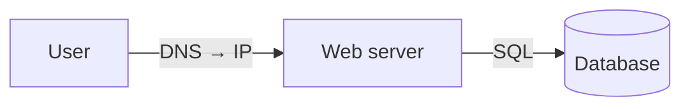
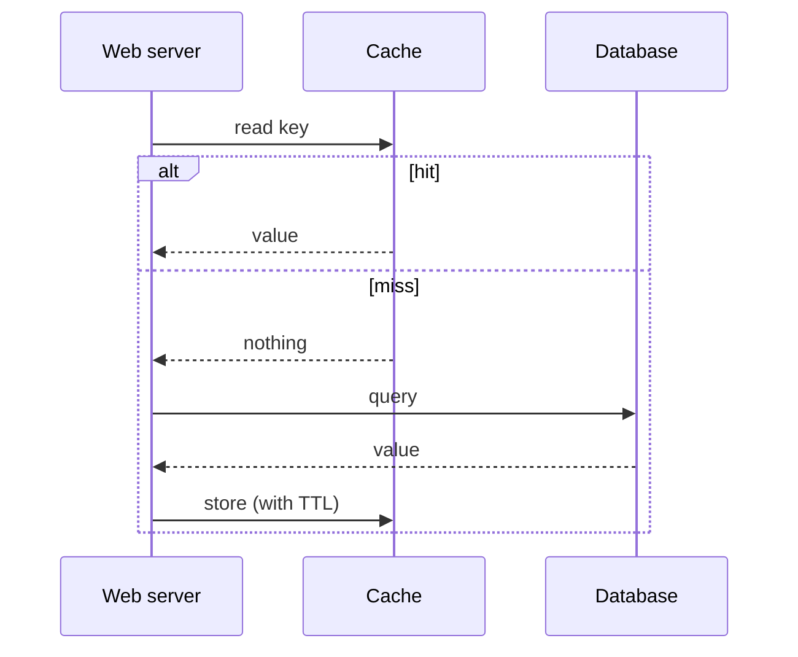
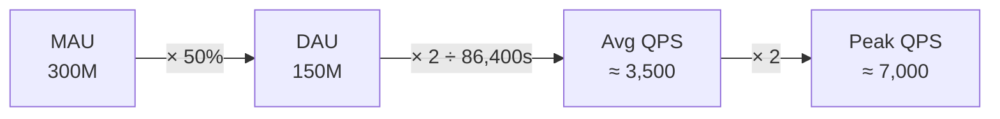

# Diagrams in `read` steps (Mermaid)

This file is for diagrams **you draw** to make a reasoning step visible. If you
want to reproduce a real, named figure from the source exactly (an architecture
box diagram, a system diagram) rather than redraw it, see
[figures.md](figures.md) instead.

`read` markdown is rendered by `src/lib/Markdown.tsx` (marked + a custom code renderer).
A fenced ```mermaid block becomes a live SVG: mermaid is **lazy-loaded** (dynamic
`import('mermaid')`, code-split) so it only ships on pages that actually contain a diagram,
and it's pre-themed to the app's dark zinc/emerald palette — you don't set colors, just
write the graph. Author diagrams as ordinary fenced blocks inside the `.md` read files:

````markdown

````

A technical book leans on figures to carry structure that prose can't. When you rewrite a
chapter, **reproduce its diagrams' intent** — don't drop the picture and keep only the words.

## Pick the type from what the prose is doing

| The text describes… | Use | Mermaid header | Example from a sys-design book |
|---|---|---|---|
| Components/topology, "what connects to what", a ladder of fixes | **flowchart** | `flowchart LR` / `TB` | web↔data split, load balancer fan-out, sharding router |
| An ordered interaction over time — who calls whom, request/response, hit vs miss | **sequence diagram** | `sequenceDiagram` | cache read-through, TLS handshake, write-ahead path, 2-phase commit |
| A quantity transformed step by step (estimation, pipelines, conversion) | **funnel** = `flowchart LR` with the math on each edge | `flowchart LR` | MAU →×50%→ DAU →÷86,400→ QPS →×2→ peak |
| A lifecycle / state machine — a thing moving between named states | **state diagram** | `stateDiagram-v2` | TCP states, job pending→running→done, leader election |
| A data model / schema with relationships | **ER diagram** | `erDiagram` | users↔tweets↔media tables before sharding |
| A taxonomy or concept breakdown (one root, branches) | **mindmap** or `flowchart TB` | `mindmap` | "kinds of NoSQL", "types of caching" |
| Phases/durations across a timeline | **gantt** (rare) | `gantt` | rollout stages, interview time budget |

If two types both fit, prefer the one that matches the book's own figure. Sequence diagrams
win whenever **ordering or round-trips** matter; flowcharts win for **structure** that's
true at rest.

## Placement — anchor every diagram to a claim

- Put the diagram **immediately after the paragraph or bullet it illustrates**, not in a
  lump at the top. The reader should hit the words, then see them drawn.
- **One concept per diagram.** A diagram that needs a legend has too much in it. Split
  "the whole architecture" into the 3–4 moves that built it.
- Diagram the things prose is **worst** at: fan-out/fan-in, ordering, branching (hit/miss,
  success/failure), and numeric transformations. Don't diagram a definition, a 2-item list,
  or anything a table already shows cleanly.
- Aim for **roughly one diagram per major section** of a read step, not per paragraph. A
  300-page book chapter rewritten to ~40 lines usually wants 2–4 diagrams. More than ~6 in
  one read step is noise.

## Generation quality bar

- **≤ 7 nodes.** Past that, split or summarize. Density kills legibility on the lesson page.
- **Label the edges**, not just the nodes — the verb/transformation is the teaching content:
  `-->|writes|`, `-->|× 50%|`, `-->|cache miss|`. An unlabeled arrow wastes the diagram.
- **Quote any label with punctuation, parens, %, math, or spaces-plus-symbols:**
  `A["hash(user_id) % 4"]`, `Q[["Message queue"]]`. Bare labels break the parser.
- Multi-line labels use `<br/>`: `S1["1 · Scope<br/><i>3–10 min</i>"]`.
- Node shapes carry meaning — use them: `[(Database)]` cylinders for stores, `{Decision}`
  diamonds for branching/routing, `[[Queue]]` for queues/subroutines, `(("Cache"))` circles.
- **Don't set colors/themes** — the renderer themes everything for dark mode. Hardcoded
  `style`/`classDef` colors will clash.
- **Dotted edges need spaces and a quoted label — this is a recurring bug across onboarded
  subjects.** Write `A -. "label" .-> B`, never `A -.label.->B`. The unspaced/unquoted form
  parses in some mermaid playgrounds but throws in this app's renderer, and it is *not*
  caught by `npm run build` (mermaid only runs client-side) — only a real render, or the
  grep below, catches it:
  ```bash
  grep -n '\-\..*\.->' src/data/md/<prefix>-*.md
  ```
  Run this on every new `.md` file before merging, even if you also checked in the browser.
- Direction: `LR` reads like a request flowing left→right (pipelines, funnels, request
  paths); `TB` suits hierarchies and fan-out (routers, taxonomies, multi-DC).
- Keep the source ASCII-safe where you can; `→ × ÷ ≈ ·` render fine inside quoted labels.

## Two worked shapes to copy

Sequence (ordering + a branch):

````markdown

````

Funnel (estimation math on the edges):

````markdown

````

## Verify

Diagrams type-check as plain strings, so the build won't catch a broken graph. After
authoring, run `npm run dev` and open the lesson — a malformed diagram renders a red mermaid
error box instead of an SVG. Glance at each read step; fix any that errored. (Mermaid runs
client-side only, so there's nothing to check in `npm run build`.)
