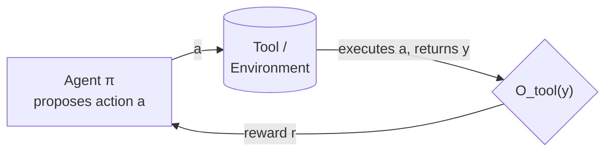

# A1 goes online: RLVR from tool execution

SFT and DPO methods (previous lesson) all share one ceiling: they train on
trajectories the agent didn't generate, so they can't explore tool-use strategies
absent from that fixed dataset. **Reinforcement learning with verifiable reward
(RLVR)** removes this ceiling by closing the loop on-line: the agent proposes an
action, a tool or environment executes it, the outcome is scored by a verifiable
function `O_tool`, and that score updates the policy — all inside the same training
loop.



This on-line setting introduces two design axes the off-policy methods didn't have
to face:

- **Reward density** — does feedback arrive after every step (as in theorem
  proving, where each tactic is checked) or only at the end of an episode (as in
  multi-tool reasoning)? Density directly governs how hard credit assignment is.
- **Reward composition** — how task-specific correctness, format compliance, and
  regularization terms combine into the final scalar reward.

## Web search and information retrieval

**DeepRetrieval** (COLM 2025) set the template for this whole family: query
reformulation is cast as an MDP, with retrieval metrics (Recall@K, NDCG, or SQL
execution accuracy) as reward, optimized via KL-regularized PPO:

```
π̂ = argmax_π  E[ r(q, q′) − β · log(π(q′|q) / π_ref(q′|q)) ]
```

where `r(q, q′) = r_retrieval(q, q′) + r_format(q′)` — a task reward plus a format
reward, combined. This single recipe transferred across literature search, QA
retrieval, and text-to-SQL, roughly **tripling recall on real search engines (65.1%
vs. 24.7%)**.

Two follow-ups patch limitations of that single-step formulation. **ReZero** adds
retry-aware reward shaping via GRPO, teaching the agent to keep searching after a
failed query in partially observable web environments. **Orion** moves from
single-step to multi-turn adaptive search with turn-level rewards based on
normalized similarity and rank — and notably, compact 350M–1.2B models learn
effective multi-hop strategies this way, showing dense reward can substitute for
sheer model scale.

## Code-based tools

Code execution is close to an ideal A1 environment: feedback is deterministic,
sandboxable, and available at every compile or test run. The open design question
is keeping that feedback *reliable* as tasks diversify. **LeDex** (NeurIPS 2024)
combines unit-test correctness with an explanation-quality term in a composite PPO
reward. **RLEF** (ICML 2025) formalizes code synthesis as a partially observable
MDP where the agent generates, sees public-test feedback, and iterates — multi-turn
interaction is what unlocks problems beyond single-shot capability. **Code-R1**
shifts the focus entirely to the *reward pipeline*: by eliminating false positives
from faulty tests, unsolvable prompts, and mismatched sandboxes, it shows **reward
quality dominates reward quantity**. **R1-Code-Interpreter** uses multi-stage
curriculum learning — prioritizing samples by improvement potential — to handle
heterogeneous code-interpreter tasks (math, retrieval, data analysis) without
sparse rewards destabilizing training. **Tool-R1** attacks sample efficiency
directly with a dynamic sample queue that caches and reuses high-quality
trajectories.

## Formal theorem proving

Theorem proving is the cleanest A1 domain of all: a proof assistant deterministically
verifies each proposed tactic, and the verification outcome — accepted, advanced
the proof state, or completed the proof — *is* the reward, with essentially no
ambiguity and at step granularity. That step-wise semantic verification gives denser
rewards than code-execution RLVR (where unit tests can be sparse or incomplete) and
substantially eases long-horizon credit assignment. **AlphaProof** (Nature 2025),
**DeepSeek-Prover-V2** (ICLR 2025), **Kimina-Prover**, and **Leanabell-Prover-V2**
all train multi-step proof-search policies on this verifier feedback, while a
complementary line of work layers auxiliary guidance signals on top to prioritize
trajectories and stabilize optimization. One caveat: formal libraries like Mathlib
grow continuously, so RLVR on a fixed prover snapshot eventually needs
complementary continual-adaptation mechanisms to keep up with an expanding premise
space.

## Multi-tool reasoning systems

When an agent must compose multiple tools sequentially or conditionally, the action
space becomes combinatorial and rewards become episode-level — sparser. The survey
groups responses into three strategies. **Routing**: **Router-R1** (NeurIPS 2025)
learns a policy that alternates between internal reasoning and selecting an
external LLM from a routing pool. **Environment construction**: **FTRL**
automatically synthesizes diverse tool-use training environments via a multi-stage
pipeline, with a verifiable reward balancing invocation accuracy against task
completion — avoiding hand-crafted toolsets. **Dense step-level rewards**:
**Tool-N1** separates internal `<think>` reasoning from external `<tool_call>`
execution into distinct credit-assignment channels; **WebGen-Agent** combines
visual-appearance scores and GUI-functionality scores via Step-GRPO to supervise
website-generation at every turn; **ToolExpander** stabilizes GRPO for small LLMs
via hard-sample replacement and a self-exemplifying-thinking mechanism.

## Cross-domain principles (§4.1.2 synthesis)

Across web search, code, theorem proving, and multi-tool reasoning, the same four
patterns recur:

| Principle | What it means |
|---|---|
| **Signal density → learning efficiency** | Dense per-step feedback (theorem proving, code execution) converges faster than sparse episode-level rewards (multi-tool reasoning) — and is why A1 often needs less data than A2 in these domains. |
| **Reward quality > reward quantity** | Code-R1 and DeepRetrieval both show that cleaning up the reward signal beats scaling training data. |
| **Format rewards: necessary, not sufficient** | Almost every successful RLVR method adds a format-compliance term alongside the task reward — alone it can't drive adaptation, but without it outputs degenerate. |
| **Stabilization is domain-agnostic** | KL regularization, dynamic sampling, and curriculum scheduling appear across every domain — stabilizing on-policy RL is a fundamental challenge, not a domain quirk. |

The trade-off the survey leaves us with: RLVR delivers exploration and on-policy
correction that off-policy SFT/DPO can't — but it's expensive, requiring careful
reward design, interactive compute, and explicit stabilization. That cost is part
of what motivates the tool-centric (T1/T2) paradigms covered elsewhere.
