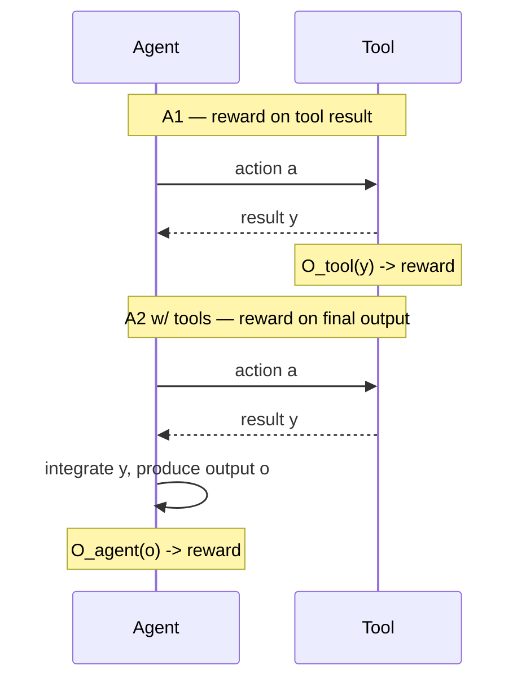

# A2 with tools: rewarding the final answer after tool use

§4.2.1 kept tools out of the loop entirely. §4.2.2 puts them back in — but the
reward still lands on the agent's *final output*, not on the individual tool
calls. The agent now has to learn a **meta-policy**: not just how to reason, but
*when* to invoke a tool, *which* tool to pick, and *how* to fold the tool's result
back into its reasoning chain. The policy space is much larger than in A1, which
makes credit assignment and data efficiency the central challenges.

## A1 vs. A2-with-tools: where the reward is read

Both paradigms can involve the exact same tool call inside the same trajectory —
the difference is *where the scoring happens*.

In A1, `O_tool(y)` scores the tool's result directly — a precise, per-call signal,
but blind to whether the agent *used* that result well. In A2-with-tools,
`O_agent(o)` scores only the agent's final answer `o` after it has integrated `y` —
a richer, end-to-end signal, but noisier, since one scalar reward must be
attributed back across every tool call and reasoning step that led to `o`.

## Retrieval-based tool learning

Earlier distillation-SFT approaches like **Self-RAG** (ICLR 2024) and its
successors taught retrieval tool use by imitating expert demonstrations. RL-based
A2 methods instead let the agent **discover its own search strategy**.
**R1-Searcher**, **Search-R1** (COLM 2025), and **ReSearch** (NeurIPS 2025) all
train LLMs to generate and refine search queries autonomously across multi-turn
reasoning. What distinguishes them is the **action representation**:

- R1-Searcher incentivizes search-API calls via a two-stage RL framework, gaining
  up to **24% over RAG baselines**.
- Search-R1 formulates search invocation as a joint reward over retrieved evidence
  *and* final answer correctness — exactly the A2-with-tools shape: the reward
  depends on `o`, not just on what the retriever returned.
- ReSearch weaves queries and results directly into the reasoning chain via
  `<think>`/`<search>`/`<result>` tags, optimized with GRPO — and is notable for
  showing *emergent* reflection and self-correction that was never explicitly
  supervised, a strategic behavior the survey attributes to holistic,
  output-level optimization.

## Code- and execution-based tool learning

Code execution sits at the boundary: the execution outcome itself is verifiable
(A1-like), but the *training signal* evaluates the agent's overall problem-solving
trajectory (A2-like). **CodePRM** (ACL 2025) trains a process reward model on code
execution results to score intermediate reasoning steps, forming a
Generate-Verify-Refine pipeline that corrects errors during inference. **ReTool**
integrates real-time code execution directly into RL rollouts, so the agent learns
*when* to offload computation to an interpreter. The survey's framing of ReTool is
the cleanest statement of why A2-with-tools matters:

> "A2 training can discover tool-use strategies that A1 training cannot, because
> the reward depends on whether the agent's overall answer (not just the tool
> call) is correct." — Section 4.2.2

## General multi-tool and agentic learning

In the most general setting, three themes organize the field. **Data generation**:
**Self-Challenging Agents** have the model act as its own challenger — generating
tool-use tasks — and then as executor, solving them via RL, for over a **2×
improvement** on multi-turn benchmarks. **Self-reflection**: **Re-ReST** uses
environment feedback (e.g., unit-test results) to refine low-quality trajectories,
yielding large gains on HotpotQA and AlfWorld; **Agent-R** formalizes iterative
self-correction via model-guided critique plus MCTS rollouts (**+5.6%** across
interactive environments). **Infrastructure**: **Test-Time Self-Improvement**
performs on-the-fly fine-tuning at inference time, extending the "no weight
update at training time" idea from §4.2.1 into the tool-using setting.

## Bringing A1 and A2 together

By the end of §4, both halves of the agent-adaptation tension are concrete:

| | A1 (tool execution as signal) | A2 (agent output as signal) |
|---|---|---|
| Reward source | `O_tool(y)` — the tool's execution result | `O_agent(o)` — the agent's final output |
| Credit assignment | Precise, per-action | Episode-level, must be attributed across many decisions |
| What it can teach | Correct individual tool calls | Strategic behavior: when/whether/how deeply to use tools, self-correction |
| What it can't see | Whether the overall strategy makes sense | — |
| Typical cost | Cheaper signal, less data needed | More expensive, less data-efficient per gain |

Neither paradigm subsumes the other — Rec-R1 (previous lesson) even shows the same
system can sit on either side depending on where the evaluation is computed. Real
systems increasingly combine both: dense A1-style execution feedback for the
"does this call work" question, layered under an A2-style outcome reward for the
"did this whole trajectory solve the task" question.
