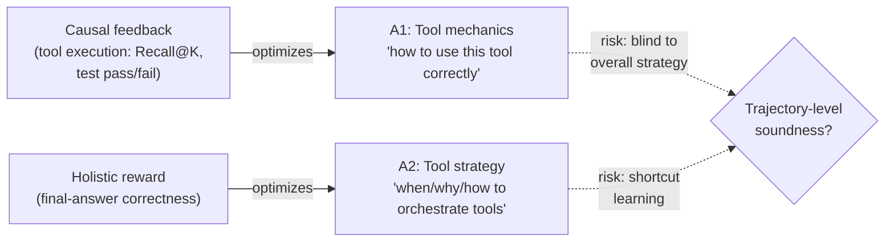

# Comparing the four paradigms: a framework, then A1 vs A2

You've now seen A1, A2, T1, and T2 each in depth — concrete methods, training
signals, headline numbers. Section 6 stops adding new methods and instead asks
a different question: **given these four paradigms, how do you compare them,
and when does each one win?**

## Four axes for comparison (§6.1)

The survey scores every paradigm along four axes:

- **Cost and flexibility.** "Cost" means compute and engineering effort to
  adapt the system; "flexibility" means how easily its behavior can be
  reconfigured afterward. A1/A2 offer high **parametric flexibility** — the
  entire agent policy can shift. T1/T2 offer high **system-level flexibility**
  — capabilities can be added, swapped, or recomposed via tools — but stay
  bounded by what the frozen agent's reasoning can actually use.
- **Data efficiency.** How much training data does the adaptation need? This
  is where T2 in particular pulls ahead, as you'll see in the next lesson.
- **Generalization.** Does the adapted system transfer to new tasks, agents,
  or environments, or does it overfit to the one it was trained in?
- **Modularity and system evolution.** Can a piece be swapped or upgraded
  later without retraining everything else, and without breaking what already
  worked?

Table 5 (the survey's high-level qualitative comparison) maps each paradigm
onto these axes at a glance — you'll build the same table yourself in the next
lesson. For now, the headline pattern: agent-centric paradigms (A1/A2) rewrite
an entire policy in one model — maximum parametric flexibility, at the cost of
expensive retraining and the risk of side effects on unrelated behaviors.
Tool-centric paradigms (T1/T2) attach specialized components that can be added
or replaced without destabilizing the base agent — but they're capped by what
that frozen agent can understand and use.

> "Data efficiency and generalization both favor tool-centric adaptation... while
> modularity—the ability to swap tools without retraining the core—is often more
> decisive than raw performance in practice." — Section 6.1

That last clause is the thesis this whole module works toward: in practice,
*can I change this later without breaking everything else* often matters more
than a few points of benchmark accuracy.

## A1 vs A2: same locus, different signal (§6.2)

A1 and A2 both adapt the **core agent policy** — they're agent-centric. What
separates them is *where the training signal comes from*, and that single
difference cascades into everything else: what gets optimized, how reliable
the signal is, and what failure modes show up.

### A1: causal feedback teaches tool mechanics (§6.2.1)

A1's signal is the **verifiable outcome of tool execution itself** — not a
downstream task metric. DeepRetrieval's reward is Recall@K or NDCG straight
from the retriever; RLEF's reward comes from whether generated code passes its
test cases. The reward answers "did *this specific action* work?", not "did
the overall task succeed?"

Conceptually, A1 on-policy RL optimizes **tool-use mechanics**: it teaches the
agent how to wield a tool correctly, grounded in the environment's "physics" —
this syntax executes, this query retrieves. That grounding is what makes A1
strong in domains with deterministic, checkable outcomes: DeepRetrieval gets
roughly 3x the recall of a baseline (65.1% vs. 24.7%) on literature search, and
R1-Code-Interpreter reaches 72.4% accuracy on a 37-task code-reasoning suite
through multi-stage RL.

The cost is that this strength is also a blind spot: a signal scoped to
individual actions has nothing to say about whether the *overall strategy*
that chains those actions together is sound.

### A2: holistic rewards teach tool strategy (§6.2.2)

A2's signal is **holistic, sparse, and high-level** — typically final-answer
correctness — and it depends on tool usage without supervising any individual
tool call. ReSearch, trained on multi-hop QA, is rewarded not for "was this
particular search good?" but for "did the entire process of thinking,
searching, and reasoning lead to the correct answer?"

So A2 optimizes **tool-use strategy and coordination** — *when* to call a
tool, *what* to ask for, *how* to weave results into reasoning — while
assuming the mechanics of the call itself (handled by a T1-style tool, say)
are someone else's problem. That strategic focus is why ReSearch reports
emergent reflection and self-correction during RL training: optimizing the
whole trajectory rewards behaviors no single-action reward would ever surface.
On retrieval-augmented QA, ReSearch reports 9–22% absolute gains over strong
iterative RAG baselines, and R1-Searcher reports up to 24% improvement with
reduced hallucination from a learned retrieval policy.

A2 offers the richest parametric flexibility of the four paradigms — the agent
can rewrite its *entire* global strategy for orchestrating tools and reasoning
— but each such change means expensive retraining of one large, monolithic
model.

## Signal source as a reliability axis

Zoom out from the taxonomy labels and A1 vs. A2 is really a trade-off along
one axis: **how precise is the signal, versus how much of the system does it
cover?**

- A1's tool-execution signals are **grounded, causal, and process-oriented** —
  produced by an environment whose semantics don't depend on the agent's
  beliefs (a compiler, a retrieval metric, a proof checker). That grounding
  buys tight coupling to intermediate correctness and tool mastery, at the cost
  of higher interaction cost and dependence on having such an environment at
  all.
- A2's agent-output signals are **holistic, flexible, and outcome-oriented** —
  scored from gold answers, math solutions, or preference models, evaluating
  the *final* output. That enables true end-to-end optimization, but a signal
  that only checks the destination is vulnerable to **shortcut learning**
  (getting the right answer for the wrong reason) and to sparse-feedback
  instability that A1's dense per-action signal doesn't face.

Neither signal is strictly better — they optimize different things and fail
in different ways. A1 gives you precise control over *how* a tool is used but
says nothing about whether using it was the right call. A2 gives you an
end-to-end policy but can reward an agent for stumbling onto the right answer
through the wrong reasoning. Holding both halves of this trade-off in mind is
the setup for the next lesson, where the same logic extends to the tool-side
paradigms T1 and T2.
