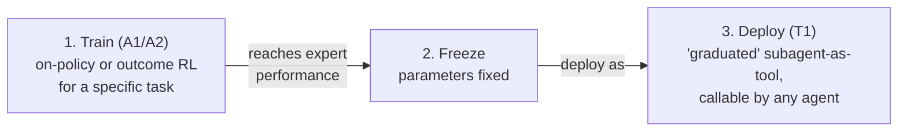

# T1 vs T2, and the sharpest comparison in the survey: A2 vs T2

A1 and A2 both pay the cost of touching the core agent's parameters. T1 and T2
take the opposite bet: leave the agent frozen, and put the adaptation effort
into the tools around it. Section 6.3 works through what that bet buys you —
and Section 6.4 then runs the sharpest head-to-head comparison in the paper,
A2 against T2, with real numbers attached.

## T1: the "graduated agent" as subagent-as-tool (§6.3.1)

T1 is defined by **agent-agnostic, pre-trained, plug-and-play** components.
At one extreme sit static, foundational tools — SAM, AlphaFold2 — trained once
on massive data and deployed as fixed APIs that any agent can call.

The more interesting case is the other extreme: **dynamic, graduated tools**.
An agent trained under A1 or A2 (the paradigms from the last lesson) can later
be *frozen* and redeployed as a T1 tool for some *other* agent. The survey
calls this the **Graduation Lifecycle**:

DeepRetrieval is the canonical example: trained via on-policy A1 RL as a
query-reformulation agent, then frozen and reused as an interchangeable T1
retrieval tool inside many different pipelines. SWE-Grep follows the same
pattern — trained as a specialized RL subagent for fast, parallel code-context
retrieval, then exposed as a tool that SWE-Agent or Cursor-style IDE agents can
call. In both cases, the graduated subagent carries a **learned policy**, not
just a fixed representation, and slots into new systems with zero retraining.

T1's payoff is high **system-level flexibility**: tools can be assembled into
different configurations, or one tool (say, a retriever) swapped out without
touching the agent at all. The cost of adding a capability scales with the
size of *that tool*, not the backbone agent. The trade-off: T1 tools aren't
tailored to any particular agent — the agent has to adapt its prompting or
orchestration to whatever interface the tool happens to expose.

## T2: inverting the optimization target (§6.3.2)

T2 flips the direction of adaptation. Instead of adapting the agent to use
tools better (A1/A2) or building agent-agnostic tools (T1), T2 adapts a
**tool to better serve one specific, frozen agent**. The frozen host (GPT,
Claude, …) becomes the *supervision source* rather than the optimization
target — it supplies reasoning and reward signals, while a lightweight
subagent (often ~7B parameters) learns to reshape information for that host's
consumption.

The central advantage is **decoupling skill from knowledge**. An A2 agent like
Search-R1 has to learn three things at once: domain knowledge, tool-use
skills, and task reasoning — a genuinely hard, high-dimensional optimization
problem. In T2, the frozen generator *already has* the knowledge and the
reasoning; the small T2 subagent only has to learn the narrow **procedural
skill** — how to search, how to write a useful memory entry, how to route a
task to the right specialist.

This lets T2 unbundle the agent's monolithic Perceive-Plan-Act-Reflect loop
into independently trainable pieces:

- **Optimizing "Perception" (agentic searchers).** s3, DynamicRAG, and QAgent
  train search subagents to decide what to query, where, and when to stop.
- **Optimizing "Reflection" (memory construction).** Subagents like Mem-α
  learn memory-writing policies via RL, rewarded on whether the stored
  experience improves the frozen generator's *future* performance.
- **Optimizing "Planning" (meta-cognitive planners).** AgentFlow trains only a
  lightweight planner that orchestrates frozen specialists using
  trajectory-level rewards — and reaches 33.1% on GAIA, surpassing the much
  larger GPT-4.

T2 gets high system-level flexibility like T1 — new subagents (a better
planner, a domain searcher, a memory module) can be trained and attached
incrementally without retraining the host. But compared to T1, T2 trades away
some agent-agnosticity: its tools are specialized for *one* frozen backbone,
which is exactly what buys the higher data efficiency and end-to-end
performance you'll see next.

## Synthesis: A2 vs. T2 — where the learning burden goes (§6.4)

A2 and T2 both aim at capable tool-using systems, but they place the learning
burden in opposite places. A2 adapts the *agent*, so it internalizes tool-use
strategy end-to-end. T2 adapts the *tools*, so they learn to support a fixed
agent. The RAG domain gives a direct case study, comparing Search-R1 (A2)
against s3 (T2):

- **Search-R1 (A2)** trains the *entire* Qwen2.5 agent end-to-end — roughly
  **170k examples** to co-adapt internal knowledge, reasoning, and tool-use
  policy simultaneously.
- **s3 (T2)** trains only a lightweight 7B "searcher" subagent against
  frozen-generator feedback, reaching comparable average accuracy (58.9%) with
  just **2.4k training samples** — about two orders of magnitude less data.

The survey is careful to flag this as a **suggestive case study, not a
controlled experiment** — the two systems differ simultaneously in
optimization target, backbone composition, and architecture, so the efficiency
gap can't be cleanly attributed to "T2 vs A2" alone. But the broader
architectural principle it illustrates holds up: T2 simplifies the learning
problem by assuming the backbone already covers knowledge and reasoning, so
the subagent only has to learn one narrow skill — while A2's optimization
landscape is higher-dimensional, with knowledge, reasoning style, and tool-use
policy all shifting at once. On specialized medical QA, T2-trained s3 reaches
76.6% vs. A2-trained Search-R1's 71.8% — consistent with (though not proof of)
the hypothesis that narrower targets generalize more robustly.

The engineering payoff follows directly: updating an A2 agent means retraining
the monolithic model, with the ever-present risk of catastrophic forgetting.
In a T2 architecture, new tools/subagents can be trained and hot-swapped
without touching the host agent — the periphery keeps evolving while the core
stays stable.

## All four paradigms, side by side

Putting Table 5 and the discussion above into one view:

| Paradigm | Locus of adaptation | Supervision signal | Cost & flexibility | Modularity & evolution |
|---|---|---|---|---|
| **A1** | Core agent policy | Tool execution outcome | High cost, high *parametric* flexibility | Monolithic — risk of overfitting |
| **A2** | Core agent policy | Agent output (final answer) | High cost, high *parametric* flexibility | Monolithic — risk of catastrophic forgetting |
| **T1** | External tool, agent-agnostic | Independent of any agent | Low cost, high *system* flexibility | High — plug-and-play |
| **T2** | External tool, agent-supervised | Frozen agent's output/reward | Low cost, high *system* flexibility | High — symbiotic, no forgetting |

Reading down the columns: A1 and A2 share a locus (the core policy) but split
on signal source — exactly the causal-vs-holistic distinction from the last
lesson. T1 and T2 share a locus (an external tool) but split on whether the
training signal comes from a frozen agent at all. And reading "Modularity &
Evolution": both agent-centric rows carry a *risk* (overfitting for A1,
forgetting for A2) that the tool-centric rows simply don't share — because the
core never moves.
