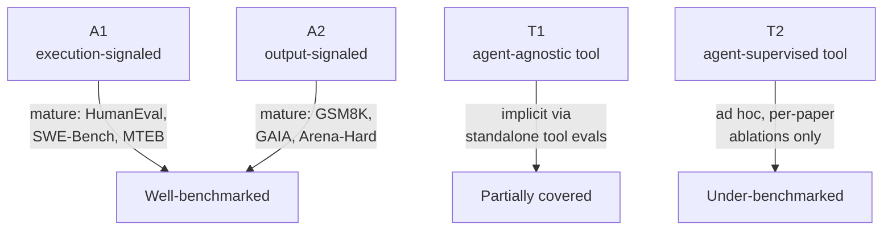

# Mapping the benchmark landscape onto A1/A2/T1/T2

Up to now you've seen the four-paradigm framework as a way to classify *methods*.
Section 7 turns the same lens on *evaluation*: given a benchmark, which paradigm
does it actually measure? The answer matters because a system can look great on
one axis and mediocre on another — and most leaderboards only show you one axis.

## A1: benchmarks with a verifiable execution signal

A1 adaptation needs a reward that comes directly from running a tool: did the
code compile, did the test suite pass, was the retrieved document relevant. The
benchmarks that fit this mold are exactly the ones with an *execution-based*
protocol — **HumanEval**, **MBPP**, **LiveCodeBench**, and **SWE-Bench** score
generated code by running it (pass@k or test-suite pass rate); **MTEB
Retrieval** scores a retriever by nDCG or Recall@K against gold relevance
judgments. In every case, the signal is causally tied to what the *tool*
produced — a passing test counts as success whether or not the agent's
surrounding explanation is any good (Section 7.1).

## A2: benchmarks that score the final output

A2 adaptation optimizes the agent's end-to-end answer, so its benchmarks score
the *whole trajectory* rather than any single tool call. Multi-hop QA setups
like those used by Search-R1 and ReSearch reward final-answer correctness after
a chain of retrieval and reasoning. General reasoning (GSM8K, GPQA Diamond),
instruction-following (IFEval, Arena-Hard), and broad agent benchmarks (GAIA,
AgentBench) all fall here — they evaluate synthesis and judgment, not whether
any particular tool call along the way was optimal (Section 7.1).

## The A1-A2 gap is itself a diagnostic

Because A1 and A2 expose *orthogonal* failure modes, comparing the two scores
for the same system is informative on its own:

- **High A1, low A2** — the agent's tool calls are working (good retrieval,
  passing tests) but something breaks in synthesis. A *synthesis bottleneck*.
- **High A2, low A1** — the final answer looks right despite weak tool use.
  Often a sign of memorization or shortcut reasoning that bypasses genuine tool
  use.
- In code specifically: high pass@k with low code quality is **test-gaming** —
  the same pattern, one level down.

"Comprehensive evaluation requires both metric families" — Section 7.1.

## T1: benchmarks that ignore the agent entirely

T1 tools are trained without reference to any host agent, and their benchmarks
follow suit: MTEB-style retrieval suites, embedding-quality benchmarks, and
standalone pass@k for a code model *in isolation* all measure the tool's
intrinsic quality — precision, IoU, transcription accuracy — without asking how
a downstream agent would actually consume the output.

## T2: the least standardized category

T2 evaluation has to answer a different question: does this tool make a
*specific frozen agent* better? The standard pattern is **counterfactual
comparison** — hold the agent fixed, swap the tool, measure the delta. S3
evaluates its learned searcher by the frozen generator's multi-hop QA accuracy;
AgentFlow evaluates its learned planner by the frozen backbone's GAIA score.

For memory-centric T2 systems, **LongMemEval** is a dedicated benchmark
covering five capabilities — information extraction, multi-session reasoning,
temporal reasoning, knowledge updates, and abstention when memory is
insufficient. Even state-of-the-art systems struggle with temporal ordering and
knowledge updates, confirming memory management as a long-horizon bottleneck.
A related gap: no existing T2 benchmark measures the *intermediate* stages of a
skill's lifecycle (does a skill library improve through reuse, or degrade
through drift?). Security-focused suites like **Skill-Inject** (prompt-injection
via skill files) and **Agent Skills in the Wild** (marketplace audits) are
starting to appear, but they measure attack exposure, not marginal utility or
long-term quality.

## Integrated benchmarks: broad coverage, low attribution

A separate cluster of benchmarks evaluates the full agent-tool system in
realistic, long-horizon environments — cutting across paradigms but reporting
only endpoint numbers:

| Benchmark | What it stresses |
|---|---|
| WebArena, OSWorld | Environment grounding — multimodal perception, multi-app coordination, execution-based success |
| τ-Bench, τ²-Bench, GTA | Multi-tool coordination — success rate over real tool invocations |
| AgencyBench | Scale/endurance — 6 capabilities, 32 scenarios, ~90 tool calls and ~1M tokens per task |
| The Tool Decathlon | Breadth — 32 applications, 604 tools, 108 tasks |

These are valuable stress tests, but because they report only endpoint metrics,
they can't tell you *which paradigm* drove an observed gain.

## The structural gap

Table 7's mapping reveals a clear asymmetry. A1 and A2 are relatively mature —
coding, reasoning, and retrieval all have well-established protocols. T1 is
implicitly covered by standalone tool benchmarks. **T2 remains ad hoc** —
typically a one-off ablation inside a paper rather than a standardized
community benchmark. No existing suite supports controlled comparison across
*all four* paradigms on the same task distribution, so a question like "for
this task, should I adapt the agent (A2) or the tool (T2)?" has no benchmark
that can answer it under matched conditions.

Part of the reason is structural: most benchmarks assume a fixed evaluation
harness tightly coupled to one agent interface, which creates integration
overhead and test/production mismatch. The **Agentified Agent Assessment
(AAA)** framework proposes decoupling this — specialized *assessor agents*
issue tasks and compute metrics while talking to *assessee agents* through open
protocols (A2A for task management, MCP for tool access). In principle, any
compliant agent could then plug into any evaluation without custom
integration — a prerequisite for the cross-paradigm comparisons current
benchmarks can't support. Whether this delivers at scale is still unvalidated.

