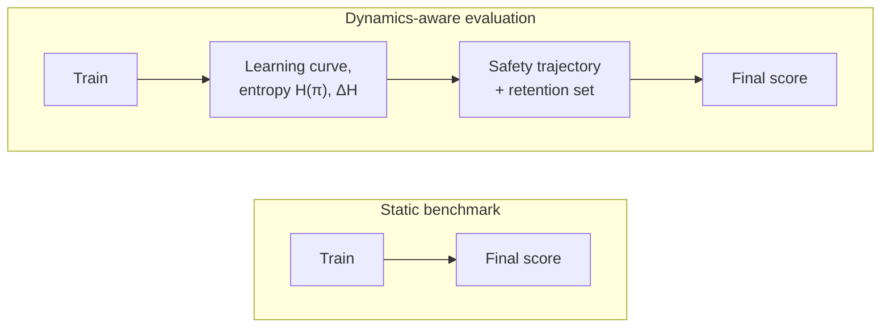

# The discussion: where evaluation falls short, and what to do about it

Table 8 in the paper summarizes everything from the last three lessons into a
single grid: for each of A1/A2/T1/T2, which evaluation dimensions are primary,
which are secondary, and which representative metrics apply. Section 7.5 steps
back from that grid to ask the harder questions — what does all this actually
*reveal* in practice, and what's still missing?

## 7.5.1 Concrete illustrations of the dynamics gap

Section 7.3's central claim — endpoint metrics are insufficient — becomes
concrete through three examples drawn from earlier in Section 7:

- **Hidden divergence in efficiency.** A2 and T2 methods that reach *similar
  final accuracy* on retrieval-augmented QA differ by **70×** in data
  requirements (Section 7.3.1) — a gap completely invisible to any endpoint
  leaderboard. Two code-generation agents with identical pass@k can likewise sit
  at very different points on the entropy-collapse curve — one near exhaustion,
  one still exploring — with the score telling you nothing about which.
- **Paradigm-selection artifacts.** The *same system* can appear to favor
  different paradigms depending on which metric family you read it through —
  A1 metrics highlight tool mechanics, A2 metrics highlight strategic
  reasoning, and neither alone tells you where further investment would pay
  off most.
- **Non-monotonic safety regression.** DeepSeek-R1 shows aggressive RL
  optimization can *temporarily* erode safety guardrails before partial
  restoration (Section 7.4.2) — a vulnerability window that an endpoint-only
  safety check, run after training completes, would never see.

The common thread: every one of these requires watching a **trajectory**, not a
final number.

The left path is what most leaderboards report. The right path is what
Sections 7.3-7.4 argue you actually need — the final score is the same node in
both, but only one path tells you how the system got there and what it might
do next.

## 7.5.2 Tool-centric vs. agent-centric evaluation

This is the same modular-vs-monolithic tension from the A1/A2/T1/T2 framework,
now showing up as an evaluation *philosophy*.

**Tool-centric evaluation** measures a tool's intrinsic quality (retrieval
recall, code correctness) independent of any agent. It supports modular design —
tools can be evaluated, compared, and swapped independently — but it can't
capture *emergent* agent-tool interaction: an agent learning to compensate for a
tool's weaknesses, or to exploit its strengths in unexpected ways.

**Agent-centric evaluation** measures end-to-end outcomes — what users actually
experience — but makes attribution nearly impossible. When the score goes up,
was it better reasoning, better tool selection, better tool quality, or a lucky
interaction between all three? You can't tell from the number alone.

**Bridging the gap: counterfactual evaluation.** Hold everything fixed except
one component — swap the adapted tool for a baseline — and measure the delta.
This is already standard in T2 work: S3 reports the frozen generator's accuracy
*with and without* the adapted searcher; QAgent shows that switching from
self-evaluation to frozen-generator evaluation corrects reward hacking. The
survey argues this should become a **standard reporting requirement across all
paradigms** — A1 papers reporting performance with/without the adapted tool
mechanic, A2 papers ablating tool use to isolate reasoning gains, integrated
benchmarks supporting component-level swap-in/swap-out.

The caveat is real, though: counterfactual evaluation assumes components are
*approximately independent*. In practice, an agent adapts its behavior in
response to the tool it was trained with — swap that tool for a baseline at
eval time, and the agent may behave differently than if it had been trained
with the baseline from the start. That's a confound pure swap-in can't resolve.
The survey's suggested complement is **progressive ablation** — gradually
degrading tool quality during evaluation to measure *sensitivity*, rather than
assuming clean separability.

## 7.5.3 How evaluation reshapes adaptation design

Evaluation protocols don't just measure adaptation — they *steer* it.

**Metric-driven optimization.** Benchmarks built on execution-based metrics
(pass@k, retrieval recall) naturally favor A1-style methods that directly
optimize those metrics. Benchmarks built on holistic metrics (final-answer EM,
LLM-as-judge) favor A2-style end-to-end optimization. The risk is **benchmark
co-adaptation**: methods evolve to exploit the specific protocol rather than to
genuinely improve. The canonical example: agents trained on pass@k may learn to
write code that passes tests but is unreadable, unmaintainable, or
inefficient — optimizing the measured dimension while degrading unmeasured
ones.

**Reporting standards.** The RL community already has concrete standards —
mandatory learning curves, confidence intervals across seeds, hyperparameter
sensitivity analyses. The survey argues agentic adaptation papers should adopt
an analogous bar: (i) learning curves with at least three random seeds, (ii)
cost-conditioned performance (accuracy vs. token budget), (iii) retention-set
performance for continual settings, and (iv) safety-trajectory plots whenever
RL is involved. Venues that enforce this incentivize methods that are
genuinely robust, not just endpoint-optimal.

**Evaluation as a design constraint — in the other direction.** Well-designed
protocols can *steer toward* desirable properties. Joint accuracy+cost+safety
benchmarks incentivize good trade-offs across all three. Time-budgeted
evaluation (accuracy under wall-clock constraints) incentivizes efficient tool
use and penalizes wasted exploration. Retention-set evaluation incentivizes
continual-learning-aware adaptation. Multi-dimensional leaderboards showing
Pareto frontiers (accuracy × cost × safety × efficiency) would be strictly more
informative than single-score rankings.

## 7.5.4 What's missing: toward next-generation benchmark suites

Despite rapid proliferation, current benchmarks share systematic limitations:

**Static tasks vs. dynamic environments.** Almost all benchmarks are fixed task
sets evaluated in a single pass — they can't assess whether an agent adapts
over time, learns from failure, incorporates new information, or adjusts to a
changing environment. Next-generation benchmarks should embed agents in
*persistent, evolving* environments where the task distribution shifts, tools
get updated or replaced, and the agent must keep adapting to hold its
performance.

**Single-paradigm evaluation.** Most benchmarks implicitly evaluate one
paradigm — usually A2 — without infrastructure to compare across paradigms. A
comprehensive suite should support all four on the *same* task distribution:
(i) verifiable tool-execution signals for A1, (ii) holistic task-completion
signals for A2, (iii) agent-agnostic tool-evaluation protocols for T1, and (iv)
frozen-agent + variable-tool protocols for T2 — all on shared underlying tasks.
Protocol-based frameworks like AAA (Section 7.1), which standardize the
*interface* between assessor and assessee agents, are a candidate path toward
this — but remain unvalidated at scale.

Put together, Sections 7.1-7.5 trace one throughline: the field has mature
tools for measuring A1 and A2 *endpoints*, weak tools for measuring T2 and any
paradigm's *dynamics*, and almost nothing that lets you compare across
paradigms on equal footing. Designing a new adaptation method increasingly
means designing part of its evaluation suite too.
