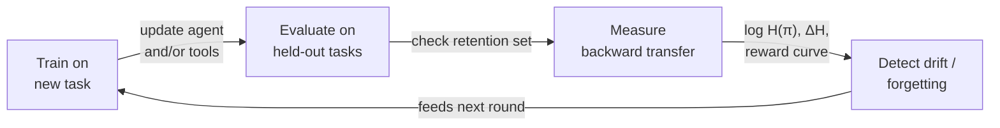

# Evaluating how adaptation happens, not just where it ends up

Section 7.2's metrics describe a system at a single point in time. But most
evaluations report only **endpoint** numbers — final success rate, pass@k, EM,
average return — and endpoint numbers erase the *process* by which an agent or
tool got there. Section 7.3 argues this is the central methodological gap in
current agentic evaluation: phenomena like abrupt phase transitions,
reward-likelihood divergence, tool-use drift, and reward-hacking episodes are
**dynamical** — invisible to any single-point measurement. Two systems can land
on the same endpoint score while differing sharply in stability, data
requirements, and safety trajectory along the way.

The signal type from Section 7.2 also shapes what's *observable*: verifiable
execution metrics (A1/T1) give dense, per-step feedback and smooth learning
curves; holistic utility metrics (A2/T2) give sparse, per-episode signals that
can mask intermediate instability. Section 7.3 organizes dynamics-aware
evaluation along three axes: **efficiency**, **generalization**, and
**stability**.

## 7.3.1 Sample and interaction efficiency

The basic question: how much data, compute, and interaction does a method need
to reach a target performance? In agentic settings each "sample" can mean
multiple tool calls and thousands of tokens, so this isn't a minor detail.

**Data efficiency** depends on the interaction between paradigm, signal
density, and task — not on the paradigm alone:

- **T2 vs. A2 (retrieval)** — S3 (T2) reaches accuracy comparable to Search-R1
  (A2) with roughly **70× fewer** training examples, because the T2 subagent
  only has to learn one narrow procedural skill.
- **A1 (code)** — RLEF trains efficiently *because* dense per-test-case
  execution rewards give rich per-step feedback. Here A1 beats A2 — the
  *opposite* ranking from the retrieval case above.
- **A1 (multi-tool)** — Self-Challenging Agents get a 2× improvement by
  generating their *own* training curriculum, showing that how data is
  generated can matter as much as how much there is.

**Interaction efficiency** looks at tool calls, API requests, or browsing steps
per episode. Smaller models can win under tight time budgets by making more,
cheaper tool calls; larger models can win in high-latency settings by making
fewer, higher-quality ones. Evaluations should report the *distribution* of
interaction counts (mean, variance, tail) — high variance can itself signal
unstable exploration.

**Compute efficiency** spans training-time cost (tokens, wall-clock GPU hours)
and inference-time cost (tokens per task at deployment) — and for agentic
systems, test-time compute (how long to reason, how many retrieval rounds) is
itself a *learned* behavior, so the two are entangled. Fair comparison needs
accuracy-vs-compute Pareto frontiers, not single numbers. T2 sits at one
extreme — AgentFlow trains only a 7B planner yet reaches 33.1% on GAIA,
beating GPT-4. A1 occupies a different region: DeepRetrieval is cheap because
of dense rewards but optimizes a single skill; Orion shows effective multi-step
search is learnable with compact 350M–1.2B models. A2, which updates the whole
agent, is the most expensive but offers the broadest capability gains.

## 7.3.2 Generalization and robustness

Adaptation only pays off if it survives contact with data the method never saw.

**Cross-task generalization** shows paradigm-dependent transfer. In retrieval,
S3 (T2) trained on general QA hits 76.6% on specialized medical QA versus
71.8% for Search-R1 (A2) — evidence that T2's frozen-agent design preserves
broad reasoning. In multi-tool settings, Agent-R's MCTS-based self-reflection
improves performance by 5.6% across diverse environments — A2-style strategic
learning *can* transfer when the training signal captures high-level reasoning
patterns. The flip side: A1 methods that optimize narrow tool-use mechanics
(e.g., query reformulation for one retrieval interface) risk overfitting to
that interface — the specialization/generalization trade-off from earlier in
the survey, showing up again in the eval data.

**Cross-agent generalization (T1/T2)** asks whether a tool adapted under one
frozen agent still helps a *different* agent. S3's trained searcher improves
both Qwen2.5-14B and Claude as frozen generators — preliminary evidence of
partial transfer — but systematic studies varying model family, size, and
instruction-tuning remain rare, despite being critical for modular system
design.

**Robustness to distribution shift** covers adversarial/OOD queries, degraded
tools (noisy retrieval, flaky APIs), and environment non-stationarity (changed
web layouts, updated codebases). The Tool Decathlon's 32 applications with
realistic initial states is an early step here for text-based agents.

**Multimodal and multi-agent robustness** is a flagged gap. Multimodal
benchmarks (VisualWebArena, OSWorld) introduce modality-specific shift — UI
redesigns, resolution changes — that text-only robustness checks miss
entirely. Multi-agent systems add their own failure modes: one agent's
adaptation can change the effective environment for the others (inter-agent
distribution shift), plus communication-protocol fragility and emergent
coordination failures. Current suites largely lack benchmarks that vary both
modality *and* interaction structure together.

## 7.3.3 Continual and co-adaptation stability

Real systems adapt continuously as tasks, tools, and users evolve — which opens
a third class of evaluation problem beyond a single training run.

**Catastrophic forgetting.** When an agent adapts to a new task, it can lose
performance on tasks it previously mastered. The standard protocol: keep a
held-out **retention set** of previously solved tasks and track performance on
it throughout adaptation, reporting *backward transfer* alongside forward gains.
The paradigm matters here too — RL-based adaptation can forget less than SFT
under some conditions, and T2's frozen-core design *structurally* avoids
forgetting in the agent itself.

**Co-adaptation stability — an open problem.** When the agent *and* its tools
adapt simultaneously, the system can become non-stationary: the agent adapts to
a tool that is itself still changing, which can produce oscillation, divergence,
or a degenerate equilibrium. No existing work has systematically measured this
in agent-tool systems — it's well-studied in multi-agent RL but not yet
formalized here. The survey proposes candidate metrics as a research agenda, not
established practice: (i) variance of the joint performance trajectory over a
sliding window, (ii) frequency of sign changes in the performance gradient, and
(iii) convergence rate to a stable equilibrium.

**Entropy dynamics as a diagnostic.** Policy entropy has emerged as a leading
indicator of training health. One line of work documents a consistent
*early-stage entropy collapse* — most performance gains coincide with rapid
entropy depletion, implying a predictable ceiling once entropy runs out.
Another argues the more telling quantity is the **change** in entropy per
update (ΔH), which naive interventions can amplify. A comprehensive toolkit
logs both H(π) (breadth of current exploration) and ΔH = H(π_{t+1}) − H(π_t)
(per-update change), alongside reward-curve shape (smooth vs. sudden jumps),
tool-call frequency/diversity (mode collapse in tool use), and KL divergence
from the reference policy (excessive drift). Rapid entropy depletion signals
premature convergence; large |ΔH| swings signal instability.

## The continual-adaptation lifecycle

Each loop through this cycle is where forgetting, drift, and co-adaptation
instability would show up — and where a single endpoint score would stay
silent.
