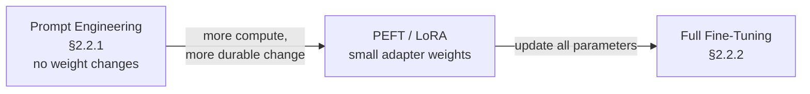

# From prompts to fine-tuning: the adaptation spectrum

Section 2.2 splits adaptation into two broad families: **prompt-based**
adaptation, which never touches model weights, and **fine-tuning-based**
adaptation, which does. They sit on a spectrum of cost, reversibility, and
depth of change.

## Prompt engineering: adaptation without training (§2.2.1)

A **prompt** is the input context handed to the agent's core model —
instructions, examples, task descriptions, constraints. Prompt engineering
adapts behavior purely by changing *what's in that context*: no parameter
updates, no training run.

This makes it the cheapest and most transferable form of adaptation — the same
underlying model can be repointed at a new goal or environment just by
rewriting its instructions. Multi-agent frameworks like CAMEL, AutoGen,
MetaGPT, and ChatDev lean heavily on this: each agent's "role" and behavior is
largely defined through carefully composed prompts, not separate fine-tuned
checkpoints.

The trade-off: prompt engineering can't change what the model fundamentally
*can't* do. If the base model lacks a capability — say, reliably following a
30-step tool-use procedure — no amount of prompt rewriting will reliably
produce it. That's where fine-tuning comes in.

## Fine-tuning: adapting the model itself (§2.2.2)

**Fine-tuning** updates the core model's internal parameters using
task-specific data, shifting its output distribution toward
domain-appropriate behavior. It comes in two granularities:

- **Full fine-tuning** updates *all* of the model's parameters. Maximum
  flexibility — the model can change in any direction the data pushes it — but
  it's expensive: you're optimizing every weight in a (often) billion-parameter
  model.
- **Parameter-efficient fine-tuning (PEFT)**, of which **LoRA** (low-rank
  adaptation) is the canonical example, updates only a small added subset of
  parameters — typically under 1% of the model's total weight count — while
  leaving the rest frozen. The headline result: LoRA "typically matches full
  fine-tuning quality while updating less than 1% of parameters" (Section
  2.2.2), which is why it's the default choice for adapting large agentic
  systems.

## Three training paradigms within fine-tuning

Within fine-tuning, the survey distinguishes three major paradigms by *what
kind of supervision* drives the parameter update. These three reappear
throughout the rest of the paper as the concrete mechanisms behind A1/A2
(agent adaptation):

| Paradigm | What it optimizes for | Signal needed |
|---|---|---|
| **SFT** (Supervised Fine-Tuning) | Imitate curated demonstrations | Labeled input→output pairs |
| **DPO** (Direct Preference Optimization) and extensions | Align with preference judgments | Pairs of (preferred, dispreferred) outputs |
| **RL** — PPO, GRPO | Maximize a reward from interaction | A scalar reward signal, often from execution |

- **SFT** performs imitation learning / behavior cloning on a dataset of
  demonstrations: given input *x*, learn to produce the reference output
  *a\**. It's the most data-efficient *per example* but requires that
  high-quality reference trajectories already exist.
- **Preference optimization (DPO and extensions)** aligns the model with
  human or automated preference signals — given two candidate outputs, learn
  to prefer the better one. No need for a single "correct" answer, just a
  *comparison*.
- **Reinforcement learning (PPO, GRPO)** optimizes behavior through
  environment interaction: the agent acts, the environment (or a reward
  function) scores the outcome, and the policy is updated to increase expected
  reward. RL methods need only a reward signal — no labeled demonstrations —
  but are harder to stabilize than SFT. **GRPO** (Group Relative Policy
  Optimization) and **PPO** (Proximal Policy Optimization) are the two RL
  algorithms the survey repeatedly references for **RLVR** (reinforcement
  learning with verifiable rewards) — RL where the reward comes from something
  checkable, like a unit test passing or a retrieval metric.

## Why this matters for the four-paradigm framework

Notice the shape of the spectrum: prompt engineering changes *behavior without
changing weights*; SFT/DPO/RL change *weights*. The four-paradigm framework in
the next lesson is built almost entirely on top of SFT and RL — A1 and A2 are
both defined as "optimize the agent via SFT or RL," differing only in *where
the supervision/reward comes from*. Keep the SFT-vs-RL distinction from this
lesson in mind: it's the mechanism; A1/A2/T1/T2 is about the *signal source*
that feeds that mechanism.
