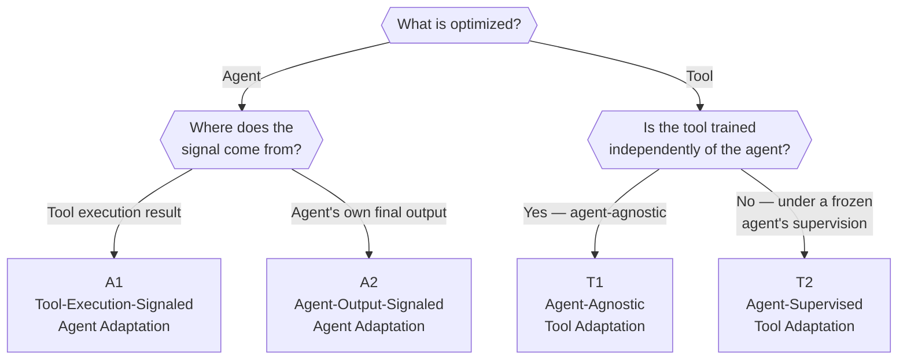

# The four-paradigm framework

Section 3 formalizes everything Lesson 1 sketched. It starts with a small,
deliberately minimal vocabulary (Section 3.1), then uses it to define four
adaptation paradigms (Section 3.2) via one decision procedure.

## Mathematical notation (§3.1)

Three categories of symbols, each answering a different question:

**Adaptation targets — *what* can be adapted:**

- **Agent (A)** — the foundation model serving as the system's reasoning and
  decision-making core, parameterized by θ. Adapting *A* means updating its
  parameters, refining its prompts, or otherwise changing its policy.
- **Tool (T)** — every external callable component beyond the agent's own
  parameters: retrievers, planners, executors, simulators, specialized models.
  Importantly, the survey **treats external memory modules as part of T**
  whenever they're dynamic, updatable stores that learn from the agent's
  outputs — memory is a *tool* in this framework, not a separate category.

**Adaptation data sources — *where the signal comes from*:**

- **Offline Data (D)** — pre-collected demonstrations, synthetic trajectories,
  or interaction logs used as supervision.
- **Environment (E)** — the live setting the agent or tool interacts with,
  providing online feedback about task performance.

**Adaptation objective:**

- **Objective function O(·)** — quantifies how well the agent-tool system is
  doing, under whatever evaluation protocol applies. When the signal comes
  from offline data, *O* often looks like an SFT/imitation loss; when it comes
  from the environment, *O* is typically an outcome-based metric like task
  success rate.

## The classification rule (§3.2)

Every adaptation method gets sorted by **two sequential questions** — this is
the survey's Figure 3 as a decision tree:

Walking each leaf:

### A1 — Tool Execution Signaled Agent Adaptation (§3.2.1)

The agent *A* generates a tool call *a* from input *x*; tool *T* executes it
and returns result *y*. The interaction is just:

> x → (A produces) a → (T produces) y

A1 optimizes *A* so that the **tool's execution outcome** is as good as
possible — formally `A* = arg max_A O_tool(A, T)`. The objective `O_tool` only
ever looks at *y*: things like a code sandbox's pass rate, or a retriever's
recall/nDCG. Two mechanisms instantiate this: **SFT** on `(x, a*)` pairs where
*a\** is a known-good action (imitating successful tool calls), or **RL**
where the agent interacts live and receives reward `R = O_tool(y)`.

### A2 — Agent Output Signaled Agent Adaptation (§3.2.2)

Same start, but the agent takes one more step: after seeing the tool result
*y*, it produces a **final output** *o*.

> x → (A produces) a → (T produces) y → (A produces) o, where o = A(x, a, y)

A2 optimizes *A* so that **this final output** is good — `A* = arg max_A
O_agent(A, T)`, where `O_agent` evaluates *o* (final-answer correctness, a
preference score, etc.), not *y* directly. Note A2 *includes* the case where
the agent never calls a tool at all — then *o* is produced directly from *x*.
For SFT, naively supervising only `o*` doesn't teach tool-use behavior (the
model could improve its final answer without ever learning to call tools well)
— so effective A2 SFT combines an A1-style tool-call term with the A2-style
final-answer term. For RL, the reward is `R = O_agent(o)` — scored only on the
final output, regardless of how many tool calls happened along the way.

### T1 — Agent-Agnostic Tool Adaptation (§3.2.3)

Now the **agent is frozen**. T1 arises when the agent is a closed-source API
(GPT, Claude, Gemini — can't be fine-tuned) or when you simply want to improve
a reusable component independent of any one agent. T1 optimizes the tool
*alone* — `T* = arg max_T O_tool(T)` — using whatever standard training
paradigm fits (supervised learning, contrastive learning, RL on the tool's own
metric). The defining property: **the tool's training doesn't reference the
agent at all.** A retriever trained on a generic relevance benchmark, with no
agent in the loop, is T1.

### T2 — Agent-Supervised Tool Adaptation (§3.2.4)

Also a frozen agent — but now the tool is adapted **using signals derived from
that agent's outputs**. The interaction extends to the full loop:

> x → a → y → o, where o = A(x, a, y)

T2 optimizes the tool toward `T* = arg max_T O_agent(A, T)` — note this is the
*same* objective family as A2, but now *T* is the thing being updated, not
*A*. Two supervised forms the survey calls out: **quality-weighted training**
(weight each tool-training example by a quality score `w = ω(o)` derived from
the agent's output — in the binary case this becomes simple data selection)
and **output-consistency training** (derive a target `τ = φ(a, y, o)` for the
tool from how *y* relates to *o*, training the tool to produce outputs more
aligned with what helped the agent). T2 also has an RL form: reward `R =
O_agent(o)` updates the tool's parameters directly.

## The pattern across all four

| | Agent adapted | Tool adapted |
|---|---|---|
| **Signal from tool execution (y)** | **A1** | — |
| **Signal from agent output (o)** | **A2** | **T2** |
| **Tool trained agent-agnostically** | — | **T1** |

A1 is the odd one out: it's the only paradigm whose objective looks *only* at
*y*, never at a final agent output *o*. Everything else either evaluates *o*
(A2, T2) or doesn't involve the agent's interaction loop at all (T1). The
practice problem below turns this table into code.
