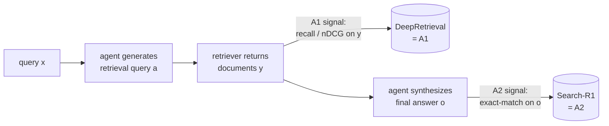

# Worked contrasts: RAG and code execution under A1 vs A2

Section 3.3 makes the four-paradigm framework concrete with paired real
systems — same tool-call action, different paradigm, because the
*optimization signal* differs. Two settings, each with an A1/A2 pair sharing
one tool-call action: **retrieval** (RAG) and **code execution**.

## RAG setting: retrieval as the shared action

In RAG, the agent produces a retrieval query *a*; the retriever returns
documents *y*; the agent synthesizes *y* with the original query into a final
answer *o*. Both examples below share this exact action — querying a
retriever — but differ in *where the optimization signal is read*.

- **DeepRetrieval = A1.** After the agent issues query *a* and the retriever
  returns documents *y*, DeepRetrieval computes retrieval-quality metrics
  (recall, nDCG) **directly from y** and uses that as the reward to update the
  agent. The signal never looks past the retrieval step — purely
  tool-execution-signaled. Classic A1.
- **Search-R1 = A2.** Same retrieval action, but Search-R1 runs the full
  pipeline through to a final answer *o*, and computes the reward from **exact
  match accuracy of o**. The retrieval step itself gets no direct gradient —
  the agent must discover good retrieval strategies only as a *side effect* of
  optimizing for the final answer.

**The contrast**, in the survey's own framing: DeepRetrieval (A1) "directly
optimizes retrieval quality but provides no gradient signal for answer
synthesis," while Search-R1 (A2) "optimizes end-to-end answer correctness but
must discover good retrieval strategies as a side effect, making credit
assignment harder" (Section 3.3.1). Neither is strictly better — A1 gives a
sharper signal for the *specific behavior* it targets (retrieval); A2 gives a
signal aligned with what users actually care about (the final answer) but
spreads that signal thinly across every intermediate step.

## Code-execution setting: the sandbox as the shared action

Same structure, different tool: the agent produces executable code as the
tool-call action *a*; a sandbox executes it and returns result *y* (e.g.,
test-case pass rate); the agent may use *y* to produce a final answer *o*.

- **DeepSeek-R1 (code) = A1.** During RL, DeepSeek-R1 generates code that runs
  in a sandbox, and — when the reward comes solely from **test-case pass
  rate**, computed directly from *y* — that's A1. The agent gets one reward
  per code invocation, tied tightly to whether *that code* worked.
- **ReTool = A2.** ReTool also generates executable code, but the sandbox
  result *y* is fed back into the agent's context, and the agent produces a
  final answer *o* whose correctness determines the reward. The signal depends
  only on *o*, after the agent has integrated the tool's feedback.

**The contrast**: DeepSeek-R1's A1 formulation "ties the reward to test-case
pass rates, giving the agent a precise signal per code invocation," while
ReTool's A2 formulation "rewards only the final answer, so the model must
learn *when* to invoke the code sandbox — a richer but noisier learning
problem" (Section 3.3.1). Same tension as the RAG pair: precision-per-step
(A1) versus alignment-with-the-real-objective-but-noisier (A2).

## The T2 example in the RAG setting

Section 3.3.2 closes the loop with a **tool adaptation** example in the same
RAG setting. The motivating scenario: the central agent is a closed-source API
model (GPT, Claude, Gemini) that **cannot be fine-tuned** — so A1/A2-style
agent adaptation is off the table by construction. The remaining lever is the
*tool* — here, the retriever or reranker that feeds the frozen agent.

This is T2 by the rule from Lesson 3: the agent stays frozen, but the
retrieval tool is adapted **using a signal derived from the frozen agent's
output**. Concretely, this looks like the T2 mechanisms from Lesson 3 applied
to retrieval — e.g., quality-weighted training, where the frozen agent's final
answer quality `w = ω(o)` is used to weight which retrieved-document
trajectories the retriever is trained on, so the retriever learns to surface
documents that *this specific frozen agent* converts into better final
answers. Compare this to T1: a retriever trained on a generic relevance
benchmark with no agent in the loop would be T1, even if it's later plugged
into the same agent. What makes this example T2 is specifically that the
**training signal for the retriever passes through the frozen agent's output**.

## The shape of the comparison

Putting all three examples side by side:

| System | Tool-call action | Signal source | Paradigm |
|---|---|---|---|
| DeepRetrieval | retrieval query | recall/nDCG on retrieved docs *y* | **A1** |
| Search-R1 | retrieval query | exact-match on final answer *o* | **A2** |
| DeepSeek-R1 (code) | code execution | test-case pass rate on *y* | **A1** |
| ReTool | code execution | correctness of final answer *o* | **A2** |
| T2 retriever (closed-agent RAG) | retrieval query | frozen agent's output quality *o*, used to train the retriever | **T2** |

Every row answers the same two questions from Lesson 3 — *what's being
optimized* (the agent, in the first four rows; the retriever, in the last) and
*where the signal comes from* (tool execution *y*, vs. agent output *o*). The
next step (a scenario) gives you a new system description and asks you to run
this same classification yourself.
