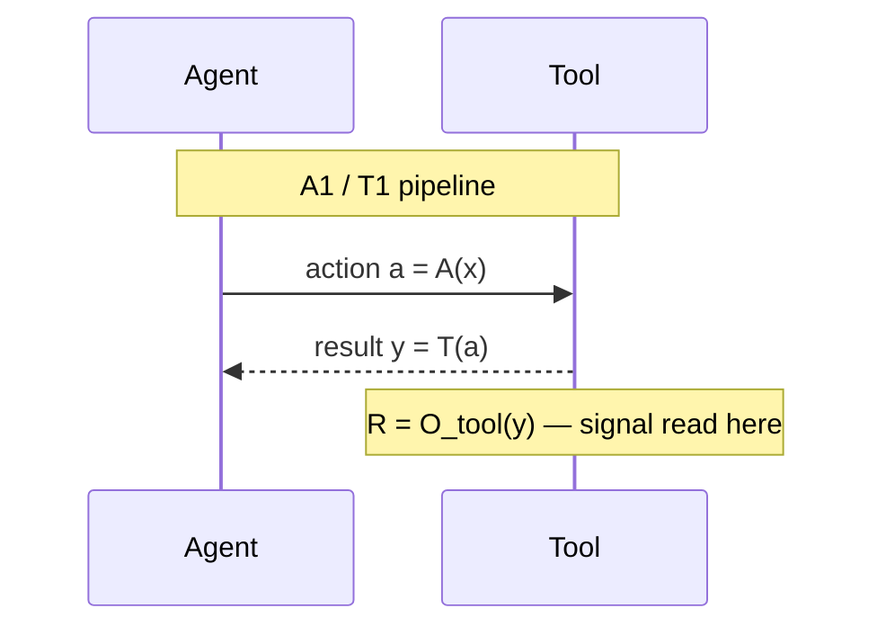
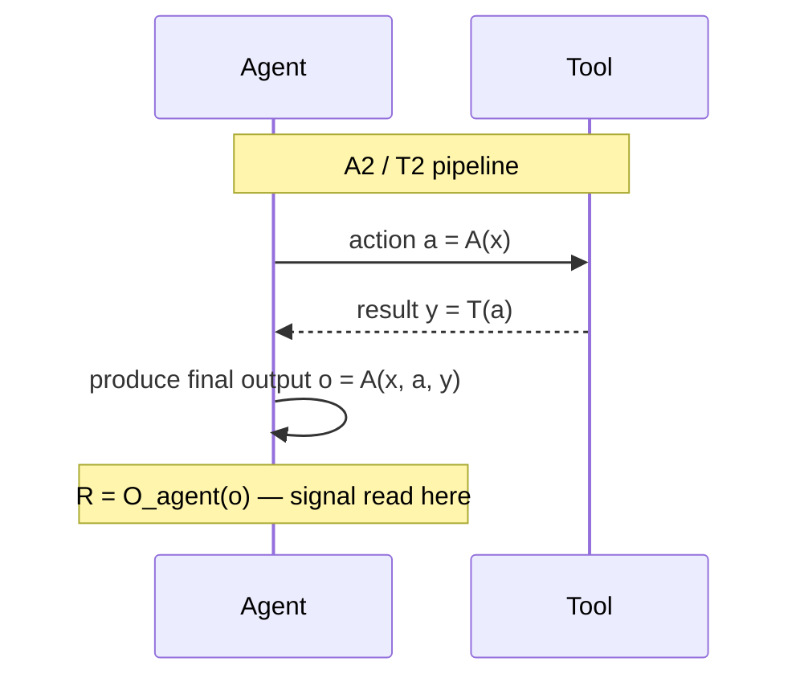
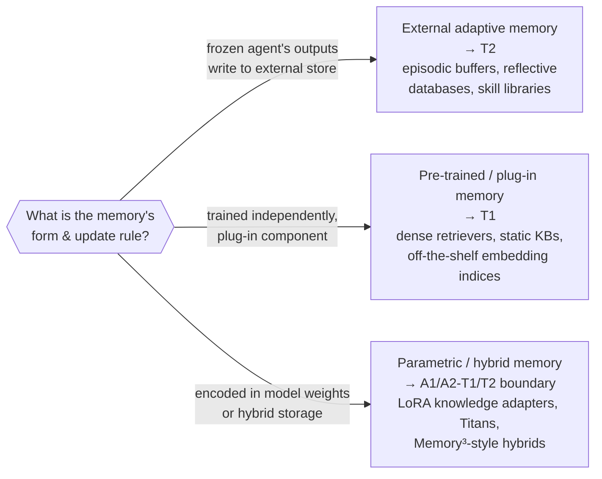

# Interaction pipelines, and where memory lives

Lesson 3 gave you the classification rule. This lesson focuses on two things
that tie the four paradigms together: the **shape of the interaction
pipeline** each one runs, and the survey's careful answer to "so which
paradigm does *memory* belong to?"

## Two pipeline shapes, one signal-readout point

Look back at the four definitions and a pattern jumps out: A1 and T1 run a
**shorter** pipeline than A2 and T2.

- **A1 / T1-style**: `x → a → y`. The agent produces an action, the tool
  executes it, and the optimization signal *R* is read directly off *y* — the
  tool's execution result. (T1 doesn't even need the agent in the loop for its
  *own* training, but the shape of "input → action → tool result" is the same.)
- **A2 / T2-style**: `x → a → y → o`. There's one more hop: the agent takes
  the tool's result *y* and produces a final output *o*. The optimization
  signal *R* is read off *o*, not *y*.

The two diagrams are almost the same — same agent, same tool, same first
hop — but the **point where the reward is read off** differs by exactly one
step. That single difference is the entire distinction between "tool execution
signaled" and "agent output signaled" adaptation. It's why A1 gives the agent
a precise, per-call signal (did *this specific tool call* work?) while A2 gives
a coarser, end-to-end signal (was the *whole episode's answer* right?) — A2
must implicitly solve credit assignment back through every intermediate tool
call.

## Where does memory fit?

Recall from Lesson 1 that memory modules are treated as part of *T* whenever
they're dynamic and updatable. But "memory" covers a wide range of designs —
from a LoRA adapter that injects facts into the model's weights, to an
external vector database the agent queries and writes to. The survey resolves
this with three cases, based on a memory system's **form and update
mechanism** (Section 3.2, "Memory and the Adaptation Paradigms"):

- **External adaptive memory → T2.** When a frozen agent's outputs drive
  updates to an external store — `M ← Update(M, o)` — that's the T2 pattern
  exactly: the agent stays fixed, the signal comes from its own output, and
  the *tool* (here, the memory store) evolves. Episodic buffers, reflective
  databases, and skill libraries that grow from an agent's experience fall
  here. This is the survey's *default* classification for adaptive memory.
- **Pre-trained or plug-in memory → T1.** A dense retriever trained on a
  generic corpus, a static knowledge base, an off-the-shelf embedding index —
  none of these were trained with reference to any particular agent's outputs.
  They're agent-agnostic plug-in tools, so they're T1, exactly like any other
  pre-trained module.
- **Parametric and hybrid memory → boundary cases.** Some memory designs
  store information *inside* model parameters — a LoRA adapter added for
  knowledge injection, a differentiable memory module like Titans, or a hybrid
  architecture (e.g., Memory³) mixing parametric and external storage. These
  blur the Tool/Agent line. The rule of thumb: if updating the memory requires
  **gradient-based changes to the agent's own core parameters**, classify it
  as A1/A2 (it's agent adaptation). If only an **auxiliary parameter set** is
  updated while the core agent stays frozen, it sits at the T1/T2 boundary.

The big takeaway: "memory" is not its own paradigm. It's a *tool*, and like any
tool, which paradigm it belongs to depends entirely on **who updates it and
from what signal** — the same two questions from Lesson 3's decision tree,
just applied to a memory store instead of a retriever or a subagent.
