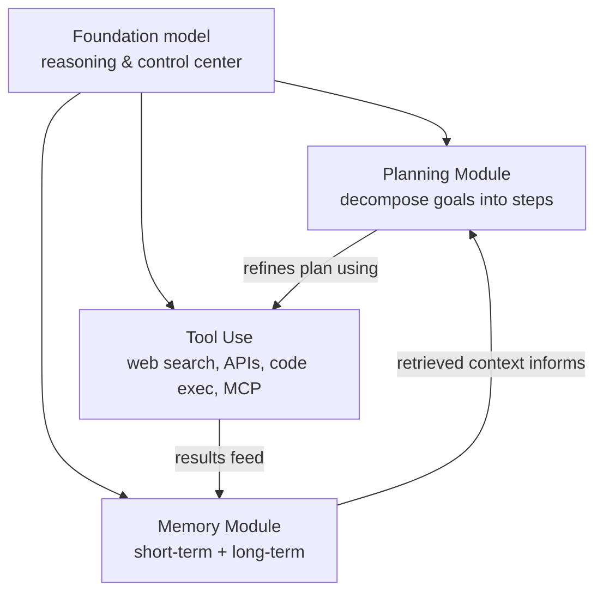

# Why adapt an agent at all?

Foundation models are now good enough to drive agents that perceive, plan, call
tools, and manage memory across long-horizon tasks. But "good enough at
pretraining time" is not the same as "good at *this* task, in *this*
environment, with *these* tools." Even the strongest models still show
unreliable tool use, shallow planning over many steps, and weak generalization
to environments they've never interacted with.

This survey calls the fix **adaptation**: improving an agent, its tools, or
their interaction *after* pretraining. Three mechanisms drive it (Section 1):

- **Post-training** — supervised fine-tuning, preference optimization, and
  reinforcement learning with verifiable rewards, all of which change the
  agent's *parameters*.
- **Memory** — episodic buffers, reflective databases, and knowledge graphs
  that let an agent retain and reuse experience *without* retraining.
- **Skills** — reusable units of procedural knowledge ("how to do X") that
  accumulate either inside the model (via post-training) or in external skill
  libraries the agent can discover and invoke.

These three mechanisms aren't separate topics — they're different ways of
answering the same question: *where does the improvement live, and how does it
get there?*

## The two axes of the framework

The survey's organizing move is a **four-paradigm framework** built from two
yes/no questions about *any* adaptation method:

1. **What is being optimized — the agent, or the tool?** Agent adaptation
   changes the foundation model's parameters or policy. Tool adaptation leaves
   the agent frozen and changes something *external* to it (a retriever,
   reranker, planner, memory store, or subagent).
2. **How does the adaptation signal arise — from tool execution, or from an
   evaluation of output?** Some methods get their training signal the moment a
   tool runs (a sandbox returns a pass/fail, a retriever returns a relevance
   score). Others wait until something — the agent's final answer, or a
   downstream evaluation — is scored.

Crossing these two axes gives four paradigms: **A1**, **A2** (agent
adaptation, split by signal source) and **T1**, **T2** (tool adaptation, split
by whether the tool is trained independently or under a frozen agent's
supervision). Lesson 3 works through exactly how each cell of this 2×2 is
defined — for now, just hold onto the idea that *"what's optimized"* and
*"where the signal comes from"* are the two questions that classify almost
every adaptation method in the literature.

## Trade-offs that follow from the framework

Once you know which paradigm a method falls into, several practical trade-offs
follow almost automatically (Section 1):

- **Cost and flexibility.** Agent adaptation (A1/A2) means training
  billion-parameter models — expensive, but it can reshape the agent's
  behavior broadly. Tool adaptation (T1/T2) is cheaper because the tool is
  usually much smaller, but it's bounded by what the *frozen* agent can already
  do with a better tool.
- **Generalization.** Tools trained independently of any one agent (T1), on
  broad data, tend to transfer well across agents and tasks. Agents fine-tuned
  for one environment (A1) risk overfitting to it.
- **Modularity.** Tool adaptation (T2 especially) lets you swap or upgrade a
  tool without retraining the agent at all. Agent adaptation risks
  **catastrophic forgetting** — fixing one task can degrade performance on
  others.

## Anatomy of an agentic AI system

To make "agent" and "tool" concrete, Section 2.1 describes what an agentic AI
system is built from. At the core sits a **foundation model** — typically an
LLM or multimodal model — serving as the system's reasoning and control center.
Around it sit three components that extend its autonomy:

**Planning Module.** Decomposes a goal into actionable steps. *Static
planning* — Chain-of-Thought, Tree-of-Thought — explores one or many reasoning
paths without looking back at the environment. *Dynamic planning* — ReAct,
Reflexion — interleaves planning with feedback from the environment or from
past actions, so the agent can revise its plan mid-task. The distinction
matters for adaptation: dynamic planning is what makes execution feedback
(A1-style signals) available in the first place.

**Tool Use.** Lets the agent reach beyond its own parameters — web search,
APIs, code execution sandboxes, Model Context Protocol (MCP) servers, browser
automation. Crucially, *which* tool to call and *how to read* its output are
themselves adaptation surfaces: an agent can be trained to get better at tool
selection and result interpretation, independent of its general reasoning
ability.

**Memory Module.** Lets the agent retain and reuse information across time.
*Short-term memory* holds context generated during the current task (the
conversation so far, intermediate results). *Long-term memory* persists across
sessions — accumulated experience, learned facts, reusable procedures. Many
systems use **retrieval-augmented generation (RAG)** to pull relevant items out
of long-term memory and fold them into the agent's working context. As
"Lesson 4" of this module will show, *how* a memory store gets updated — by
whom, and using what signal — is exactly what determines which adaptation
paradigm it falls under.

Together, these three components (planning, tools, memory) plus the
foundation model are *what* adaptation acts on. The next lesson covers *how* —
the spectrum from prompt engineering to full fine-tuning.
