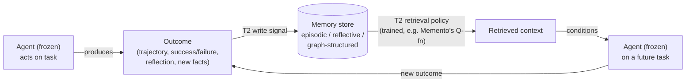

# Agentic memory as a T2-trained tool

An agent's memory system can itself be framed as an adaptive tool — and which
paradigm it falls under depends on its form and update mechanism (recall §3's
discussion): **external non-parametric stores updated by a frozen agent's
outputs are predominantly T2**; pre-trained/plug-in memory modules are T1; and
parametric or hybrid architectures sit on the boundary. Most systems in this
lesson are T2 — the frozen agent's downstream task performance becomes the
supervisory signal for *how the memory writes, retrieves, reflects, and forgets*.

## A map of the memory design space

Several complementary surveys carve up this space along different axes. Hu et
al.'s **forms / functions / dynamics** framework is the most useful one to hold
onto:

- **Forms** — where information lives: token-level, parametric, or latent memory.
- **Functions** — what kind of information: *factual* (knowledge of users/
  environments), *experiential* (accumulated interaction outcomes), or *working*
  (active context management).
- **Dynamics** — the lifecycle: formation, evolution, retrieval.

Within the *experiential* function, Hu et al. identify three abstraction levels
that map directly onto T1/T2:

| Abstraction level | What's stored | Paradigm |
|---|---|---|
| Case-based memory | raw trajectories | T2 (frozen agent's success/failure decides retention) |
| Strategy-based memory | distilled workflows, heuristics | T2 |
| Skill-based memory | executable code, APIs, MCP protocols | bridges T2 (curated by agent feedback) and T1 (pre-trained tool APIs) |

The **CoALA** framework (Sumers et al.) offers a complementary, more classical
decomposition — working memory (active context), episodic memory (records of
past interactions), semantic memory (general knowledge), procedural memory
(learned action routines) — and clarifies that "each memory type can be
independently adapted under frozen-agent supervision."

## Three families of dynamic memory stores

Foundational T2 memory architectures cluster by *how they organize stored
information*:

- **Hierarchical / OS-inspired** (MemGPT, Memory OS): explicit tiers — working
  memory vs. long-term storage — with page-eviction or garbage-collection
  policies.
- **Reflection-based** (Generative Agents, A-MEM): the agent's own outputs decide
  what to consolidate and when.
- **Graph/structured** (HippoRAG, SHIMI): memories indexed by relational or
  semantic structure rather than recency.

**MemGPT** formalizes the OS metaphor literally: a limited main-context window is
"RAM," an unbounded external store is "disk," and the agent issues explicit
read/write operations between tiers with a page-eviction policy deciding what
stays active. **Generative Agents** maintain a memory *stream* of natural-language
observations, periodically consolidated by the agent's own reflections into
higher-level abstractions — a two-tier store (observations + reflections)
supporting day-long planning horizons. **A-MEM** goes further: the LLM itself
decides how to organize the store, dynamically creating, linking, and
restructuring entries based on content relevance — no fixed indexing scheme at
all.

**HippoRAG** draws on hippocampal memory indexing from neuroscience: a
neocortical component (an LLM encoding passages into a knowledge graph) is paired
with a hippocampal index (a retrieval module performing pattern completion over
the graph) — enabling associative retrieval across passages with *no lexical
overlap*, a big win on multi-hop QA. **SHIMI** decentralizes this for multi-agent
settings: each agent keeps a local memory shard organized by semantic similarity,
with a coordination protocol enabling cross-agent retrieval without a central
store.

## Experiential and reflective memory: learning from your own trajectory

A major line of T2-aligned work lets a frozen agent *store, reflect on, and learn
from its own output* — converting outcomes into a curriculum of strategies
without touching model weights.

**Reflexion** pioneered **verbal reinforcement learning**: after each attempt, the
frozen agent generates a natural-language self-critique appended to an episodic
memory buffer, and subsequent attempts condition on these reflections — turning
scalar rewards into rich textual feedback, reaching 91% pass@1 on HumanEval.
**Retroformer** separates this further: a *dedicated* retrospective model
generates targeted feedback for the frozen actor, splitting "what went wrong"
analysis from "try again" generation. **Think-in-Memory** introduces a
recall-then-post-think pipeline — retrieve relevant historical thoughts, then
recombine and adapt them to the current context, preserving long-term coherence
without expanding the context window.

**Agent Workflow Memory (AWM)** extracts reusable *workflows* (structured action
sequences) from past successful trajectories, retrieving the most relevant
workflow as a template for new tasks — cutting planning errors on web navigation
by 24%. AWM's lesson: the unit of experiential memory doesn't have to be a raw
trajectory or a verbal reflection — a structured procedural abstraction can be a
more efficient retrieval target. (When these accumulated experiences get distilled
into reusable, *composable* capabilities, the result is a **skill library** — the
next lesson's topic.)

## Structured memory: graphs, trees, databases

Some T2 memory tools move beyond linear text into richer structures, with the
frozen agent's outputs used to *tune* that structure — adding nodes, updating
relationships, writing records. **AriGraph** builds an episodic knowledge graph
during interaction: observations are parsed into entity-relation triples and
merged into a persistent graph for later multi-hop queries. **ChatDB**
externalizes memory into a relational database, translating natural-language
outputs into SQL (`INSERT`, `SELECT`, `UPDATE`). **Zep** introduces a *temporal*
knowledge graph, modeling time as a first-class dimension — when facts were
learned, how they changed, which are current — a capability flat vector stores
lack.

## Parametric and hybrid memory

A parallel line blurs the T1/T2 boundary from the other direction. **Memory³**
introduces a three-tier hierarchy: model weights (implicit long-term memory), an
explicit pool of retrievable text chunks (semi-parametric memory), and the
context window (working memory) — with a lightweight "memory circuitry" routing
information between tiers. A 2.4B model with this external pool matches the
perplexity of a 6.4B model without it — explicit memory substituting for raw
parameter count. **Titans** incorporates a *differentiable* long-term memory
module directly into attention, updated via gradient-based learning during
inference — memory adaptation happening *inside* the model's computational
graph.

## Memento: memory as the only thing that's trained

**Memento** is the cleanest demonstration that memory alone can be the entire T2
tool. A frozen GPT-4.1 high-level planner is paired with a *trainable* episodic
case-memory module — specifically, a neural Q-function that learns a case
*retrieval policy*: which past cases to surface for a new problem. The signal is
binary task success/failure, broadcast across all case-selection decisions in a
trajectory via soft Q-learning. The frozen LLM never sees Q-values — it just
receives retrieved cases as context. Result: 87.88% on GAIA validation (1st
place), with case-based memory adding 4.7-9.6% absolute improvement on
out-of-distribution tasks. Same frozen LLM, better memory, better agent.

## The reflective-memory loop, generalized

Strip away the implementation details and every system above shares the same
T2 loop: the agent *acts*, an outcome is *observed*, that outcome *writes* to
memory (the T2-trained update), and a *future* task *reads* from that memory —
closing the loop back into the agent's behavior.

This is exactly the "agent output supervises memory update" loop from earlier in
the survey, made concrete: the *write* policy (what to store, how to structure
it) and the *read* policy (what to retrieve) are the trainable T2 components,
while the agent producing and consuming memory stays frozen throughout.

## Test-time memory curation, without any training

Not every T2 memory adaptation requires gradient updates at all. **Dynamic
Cheatsheet (DC)** provides a "persistent, evolving memory" for black-box LMs that
"operates without modifying their underlying parameters." Its **Memory Curator**
assesses the correctness and efficiency of the frozen generator's own solutions
*without ground-truth labels*, then updates the memory with concise, transferable
snippets — reusable strategies, code patterns, problem-solving insights — rather
than raw transcripts. **ReasoningBank** extends this: it distills generalizable
reasoning strategies from both successes *and* self-judged failures, extracting
"crucial preventative lessons" from what went wrong, and pairs this with
memory-aware test-time scaling, where curated memory guides a scaled exploration
that in turn forges stronger future memories.

The common thread across this entire lesson: memory's *write* and *read* policies
are tunable surfaces, and a frozen agent's own outputs — successes, failures,
self-critiques, downstream accuracy — are sufficient supervision to tune them.
