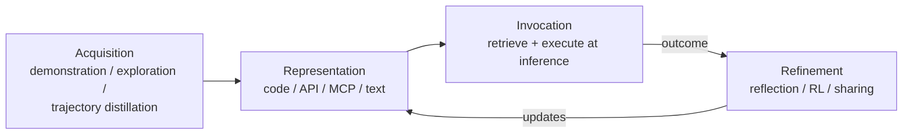

# Skill libraries: discovery, invocation, refinement

The previous lesson ended with experiential memory being "distilled into reusable,
composable capabilities" — that distillation product is a **skill library**, a
particularly important and well-studied form of T2 memory adaptation.

## Skills as procedural memory

Skills are best understood through **procedural memory**: structured, reusable
knowledge of *how* to perform a task — paralleling the classic cognitive-science
split between declarative knowledge ("knowing that") and procedural knowledge
("knowing how"). Under this framing, every skill goes through the same lifecycle:

- **Acquisition** — learning from demonstrations, exploration, or trajectory
  distillation.
- **Representation** — as executable code, API specs, MCP protocols, or textual
  procedures.
- **Invocation** — retrieval and execution at inference time.
- **Refinement** — iterative improvement through reflection, RL, or collective
  sharing.

This lifecycle maps onto the experiential-memory hierarchy from the previous
lesson: **case-based memory stores raw trajectories, strategy-based memory
distills heuristics, skill-based memory compiles executable capabilities.**
Memory provides the storage substrate; skills provide the executable content that
makes that storage actionable.

## The skill-library design space: granularity x acquisition

Table 4 organizes representative skill-library systems along two axes: **skill
granularity** (what is stored) and **acquisition mechanism** (how it's obtained).

| Granularity | Acquisition | System | What it does |
|---|---|---|---|
| Executable code | Exploration | Voyager, OS-Copilot, CRADLE | Frozen agent generates & verifies code skills |
| Executable code | RL | PAE | Proposer-Agent-Evaluator RL loop |
| Abstract heuristics | Reflection | EXPEL | Extracts rules from success & failure |
| Abstract heuristics | Demonstration | Synapse | Stores state-action exemplars |
| Full trajectories | Exploration | JARVIS-1 | Multimodal (visual+textual) indexing |
| API / MCP protocols | Exploration | SkillWeaver | Community-shared API-level skills |
| Programs (compositional) | Reflection | CASCADE, ASI | Structured programs with loops & conditionals |
| Synthesized tools | Demonstration / Reflection | LATM, CREATOR | Maker-user cost amortization |
| Specialist agents | Exploration | AgentStore | Registry + meta-controller selection |

## Code-level skills: Voyager and its lineage

**Voyager** pioneered code-level skill accumulation in Minecraft: a frozen GPT-4
agent generates executable code for each new task, and *successful* programs are
stored in a growing library indexed by natural-language descriptions. On a
related task, the agent retrieves and composes previously-verified skills instead
of reasoning from scratch — discovering 63 unique items (3.3x more than
baselines) with **no catastrophic forgetting**, because new skills are appended
without modifying existing ones.

Related Minecraft systems show what's *missing* without a skill library: **GITM**
equips a frozen LLM with text-based knowledge and memory to decompose goals into
sub-goal sequences, and **DEPS** uses a describe-explain-plan-select loop to
recover from failures by re-planning. Both maintain persistent memory of past
interactions — but neither builds a *reusable, composable* skill library, which
is precisely Voyager's distinguishing contribution.

**JARVIS-1** extends the paradigm to open-world multi-task settings: a multimodal
memory stores successful (observation, plan, action) tuples, indexed by *both*
visual similarity (CLIP embeddings) and textual similarity — enabling cross-modal
retrieval. On 200+ Minecraft tasks, JARVIS-1 substantially beats Voyager,
especially on long-horizon tasks (10+ sub-goals) where memory-guided planning cuts
compounding errors.

## Generalizing beyond games

**EXPEL** generalizes the principle outside game environments: a frozen LLM
extracts abstract "insights" (rules and heuristics) from both successful *and*
failed trajectories into a persistent experience pool — improving task success by
18% (ALFWorld) and 12% (WebShop) over non-adaptive baselines. **Synapse** combines
trajectory-level memory with state-action exemplars, letting a frozen agent select
from a demonstrated-skill library at each decision step.

**OS-Copilot** extends skill libraries to general-purpose computer use: each skill
is a Python function with a natural-language docstring; the agent searches the
library first, and if nothing fits, generates a new skill, executes it, and stores
it on success — a self-improvement loop with *no human annotation*, driven purely
by execution outcomes. **CRADLE** applies the same skill-curation idea to general
computer control, decomposing tasks into sub-goals, matching against the library,
and refining successful skills through repeated use. **AppAgent** discovers
smartphone-UI interaction patterns through trial and error and stores them as
reusable procedural knowledge — no human demonstration required.

**Agent S** introduces experience-augmented hierarchical planning with a
Manager-Worker split: the Manager decomposes tasks using retrieved experience, the
Worker executes; retrieval matches new sub-goals against the library via both
semantic similarity and structural task-graph matching. **AgentStore** addresses a
different facet entirely — integrating *heterogeneous specialist agents* as
reusable skills, with a meta-controller learning to select and compose registered
specialists, supporting dynamic registration without retraining the controller.

**ExACT** combines reflective Monte Carlo Tree Search with exploratory learning,
building a skill *tree* through exploration where each node is a discovered
interaction pattern. Zhao et al. formalize **agentic skill discovery** more
broadly: an LLM agent that autonomously identifies, abstracts, and catalogs
reusable behavioral patterns from its own interaction history — a theoretical
grounding for all the empirical systems above.

**SkillWeaver** shows web agents can autonomously discover and refine API-level
skills through exploration, encoding recurring interaction patterns as callable
functions shared across agents — a *community* mechanism where multiple agents
contribute to a collective library. **PAE** (Proposer-Agent-Evaluator) formalizes
discovery as a three-component RL loop: a Proposer generates candidate tasks, an
Agent attempts them, an Evaluator scores outcomes as RL rewards. **SAGE** pushes
further — the skill library is *part of the learning loop itself*: during
sequential rollouts, new skills accumulate and become immediately available for
later tasks in the same run, with a skill-integrated reward encouraging both
useful creation and effective reuse.

## Tool creation: synthesizing new capabilities, not just storing old ones

A related but distinct form of skill construction is **tool creation**: rather
than storing successful action *traces*, the agent synthesizes new reusable
*tools* (executable functions) that encapsulate solutions to recurring
subproblems.

**LATM** (Large Language Models as Tool Makers) formalizes a two-phase protocol:
a "tool maker" LLM creates Python functions from task demonstrations, and a
lightweight "tool user" LLM applies these functions to new instances — amortizing
the expensive maker model's cost across hundreds of reuses, cutting per-instance
cost by up to 79% on GSM8K/MATH/TabMWP while matching a single large model's
performance. **CREATOR** disentangles abstract reasoning from implementation:
first formulate an abstract plan, then create a tool implementing it, then apply
it — separating "what to do" from "how to do it" lets the agent correct tool
*implementations* via verification-and-refinement without re-deriving the
strategy.

**CASCADE** extends skill creation to computational chemistry, validating each new
skill against domain-specific correctness criteria before it enters the library
and tracking skill dependencies for compositional reuse. **ASI** takes a
programmatic approach: rather than natural-language descriptions or raw code, it
induces structured programs (with loops, conditionals, subroutine calls) that
capture compositional task structure — enabling generalization to longer horizons
and novel compositions that flat skill libraries struggle with.

## Multi-agent and meta-level skill management

**LEGOMem** introduces *modular procedural memory* for multi-agent systems: each
agent keeps a local memory of learned workflows, with a coordination layer
enabling agents to share, compose, and specialize procedural knowledge across the
team — extending the single-agent skill library to collaborative settings. At a
higher level still, **ADAS** (Automated Design of Agentic Systems) automates the
design of agent architectures themselves — an LLM iteratively proposes, evaluates,
and refines prompts, tool configurations, and control flows. ADAS is a
*second-order* skill-management process: instead of accumulating task-level
skills, it accumulates reusable **architectural patterns**.

## Skills in embodied settings

The skill-library paradigm extends to physical action sequences too. **SayCan**
grounds LLM-proposed skills in robotic affordances: a value function trained on
real robot data scores each candidate skill's probability of success, and the
product of the LLM's semantic score and the affordance score picks the next
action. **ProgPrompt** generates Python-like programs composing primitive robot
actions (grasp, place, navigate) — primitives are fixed, but composition logic is
generated dynamically. **Eureka** tackles *reward function design*: an LLM
generates candidate reward functions as code, evaluated through physics
simulation and iteratively refined — matching or beating human-designed rewards on
83% of 29 manipulation/locomotion tasks. **RoboGen** closes the loop further: the
LLM proposes tasks, generates simulation environments, and designs rewards, while
an RL agent acquires the resulting motor skills — open-ended accumulation with no
human task specification.

## The common architecture

> "These systems share a common architecture: the frozen agent generates
> experience, a curation mechanism (code verification, self-reflection, or
> success filtering) selects what to retain, and a retrieval interface makes
> accumulated skills available for future reasoning." — Section 5.2.3

Two axes of variation recur throughout: **granularity** (Voyager/OS-Copilot store
code; EXPEL stores heuristics; JARVIS-1 stores trajectories; AgentStore stores
whole specialist agents; LATM/CREATOR store synthesized tools; SkillWeaver stores
API-level functions) — trading composability against transfer breadth — and
**acquisition mechanism** (demonstration, exploration, reflection, RL). Every
system maps onto the T2 paradigm: the agent stays fixed, and the skill library
evolves entirely under agent-derived supervision.
