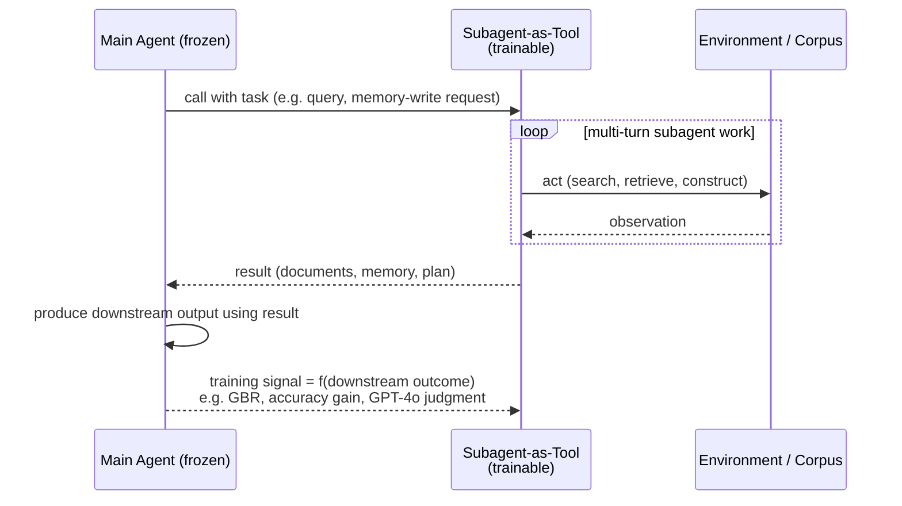

# Subagent-as-Tool: a trained subagent the main agent calls

2025 marks a transition in T2 research: from training *reactive* tools
(retrievers that respond to a single query) to training **proactive subagents**
— autonomous systems that explore, plan, orchestrate, and refine their own
behavior across multiple turns, while serving a frozen primary agent. The shift
is enabled by advances in **RLVR** (reinforcement learning with verifiable
rewards), and it applies not just to retrieval but to memory management and
workflow orchestration too.

Section 5.2.2 organizes this into four families: **agentic searchers**,
**memory-construction subagents**, **meta-cognitive planners/orchestrators**, and
**self-evolving subagents**. What unites all four: a smaller model is trained
end-to-end as a subagent, then called by a *frozen* main agent exactly the way
you'd call any other tool — except the subagent's own training reward comes from
how well the main agent does *after* using its output.

## Agentic searchers: data efficiency as the headline result

**s3** (EMNLP 2025) is the clearest demonstration that training a *tool* can be
radically cheaper than training an *agent*. It trains a lightweight 7B "searcher"
that performs multi-turn iterative search: generate a query, retrieve, decide
whether to search again or hand context to the frozen generator. The frozen
generator (Qwen2.5-14B or Claude) never updates — but it supplies the training
signal via **Gain Beyond RAG (GBR)**:

`GBR = Accuracy(G_frozen(q, D_s3), a) - Accuracy(G_frozen(q, D_naive), a)`

— how much better does the frozen generator do with the trained searcher's
documents `D_s3` versus naive top-k retrieval's `D_naive`? This focuses training
on exactly the cases where naive retrieval fails.

The headline numbers: s3 reaches 58.9% average generation accuracy using only
**2.4k training samples** — 70x less data than Search-R1 (an A2-style agent
needing ~170k examples), and 33x faster wall-clock training. On medical QA, s3
*trained on general QA* reaches 76.6% vs. 71.8% for Search-R1. The survey's
explanation: A2-style agent training must learn domain knowledge, tool-use
skills, *and* task reasoning all at once — a high-dimensional landscape. In T2,
the frozen generator already has domain knowledge and reasoning; the tool only
needs to learn the *procedural skill of effective search*.

**DynamicRAG** "agentifies" reranking the same way: an RL policy decides how many
and which documents to pass based on query difficulty, trained with imitation
learning (to bootstrap reasonable behavior) plus policy gradient RL where the
generator's output is the reward.

**QAgent** demonstrates a subtle failure mode and its fix. Stage 1 trains a 3B
search agent end-to-end, rewarding it when *its own* generated answer is correct
— but this invites **reward hacking**: the agent learns to retrieve shallow,
easily-copyable evidence rather than genuinely informative documents. Stage 2
fixes this by decoupling evaluation from generation:

`R_Stage2 = I[G_frozen(q, D_agent) = a_correct]`

— reward the searcher only when the *frozen* model can answer correctly using
its retrieved documents. This reinforces the core T2 principle stated in the
survey: "the frozen generator should not only consume a tool's outputs but also
*supervise its learning*."

## Memory-construction and meta-cognitive subagents

The same recipe extends beyond search. **Mem-α** treats long-term memory
construction itself as a T2 subagent problem: a lightweight Qwen3-4B controller
operates a three-part external memory (core summary, semantic facts, episodic
events) for a frozen backend generator. Only the memory-*writing* policy is
trained; rewards come from verifiable outcomes — QA accuracy over long horizons,
tool-call correctness, compression effectiveness. Mem-α generalizes from ~30k
token training sequences to 400k+ token contexts at inference.

**AutoGraph-R1** applies the same idea to knowledge-graph construction: an LLM
"constructor subagent" learns to build KGs from raw text, with its supervision
signal coming from the frozen agent's downstream reasoning performance
(GraphRAG) using the generated graph — prioritizing graphs that are *useful for
retrieval*, not just dense in triples.

**AI-SearchPlanner** trains a planner (Qwen2.5-7B) to generate multi-step search
strategies for a frozen generator, optimizing a combined objective:

`J = E[R_outcome + λ·R_process - α·Cost]`

where `R_outcome` is final task success, `R_process` is the *rationality of the
plan* as critiqued by the frozen generator itself, and `Cost` penalizes
over-planning. The frozen model acts as both executor and teacher — the planner
learns not just "what works" but "why it works." Varying `λ` traces a Pareto
frontier between cost and quality.

**Advisor Models** generalize this to instance-wise natural-language steering: a
small advisor model, trained via GRPO, prepends context-specific advice that
nudges a frozen foundation model's style, safety, or reasoning depth — without
touching its weights. **Matryoshka Pilot** formalizes a controller-generator loop
where a small white-box LLM controls a larger black-box LLM by emitting
decomposition steps and plans, treating the black-box model *as an environment*
and optimizing the controller with Iterative DPO — yielding ~3-7% gains that
transfer plug-and-play across different black-box backends.

**AgentFlow** decomposes an agent into modules — planner, tool executor,
verifier, solution generator — implemented mostly as *frozen* Qwen2.5-7B-Instruct
models, with **only the planner trained**. Using Flow-GRPO, a single
trajectory-level reward (correct/incorrect, judged by GPT-4o) is broadcast to all
decisions in the rollout via group-normalized advantages. A 7B AgentFlow planner
hits 57.3% on search-intensive tasks (+14.9% over AutoGen) and outperforms much
larger models on several benchmarks — learned orchestration of frozen specialists
rivaling monolithic models.

## Self-evolving subagents

A more advanced branch lets the *tools themselves* co-evolve via self-generated
tasks and rewards. **R-Zero** instantiates a Solver and a Challenger from the same
base LLM: when the Solver is frozen, its successes/failures/uncertainty define
rewards that train the Challenger to propose tasks near the Solver's capability
frontier — alternating phases in a bidirectional loop, each step still following
T2's "optimize a lightweight subagent under signals from a fixed core" principle.
**Multi-Agent Evolve (MAE)** extends this to a Proposer-Solver-Judge triad: the
Proposer and Judge are adaptive T2 subagents that shape *data, rewards, and
curricula* for the Solver, rather than tuning the Solver directly.

## The interaction pattern, end to end

Across all four families, the interaction has the same shape: the main agent
calls the subagent like any tool, the subagent does its (possibly multi-turn)
work and returns a result, the main agent produces a downstream outcome — and
*that outcome* becomes the training signal fed back to the subagent.

## Synthesis: the maturation of T2

The subagent-as-tool paradigm progressively broadens T2's scope: agentic
searchers (s3, DynamicRAG, QAgent) optimize information acquisition;
memory-construction subagents (Mem-α) curate long-horizon state; meta-cognitive
controllers (AI-SearchPlanner, Advisor Models, Matryoshka Pilot, AgentFlow)
decide how tools and specialists are deployed; self-evolving frameworks (R-Zero,
MAE) generate their own curricula and rewards. Decoupling tool training from
generator training — while letting tools adapt to each other — yields systems
that are more data-efficient, modular, and generalizable than monolithic
alternatives.

The next lesson takes this same T2 principle and applies it to a tool category
that's everywhere in production agents: memory.
