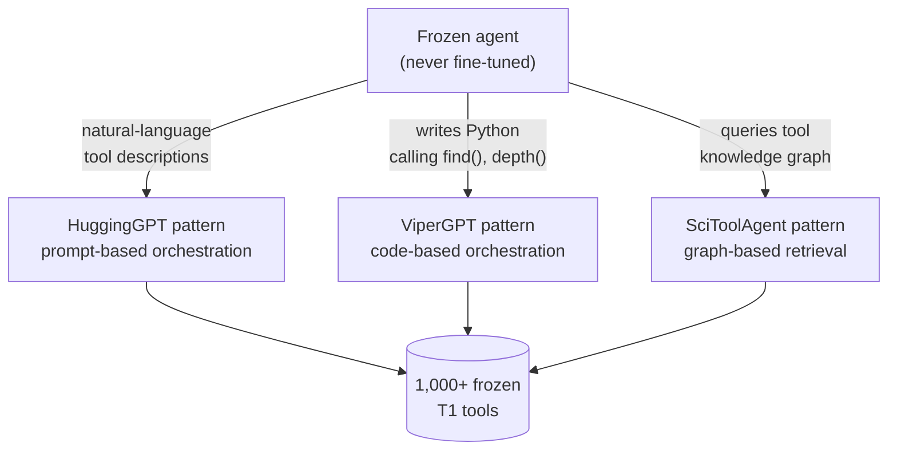

# T1: tools that don't know the agent exists

Tool adaptation flips the optimization target. Instead of changing the agent's
parameters (A1/A2), it changes the *ecosystem* the agent calls into — retrievers,
rerankers, vision encoders, planners, executors. Section 5 formalizes this with
two objectives over a tool `T`:

- **T1**: `T* = argmax_T O_tool(T)` — the tool is optimized against its own
  task-specific or environment-driven objective (retrieval accuracy, planning
  efficiency), with no reference to any particular agent.
- **T2**: `T* = argmax_T O_agent(A, T)` — the tool is optimized using signals
  *derived from a frozen agent A's* outputs.

This lesson is about T1. The defining property is independence: a T1 tool is
"trained independently on diverse data sources before deployment," and the agent
"orchestrates tool usage through prompting alone, never updating its parameters"
(§5.1). Any pre-trained model an agent can invoke — a classifier, a segmentation
model, a dense retriever — qualifies.

T1 looks simple, almost too basic to study on its own. But Section 5.1 argues it's
the **compositional substrate** the entire framework sits on: A1/A2 agents invoke
T1 tools mid-task, T2 subagents are frequently *initialized* from T1 components
before further training, and the "graduation lifecycle" (A1 → T1, covered in
§6.3.1) keeps feeding well-adapted agents back into the T1 pool as new frozen
tools. Understanding T1's design space is a prerequisite for everything else in
this module.

## Four orchestration patterns (§5.1.1)

Early systems established the architectural patterns by which a frozen agent
calls out to T1 tools. Each one answers the same question — "how does the agent
*talk* to the tool?" — differently.

**HuggingGPT** (NeurIPS 2023) is **prompt-based orchestration**: a frozen ChatGPT
runs a four-stage workflow — task planning, model selection, task execution,
response generation — and commands over 1,000 HuggingFace models purely through
natural-language tool descriptions in its prompt. No fine-tuning of the LLM or the
tools. The limitation is structural: sequential LLM calls add latency, and tool
descriptions compete for context-window space.

**ViperGPT** (ICCV 2023) is **code-based orchestration**: a frozen GPT-3 Codex
*writes Python code* that calls vision tools (GLIP for detection, SAM for
segmentation, MiDaS for depth) as simple functions like `find(image,
object_name)`. Code composition is more flexible than fixed API calls — Codex
chains tools programmatically without ever learning a tool-specific calling
convention, and the approach beats end-to-end models by 10-15% on compositional
visual reasoning (GQA).

**SciToolAgent** (Nature Comp. Sci. 2025) is **knowledge-graph retrieval**: a
frozen GPT-4o selects from 500+ scientific tools (protein folding, sequence
alignment, materials prediction) via SciToolKG, a knowledge graph encoding tool
metadata, dependencies, and safety constraints. Graph-based retrieval hits 94%
tool-selection accuracy — a 15-20% jump over GPT-4o without tool access — because
structured retrieval scales past the point where stuffing every tool description
into a prompt becomes unworkable.

A fourth pattern, **multimodal bridging**, converts non-text modalities into text
the agent can reason over — Visual ChatGPT's prompt manager serializes vision
operations as text API calls.

## Interfaces and execution modes

What makes any of these patterns *usable* is interface design: programmatic
function signatures (`find_object(image: PIL.Image, ...)`), structured JSON
schemas, or plain natural-language descriptions. Execution modes vary just as
widely — direct API calls, generated code, HTTP requests, or command-line
invocations. The pattern and the interface are independent choices: ViperGPT's
code-based pattern could in principle call tools over HTTP just as easily as
in-process functions.

## MCP: standardizing the interface

As agent ecosystems scaled toward thousands of heterogeneous tools, ad-hoc
prompt-stuffed tool descriptions stopped working. The **Model Context Protocol
(MCP)** emerged as an open standard: a universal API layer letting frozen agents
*discover*, *invoke*, and *coordinate* tools across domains through a consistent
schema, instead of embedding long tool definitions directly in the model's
context.

Anthropic's "Code Execution with MCP" pushes this further with an
execution-centric design: the agent writes executable code to interact with MCP
servers rather than making token-level tool calls one at a time. This lets the
agent load only the tool definitions it needs, filter and aggregate data inside a
sandbox, and pass back compact results — substantially cutting context usage
while preserving compositionality.

MCP itself is "a scalable T1-style tool adaptation infrastructure that decouples
execution from inference" — but the code-execution mode is also a bridge: by
*dynamically improving efficiency under a frozen agent*, it edges toward the
T2-style optimization this module covers next.

## Why this matters for the rest of the module

Every system in this lesson shares one property: the tool was built, trained, and
validated *before* any specific agent ever called it, against an objective that
has nothing to do with that agent. The next lesson asks how those tools actually
get trained — and why that training process determines whether a tool can later
be *upgraded* into a T2 tool under agent supervision.
