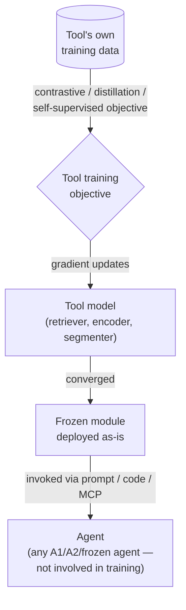

# How agent-agnostic tools get trained

Section 5.1.1 covered *how agents invoke* T1 tools. Section 5.1.2 asks a different
question: *which* tool modalities exist, and how does each one's training
methodology shape what it can become later?

The survey's organizing claim is a split by output type:

- **Structured, evaluable outputs** (code, retrieval rankings) are "most
  naturally upgraded to T2, because the frozen agent can score their outputs
  automatically."
- **Perceptual features** (vision embeddings, speech transcripts) are "harder to
  supervise via T2 and remain predominantly T1 plug-ins" — there's no cheap,
  automatic way for a frozen LLM to grade a CLIP embedding's "correctness."

This split matters because it predicts which tools you'll see again in the T2
sections of this module, and which ones stay frozen forever.

## The T1 training loop

Whatever the modality, T1 training shares one shape: the tool is trained to
convergence against **its own objective**, using **its own data**, completely
independent of any downstream agent. Only *after* training finishes does the tool
get deployed as a frozen, callable module — and the agent that eventually calls it
plays no role in shaping it.

Notice what's *absent* from this loop: no agent output, no agent feedback, no
agent-derived reward. The "Agent" box is purely a consumer, drawn only to show
where the tool ends up — it never appears upstream of `TOOL`.

## Worked examples by modality

**Vision models dominate T1 deployments.** CLIP is trained *contrastively* on 400M
image-text pairs, learning to pull matching image/text embeddings together and
push non-matching pairs apart — giving frozen encoders that support zero-shot
classification with no task-specific fine-tuning. SAM is trained on 11M images
with 1B masks via a human-in-the-loop data engine, producing promptable
segmentation from points, boxes, or masks. SAM-CLIP then *distills* both frozen
teachers into one model via multi-task distillation, gaining +6.8% mIoU on Pascal
VOC zero-shot semantic segmentation while keeping both parents' strengths.
Contrastive learning and distillation — neither references any specific
downstream agent.

**Speech tools rely on scale.** Whisper is trained on 680K hours of multilingual
audio with weak supervision, producing an encoder-decoder Transformer that
transcribes, translates, and identifies languages zero-shot. Agents pass audio in
and get text out; Whisper never adapts to any particular agent's preferences.

**Code execution tools learn compositional representations.** CodeAct shows that
representing tool calls as executable Python (rather than static JSON) improves
compositional reasoning by over 20% on API-Bank — a training-time choice about
*how tool use is represented*, made independent of any one agent.

**Search and retrieval tools are bi-encoders trained on passage ranking.** DPR,
ColBERT, Contriever, and e5 are all trained — typically with contrastive losses
over query-passage pairs — to support semantic search, then deployed frozen
inside RAG pipelines. This category matters a lot for the next lesson: these are
exactly the retrievers that later get *re-trained* under T2 (REPLUG and
successors retrain a Contriever-style retriever using a frozen LM's feedback).

**Scientific tools encode years of domain-specific development.** AlphaFold2 and
ESMFold predict protein structure from sequence; CGCNN predicts crystal
properties from structure. These are deployed as-is — the survey notes they
"represent years of domain-specific model development, deployed as-is for frozen
agents tackling scientific queries."

## The graduation path: A2 outputs become T1 tools

One more wrinkle: T1 isn't limited to models that were *designed* as tools.
Section 4 covered adaptive agents like DeepRetrieval (trained for search query
rewriting) and Code-R1 (trained for code generation). Once *their* training
finishes and they're frozen, they extend the T1 tool ecosystem exactly like CLIP
or DPR do — reformulating queries or generating code as a fixed, callable module.
A model that was an *agent* during its own training becomes a *T1 tool* the
moment it's frozen and handed to someone else's agent. This is the
"graduation lifecycle" Section 5.1 gestures at, explored more fully in §6.3.1.

## Setting up T2

The contrastive/distillation/self-supervised objectives in this lesson are what a
T1 tool starts from. T2, covered for the rest of this module, takes some of these
same tool *architectures* — especially dense retrievers, which produce
structured, scoreable rankings — and re-optimizes them using signals that come
from a frozen agent's own outputs. The tool's starting point is T1; its
*adaptation signal* is what changes.
