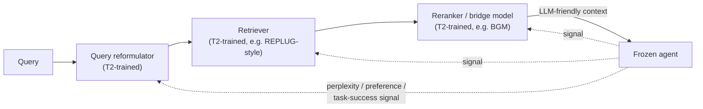

# T2's first wave: proxy signals to structured preferences

T2 inverts the question T1 asks. Instead of "how do we modify the agent to use
its tools better?" — the A1/A2 question — T2 asks **"how can we modify the tools
to better serve a fixed agent?"** This reframes the expensive foundation model as
a *stable source of supervision* rather than a target of optimization.

The economic argument is straightforward: training a billion-parameter foundation
model is expensive and risks catastrophic forgetting. Peripheral tools —
retrievers, planners, memory modules — are orders of magnitude smaller and
cheaper to train. T2 exploits that asymmetry: the frozen agent provides
supervision signals derived from its own pre-trained knowledge, while the tool
learns to reshape information into the form the agent can best exploit.

Section 5.2 traces an evolution across roughly 2023-2025: from training *passive
retrieval tools* on **internal proxy signals** (perplexity, ranking scores), to
training **active, multi-turn agentic tools** on **verifiable outcome signals**
(task success, accuracy gains). This lesson covers the first half of that
evolution — §5.2.1's "Earlier Methods."

## Stage 1: proxy signals — perplexity as a teacher

The earliest T2 methods came from the RAG community, trying to make dense
retrievers compatible with LLMs. **REPLUG** (NAACL 2024) is the foundational
example: it uses *perplexity reduction* as the training signal. If conditioning a
frozen LM on a retrieved document lowers that LM's perplexity on the query, the
document is probably useful context. Formally:

`L_REPLUG = D_KL( P_retriever(d|q) || P_LM-perplexity(d|q) )`

The retriever is trained to match its own retrieval distribution to the
distribution implied by how much each document reduces the frozen LM's
perplexity — adaptation "without parameter access to the LM."

Two extensions show the same proxy-signal principle generalizing:

- **BLADE** pairs a frozen general LLM with a small domain-specific LM, trained
  via Bayesian Prompted Optimization to generate domain knowledge and soft
  prompts — extending REPLUG's black-box principle from *retrieval* to
  *generative* tool co-adaptation.
- **BBox-Adapter** reframes adaptation as energy-based modeling: a
  ranking-based noise-contrastive loss aligns a black-box API's outputs (GPT-3.5)
  without access to internal probabilities at all.
- **proxy-tuning** moves the idea to decoding time: a small tuned "expert" and
  its untuned "anti-expert" provide logit offsets that steer a frozen large LM —
  a lightweight steering *tool* trained under a frozen agent.
- **EVOR** extends to code generation, treating retrieval and knowledge evolution
  as co-adaptive, driven by execution feedback from a frozen LLM.

All of these share REPLUG's core move: a frozen LM's *internal computations*
(perplexity, logits, likelihoods) become the training signal for a peripheral
tool — no task labels, no human preferences, just signals the LM produces for
free.

## Stage 2: structured preferences — task alignment

Proxy signals like perplexity are cheap but indirect: a document that lowers
perplexity isn't necessarily one that helps the LM produce a *correct answer*.
The next wave moved to **explicit preference-based supervision** that more
directly reflects task utility.

**AAR** (ACL 2023) has a frozen source LM construct preference *pairs*: documents
that most improve the LM's own likelihood, compared against human-annotated
references. The retriever is then trained via contrastive loss to reproduce these
preferences — and the resulting "what helps an LM" signal transfers across model
scales, improving even 175B-parameter agents.

**RA-DIT** formalizes document utility directly as a log-probability *gain*:

`Utility(d, q, a) = log P_LM(a|q,d) - log P_LM(a|q)`

— how much does conditioning on document `d` increase the probability of the
*correct* answer `a`, versus not having it at all? Retrievers are trained to
prefer documents with higher expected utility under this definition.

> "These works mark a conceptual shift from proxy-based to task-aligned
> supervision, setting the stage for reinforcement-style feedback and multi-turn
> optimization in later frameworks." — Section 5.2.1

## Stage 3: multi-stage distillation and cross-task transfer

**LLM-R** decouples *preference modeling* from *deployment efficiency*: rather
than training the retriever directly on the frozen LM's outputs, it first trains
a slow, expressive cross-encoder "reward model" that captures the LM's nuanced
preferences over in-context examples — then *distills* that reward model into a
fast bi-encoder retriever used at inference time. The insight: the complexity of
the training signal doesn't have to match the inference-time efficiency budget.

**UPRISE** extends the idea from documents to *prompts*: it trains a prompt
retriever on a frozen LLM's task performance across many tasks simultaneously,
learning a generalizable meta-skill — "what helps an LM," not memorized
task-specific tricks. UPRISE shows cross-task transfer gains of +8.5% on reading
comprehension and +14.6% on paraphrase detection from a single trained retriever.

## Stage 4: bridge tools and the cascaded ecosystem

By 2024, isolated retriever optimization hit a ceiling: a retriever that scores
well on classic IR metrics (NDCG, MRR) can still return results poorly suited for
LLM reasoning — what the survey calls the **preference gap** between
surface-level relevance and reasoning-useful context.

**BGM** addresses this with a *bridge model*: a T5-XXL model sitting between a
frozen retriever and a frozen generator (PaLM2-S), transforming retrieved output
into LLM-friendly context. Training is two-stage — supervised learning on
synthetic preference data, then RL where the frozen LLM's task success is the
reward. On HotpotQA, the bridged system reaches 35.6% exact-match vs. 25.8% for
the best prior retriever — a 38% relative gain. The lesson: **decompose, don't
overload** — the retriever handles broad recall, the bridge model handles
preference alignment.

This generalizes into **cascaded tool adaptation**: a pipeline of specialized
tools (query reformulator → retriever → reranker), each trained on a different
aspect of the frozen LLM's behavior. The benefits are separation of concerns
(each tool optimizes one sub-problem), composability (swap a reranker without
retraining the retriever), and efficiency (cheap tools filter before expensive
LLM inference runs). Empirically, 2-3 stages seems to be the sweet spot before
compounding errors start to overwhelm the gains.

## Where this leads

This whole progression — proxy signals → structured preferences → distilled
reward models → cascaded pipelines — is still about *retrieval-adjacent* tools
responding to queries. The next lesson covers the next shift: training
*proactive subagents* that explore, plan, and refine their own behavior over
multiple turns, still under a frozen primary agent's supervision.
