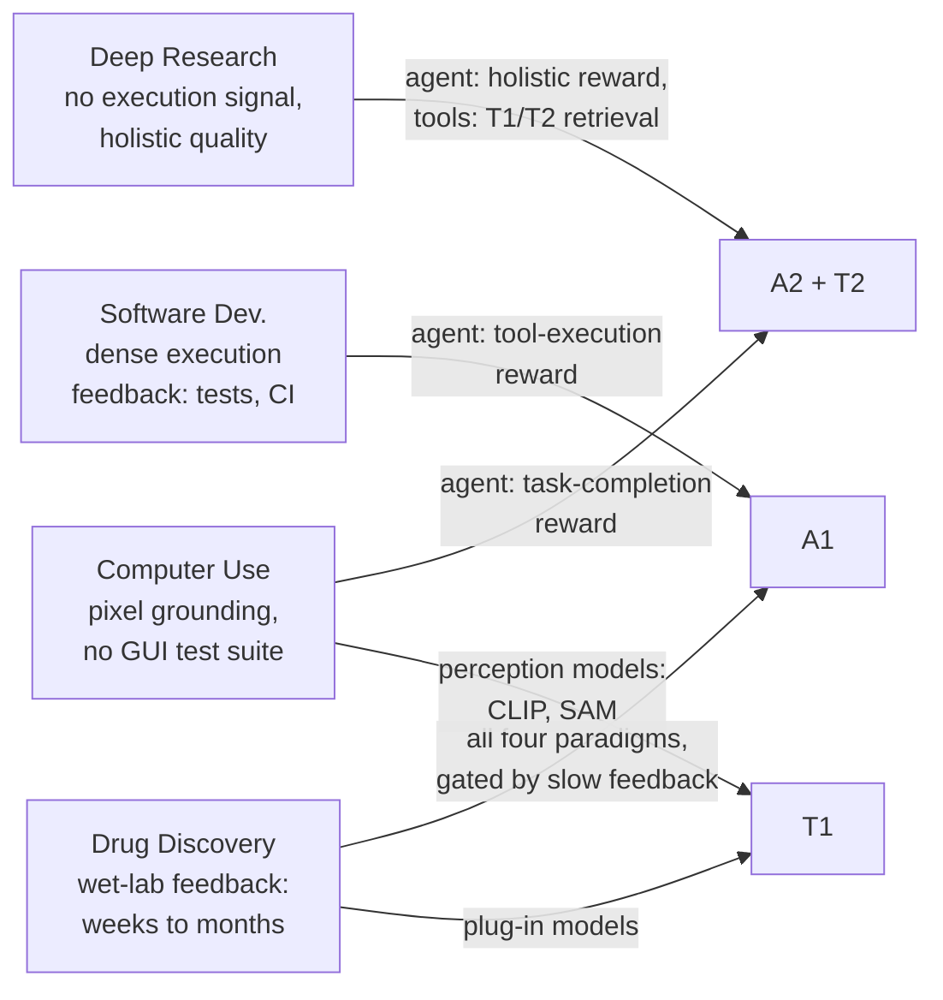

# Where the framework meets the real world

Sections 1–7 built the A1/A2/T1/T2 framework from first principles and then
compared the paradigms in the abstract. Section 8 turns the lens around: across
four application domains, which paradigm actually dominates in practice, and
why? The answer tracks two properties of the domain — **does verifiable
execution feedback exist**, and **how expensive is it to retrain the agent
versus the tool**.

Table 9 (the survey's domain-profile table) gives the headline pattern:

| Domain | Dominant paradigm | Key bottleneck | Representative system |
|---|---|---|---|
| Deep Research | T2 (search/planning subagent) | No deterministic execution signal; holistic quality is hard to verify | AgentFlow |
| Software Dev. | A1 (execution RL) | Long-horizon credit assignment across multi-file edits | RLEF |
| Computer Use | A2 (task completion) | Visual grounding; no "test suite" for GUI actions | OpenCUA |
| Drug Discovery | T1 (plug-in models) | Sparse, delayed wet-lab feedback (weeks–months) | AlphaFold2 |

## 8.1 Deep Research — A2 reasoning over a T1/T2 retrieval stack

Deep research systems (OpenAI's DeepResearch, Claude's deep-search
capabilities, Gemini-based research agents) decompose an open-ended question
into a multi-step plan, then iteratively search, validate, and synthesize.
Their defining trait is **dual adaptation**: both the reasoning agent and the
scientific tools it calls get adapted.

- **Agent side (A2).** The core reasoning agent is adapted toward long-context
  reasoning, hypothesis refinement, and multi-step self-critique — judged on
  the quality of the *final* research output, not on any single retrieval
  call. That holistic signal is why this is A2, not A1.
- **Tool side (T1/T2).** Retrieval and search tools are either deployed as
  pre-trained **T1** components (dense retrievers over PubMed, arXiv) or
  trained as **T2** search subagents under a frozen planner's supervision —
  DeepRetrieval and s3 are the survey's examples, boosting real-time
  information gathering even on top of proprietary models that can't be
  fine-tuned at all.

**Why not A1?** Deep research has no compiler, no test suite, no single
ground-truth signal for "was this search good?" — the survey notes the
absence of deterministic execution signals "makes pure A1 adaptation less
natural in this domain." Retrieval-specific metrics like Recall@K can still
supply A1-style feedback *for the search component specifically* — which is
exactly what makes that component a good T2 candidate even while the
surrounding research agent stays A2.

## 8.2 Software Development — A1 where execution is dense, A2 where it isn't

Coding agents (Cursor, Claude Code, OpenAI's Codex; benchmarked on SWE-Bench,
built on interfaces like SWE-Agent's agent-computer interface and OpenHands'
sandboxed environments) sit in the domain with the richest execution feedback
of the four.

- **Agent side.** Test-suite pass rates, compilation success, and CI/CD
  outcomes are *deterministic execution signals* — exactly the kind A1 needs.
  Agents optimized directly on tool-execution feedback (RLEF is the
  representative system in Table 9) get dense, per-action correctness signal.
  A2-style adaptation kicks in for the *holistic* task — resolving a full
  GitHub issue requires reasoning about what to read, what to edit, and how to
  validate, which a single test-pass signal doesn't capture end-to-end.
- **Tool side (T2).** The development ecosystem itself adapts under agent
  supervision: Cursor's Tab-RL framework refines tab-completion using
  real-world interaction data, and SWE-Grep trains a fast, parallel
  context-retrieval subagent so the main agent's context window isn't burned
  on irrelevant search results — a textbook T2 "tool trained under the agent's
  supervision to protect the agent's resources" move.

The bottleneck in Table 9 — long-horizon credit assignment across multi-file
edits — is precisely the hard part A1 doesn't solve for free: dense feedback
tells you *that* a test failed, not *which* of twelve edited files caused it.

## 8.3 Computer Use — A2 task completion, T1 perception, T2 memory

Computer-use agents (OpenAI's CUA, evaluated on OSWorld, WebArena,
VisualWebArena, AppWorld, WebVoyager, τ-bench) perceive screens visually and
act via keyboard/mouse. This is the most *multimodal* of the four domains —
grounding happens in pixels, not text.

- **A1 is the least natural fit here.** There's no "test suite" for clicking
  the right button — verifiable execution signals are hard to define for GUI
  actions.
- **A2 dominates** with holistic task-completion rewards: did the agent
  accomplish the overall goal (book the flight, fill the form), evaluated
  end-to-end. OpenCUA demonstrates this by training on large-scale,
  GUI-centric human-demonstration trajectories with reflective reasoning;
  AgentTrek synthesizes trajectories from web tutorials at low cost, keeping
  only automatically-verified-correct ones.
- **T1 supplies perception.** Pre-trained vision models (CLIP, SAM) act as
  plug-and-play perception modules — agent-agnostic, reusable across systems.
- **T2 supplies persistent memory.** Agentic Context Engineering (ACE) treats
  evolving context as a structured "playbook" that accumulates and refines
  tool-use strategies from execution feedback — adapting the operational layer
  around the agent rather than the agent's weights. CUA-Skill goes further,
  building a reusable computer-use **skill base** with parameterized execution
  and composition graphs, so a meaningful share of the adaptation burden sits
  in the skill substrate rather than the agent itself.

## 8.4 Drug Discovery and Development — all four paradigms, gated by slow feedback

Drug discovery is the one domain where **all four paradigms appear together**,
because the pipeline itself spans tasks with wildly different feedback
characteristics.

- **A1** applies where agents call computational chemistry tools with
  verifiable outputs — docking scores, molecular property predictions.
  Evidence retrieval for clinical trials (TrialMind, LEADS) similarly admits
  structured supervision via citation recall.
- **A2** governs the higher-level research workflow — hypothesis generation
  and literature synthesis, where holistic quality matters. Patient-to-trial
  matching (TrialGPT) is a clean A2 case: guideline-based eligibility criteria
  resist decomposition into verifiable sub-signals, so the judgment has to be
  holistic. Upstream trial design (TrialGenie) combines both: code-execution
  signals (A1) for the analytical code it generates, and overall protocol
  quality (A2) for the design itself.
- **T1** is abundant: AlphaFold2 and ESMFold are pre-trained independently and
  used as plug-and-play components, exactly like Biomni's hand-verified
  biomedical tool repository.
- **T2** appears as the tool ecosystem evolves under agent supervision —
  SyntheMol-style frameworks use molecular property predictors as reward
  functions to steer generative models, and STELLA runs a self-evolving loop
  where a tool-creation agent discovers and integrates new bioinformatics
  utilities into a growing "Tool Ocean." The survey frames this curated → T1 →
  autonomous → T2 progression as a gradient seen across domains, here
  complicated by the need for domain-expert validation of each new tool's
  scientific correctness.

**The defining bottleneck**, per Table 9, is that wet-lab validation takes
weeks to months — sparse, delayed reward compared to code execution or
retrieval. No amount of paradigm choice fixes a feedback loop that slow; it
just determines *where* the system can make progress while waiting for ground
truth.

## The cross-domain pattern

Two properties predict which paradigm dominates:

1. **Availability of verifiable execution feedback.** Where it's dense and
   deterministic (compilers, test suites — Software Development), A1
   flourishes. Where it's absent or only available for sub-components (Deep
   Research, Computer Use), the core agent shifts to A2 and execution-style
   signals get pushed down into T1/T2 tools.
2. **Cost of agent retraining versus tool retraining.** Domains with slow,
   expensive feedback loops (Drug Discovery's wet-lab validation) favor
   leaving the agent's reasoning workflow stable (A2, or even no agent
   adaptation) while concentrating adaptation effort in cheaper, swappable
   tools (T1/T2) — the frozen-agent-supervises-tools pattern recurs everywhere
   feedback is scarce.

No domain in Table 9 is purely single-paradigm — even Software Development,
the cleanest A1 case, layers A2 (holistic issue resolution) and T2 (SWE-Grep)
on top. The framework's real use, in practice, is less "classify this system"
and more "identify which sub-problem inside this system has which kind of
feedback, and adapt that piece with the matching paradigm."
