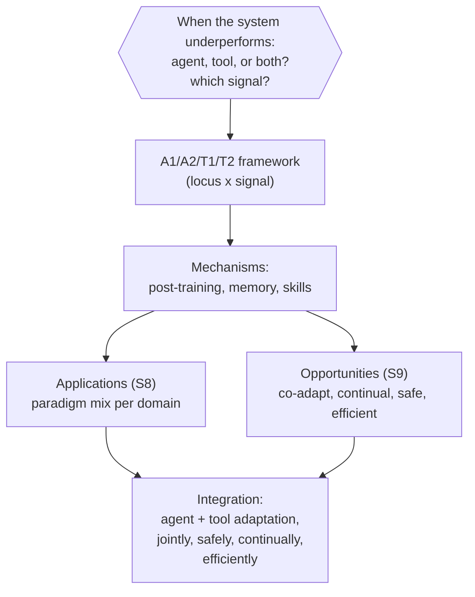

# Conclusion: the synthesis

Section 10 closes the survey by stepping back from individual methods,
domains, and open problems to restate the question the whole framework was
built to answer. It's worth holding onto this question as the single thread
that ties every earlier module together:

> "When the system underperforms, should we change the agent, the tool, or
> both — and what signal should drive that change?" — Section 10

The four-paradigm framework (A1/A2/T1/T2) is the answer scaffold. It structures
the literature along two axes — **locus of optimization** (agent vs. tool) and
**signal source** (execution-grounded vs. output-evaluated) — and grounds that
abstract 2×2 in three concrete mechanisms you've now seen across the whole
subject: **post-training** (changing parameters), **memory** (persisting
experience without retraining), and **skills** (reusable procedural
knowledge, internal or external).

## Monolithic vs. modular: the design tension restated

Everything in this survey is shaped by one tension:

- **Agent-centric paradigms (A1, A2)** offer high *parametric* flexibility —
  the model can internalize tool mechanics (A1, via direct execution feedback)
  or whole reasoning/orchestration strategies (A2, via holistic outcome
  evaluation). The cost is expensive retraining, and — especially for A2 — risk
  of degrading previously-learned capabilities when adapted to a new domain.
  That degradation is not uniform: on-policy RL with reverse-KL regularization
  forgets less than SFT in some settings, and T2-style modular adaptation
  avoids the problem *structurally* by never touching the core agent's
  parameters at all.
- **Tool-centric paradigms (T1, T2)** shift the adaptation burden to the
  peripheral ecosystem. T1 gives plug-and-play reusability — train once, use
  anywhere. T2 lets a frozen agent supervise lightweight subagents (searchers,
  planners, memory curators), often reaching competitive accuracy with far
  fewer training examples, as in retrieval-augmented QA case studies.

One caveat the survey is careful to flag: these cross-paradigm comparisons
**are not controlled experiments**. Systems compared across paradigms differ in
optimization target, backbone, and architecture — so an efficiency gap can't be
attributed to paradigm choice alone. Building controlled cross-paradigm
benchmarks remains an open problem in its own right, distinct from (but related
to) the evaluation gaps covered earlier in this subject.

## Four findings worth carrying forward

1. **Signal density shapes paradigm effectiveness.** A1 excels where execution
   feedback is dense and verifiable — code, theorem proving, SQL. A2 becomes
   necessary once only sparse outcome signals are available. This pattern
   recurs across the §8 domains, though the survey is careful to note the
   evidence base for treating it as a *universal* law is still incomplete.
2. **Evaluation is paradigm-dependent.** The same system looks different under
   A1 metrics (tool-execution quality) than under A2 metrics (end-to-end task
   success) — no single metric suffices, and multi-dimensional evaluation
   (accuracy, cost, safety, adaptation dynamics together) is essential.
3. **The graduation lifecycle bridges paradigms.** An agent trained under
   A1/A2 can be frozen and redeployed *as a T1 tool* for another system —
   agent adaptation enriches the tool ecosystem, closing a loop between the
   agent-centric and tool-centric halves of the framework.
4. **Memory and skills span the whole taxonomy.** Episodic buffers, reflective
   databases, and knowledge graphs can all be optimized as T2 tools — giving
   agents persistent experience without parameter updates. Skills range from
   A1/A2-internalized tool-use patterns (learned *into* the model) to external
   skill libraries that accumulate as reusable T1/T2 resources (learned
   *alongside* the model).

## The road ahead

The survey's closing claim is that future progress depends on **integrating**
these paradigms rather than treating agent adaptation and tool adaptation as
separate tracks — and that integration runs directly through the four
opportunities from Section 9:

- **Co-adaptation** — jointly optimizing agent and tools instead of freezing
  one side.
- **Continual adaptation** — maintaining performance as task distributions
  shift, instead of one-off adaptation.
- **Safe adaptation** — mitigating the dynamic risks (unsafe exploration,
  parasitic adaptation) that on-policy and outcome-driven adaptation introduce.
- **Efficient adaptation** — making all of the above affordable outside large
  GPU clusters.

## Putting the whole framework to use

Every concept this capstone leans on was taught earlier in this subject: the
A1/A2/T1/T2 classification rule, the cost/flexibility/generalization/modularity
comparison axes, the evaluation framework (verifiable execution vs. holistic
utility, sample efficiency, safety/alignment, the dynamics gap), and now the
domain examples (§8) and open problems (§9) from this module. The scenario
below asks you to run all of it at once: given a new agentic system, decide
*where* to adapt, *what signal* to use, and *how to evaluate* whether it
worked — exactly the question Section 10 opens with.
