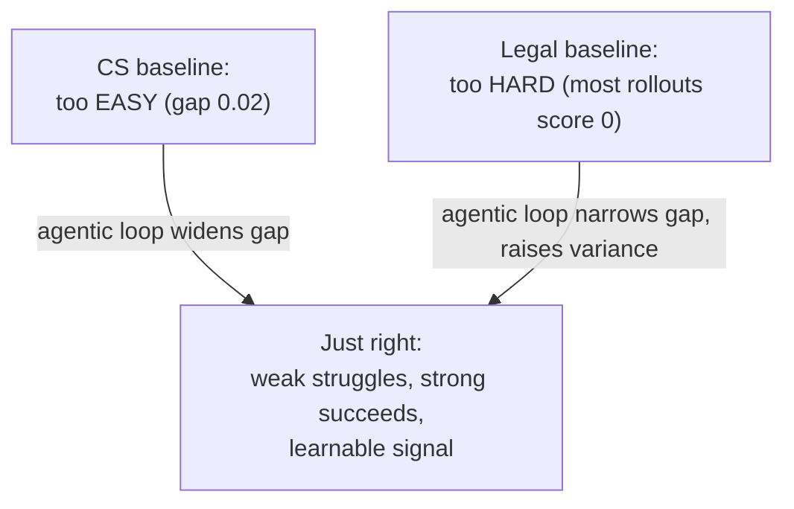

## Same loop, three domains, two opposite failure modes

Before reading further: guess what could go wrong with the baseline (non-agentic) generation method in two different domains. In one domain, do you think the generated questions skew *too easy* or *too hard* for a small model? What about a domain like law, with dense, technical source documents?

The paper runs Agentic Self-Instruct on computer-science research questions, legal reasoning, and mathematical/scientific reasoning. The surprising result: the baseline (CoT Self-Instruct) fails in *opposite* directions depending on the domain — and the agentic loop fixes both.

### Computer science research questions: baseline is too easy

Source material: 10k+ CS papers from S2ORC. Weak solver: Qwen3.5-4B. Strong solver: Qwen3.5-397B-A17B.

| Metric | CoT Self-Instruct | Agentic Self-Instruct |
|---|---|---|
| Weak solver avg | 0.677 | 0.458 |
| Strong solver avg | 0.696 | 0.772 |
| Gap (strong − weak) | 0.019 | 0.314 |
| Agentic rounds | 1.00 | 6.59 |

A weak/strong gap of **0.02** means the baseline questions don't discriminate at all — a 4B model and a 397B model score about the same. After the agentic loop, the weak solver's score *drops* 22 points while the strong solver's score *rises* 8 points. Inspecting the actual trajectories: the Challenger's first attempt on a paper is typically a high-level summary question (easy for anyone). Later rounds, steered by judge feedback, push toward "specific algorithmic steps, ablation details, or numerical claims" — the kind of question you can only get right by actually following the paper's argument.

Training Qwen3.5-4B with GRPO on 1.3k examples from each source confirms this matters downstream, not just at generation time:

| Response model | CoT-test mean@3 | Agentic-test mean@3 |
|---|---|---|
| No additional RL | 0.630 | 0.366 |
| RL on CoT Self-Instruct data | 0.727 | 0.500 |
| RL on Agentic Self-Instruct data | **0.774** | **0.632** |

The Agentic-trained model wins on *both* held-out test sets — including the CoT one, which was never its target distribution.

### Legal reasoning: baseline is too hard

Source material: Pile of Law court opinions. Same weak/strong solver pair. Evaluated on PRBench-Legal.

| Metric | CoT Self-Instruct | Agentic Self-Instruct |
|---|---|---|
| Weak solver avg | 0.159 | 0.283 |
| Gap (strong − weak) | 0.558 | 0.415 |
| Weak rollout std | 7.93 | 12.63 |

Here the problem inverts: the baseline's weak-solver score of **0.159** means most attempts score near zero. Under GRPO, a group of rollouts that all score ~0 gives almost no usable advantage signal — there's nothing to learn from "everyone failed." The agentic loop's job here isn't to make questions *harder*; it's to make them **learnable** — it pushes the weak-solver mean up to 28.3% while leaving the strong solver roughly unchanged, spreading the same gap over a usable variance range (std 7.93 → 12.63).

Notice the acceptance mechanism had to change for this domain too: instead of the CS task's hard numeric thresholds, legal reasoning uses a **flexible loop judge** that returns a `grpo_suitability` verdict (high/medium/low) based on rollout *variance*, not just the average score. On the CoT pool, only 4.8% of examples are rated "high" suitability; on the Agentic pool, 52% are. RL results follow the same pattern as CS — a 4B model trained on Agentic data even beats the *bigger* 397B baseline model on PRBench-Legal (0.441 vs. 0.404, graded by GPT-5).

### The unifying insight: not harder, *just right*

> "The key is not to make the question more challenging, but to make them *just right* for the model to hill-climb on; the Agentic Self-Instruct loop is what lets us achieve this." — Section 3.2.2

The gap moves in *opposite* directions across the two domains — widening for CS, narrowing for legal — yet both produce a better RL outcome than the baseline. That's the real claim: the loop adapts the difficulty target to whatever the weak solver actually needs to learn from, not toward a fixed "harder is better" rule.

### Scientific reasoning: harder data transfers to easier problems too

A third experiment, on mathematical/scientific reasoning (the Principia collection), adds a training-data-mixing angle: compare training on CoT-only data, Agentic-only data, and a Combined set (both, doubling the training size).

| Eval subset | Base | +CoT | +Agentic | +Combined (2× data) |
|---|---|---|---|---|
| Overall avg@8 | 68.66% | +2.42 | **+3.20** | +2.70 |
| CoT subset avg@8 | 77.17% | +1.86 | **+3.05** | +2.49 |

Agentic data wins overall *and* on the CoT-only subset — despite never being optimized for that distribution, and despite the Combined run using twice the data. The paper's reading: training on harder, agentically-generated problems builds reasoning skill that generalizes down to easier problems, not just sideways to similarly-hard ones.

> **Wait — does "harder is better" contradict the CS-vs-legal "just right" story above?** No — "just right" is *relative to the weak solver's current capability*, and that target keeps moving as the model improves during RL training. In math/science, the weak solver (also Qwen3.5-4B) is already a fairly capable reasoner, so the "just right" zone for it happens to sit higher on the difficulty scale than it did for raw paper-summary questions in CS. The mechanism — calibrate to the gap, not to a fixed difficulty — is the same in both cases.
