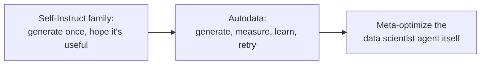

## The data problem nobody's talking about

Everyone's racing to scale up models, context windows, and tool use. But ask yourself: where does *frontier* training data come from once you've already used up the internet?

Human-written data was the original foundation. It's running out of headroom — there's only so much expert-labeled legal reasoning or PhD-level math in the world, and labeling more of it is slow and expensive. So labs turned to **synthetic data**: have the model generate its own training examples.

> "Synthetic data addresses several practical challenges: it facilitates the generation of edge cases and long-tail scenarios that are underrepresented in real corpora, reduces the difficulty and latency associated with manual labeling, and can potentially produce more challenging data than the human-generated data distribution." — Section 1

That last clause is the catch. *Can* potentially produce harder data — but does it, reliably?

## The Self-Instruct lineage, and where it stalls

A short genealogy, because each step fixed one problem and left another:

| Method | What it added | What's still missing |
|---|---|---|
| **Self-Instruct** (Wang et al., 2023) | Bootstrap new examples from a small seed set, zero/few-shot | No grounding — prone to hallucinated facts |
| **Grounded Self-Instruct** (Lupidi et al., 2024) | Ground generation in real documents | Still single-shot prompting, no quality loop |
| **CoT Self-Instruct** (Yu et al., 2025) | Chain-of-thought during generation, for more complex tasks | No mechanism to *control* difficulty |
| **Self-Challenging** (Zhou et al., 2025) | A challenger agent interacts with tools before proposing a task | Still doesn't measure or steer how hard the result actually is |

Read down that "still missing" column and a pattern emerges: every method generates data and hopes it lands at a useful difficulty. None of them *check*. You write one prompt, sample once, and whatever comes out is what you train on.

> **Wait — isn't filtering already the fix?** Partially. Work on filtering (Yu et al., 2025), evolution (Xu et al., 2024), and refinement (Shah et al., 2024) all add a pass *after* generation to discard bad examples. But filtering a fixed pool only removes what's already wrong — it can't push the *generation* process itself toward the difficulty you actually need. If 95% of your generated questions are too easy, filtering leaves you with the 5% that survive, not with a process that learns to generate harder ones.

## Autodata's reframe: treat data creation like a data scientist's job

Here's the move this paper makes. Instead of "prompt once, maybe filter," treat synthetic data generation the way a human data scientist treats any dataset: **create it, eyeball it, measure how well it's working, write down what's wrong, and revise the recipe — repeat.**

> "We introduce Autodata, a general method that enables AI agents to act as data scientists who build high quality training and evaluation data. We show how to train (meta-optimize) such a data scientist agent, so that it learns to create even stronger data." — Abstract

Two distinct claims are packed in there, and the rest of this module covers both in turn:

1. **The data creation loop itself** — an agent that generates, analyzes, and iterates (covered next, in *The Autodata loop*).
2. **Optimizing the agent that runs the loop** — using the same "is this data good?" signal to improve the data-scientist agent's own prompts and strategy (covered later, in *Meta-optimizing the data scientist*).

The authors test this on three very different domains — CS research questions, legal reasoning, and mathematical/scientific reasoning — and report the same outcome each time: data produced by the agentic loop beats data produced by a single well-prompted pass, when both are used to train the same model with reinforcement learning. *Why* the loop wins, and why the failure mode is opposite in CS versus legal tasks, is the subject of the *Experiments across three domains* lesson.
