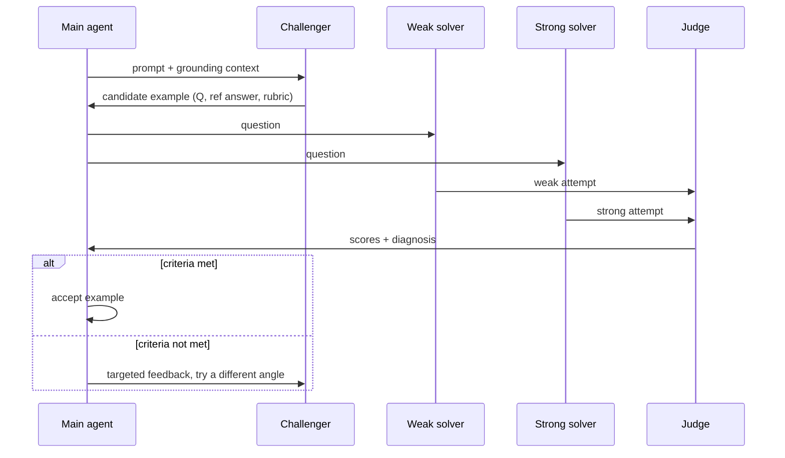

## Four agents, one goal: find the question only the strong model can answer

How do you operationalize "the data is good"? You need *some* measurable signal, not just vibes. Agentic Self-Instruct's answer: a question is good training data for a weak model if a demonstrably **stronger** model can reliably answer it and the weak model reliably can't. That gap *is* the learning signal.

To produce and check that gap, the main orchestrator agent calls on four LLM subagents:

| Role | Job |
|---|---|
| **Challenger** | Generates the candidate example — context, question, reference answer, evaluation rubric |
| **"Weak" solver** | Expected to generally *struggle* with the candidate |
| **"Strong" solver** | Expected to generally *succeed* at the candidate |
| **Verifier / Judge** | Scores both solvers' attempts and reports back what's wrong |

> "The system aims to generate training data where the strong solver succeeds while the weak solver struggles." — Figure 2 caption

> **Wait — are the weak and strong solver always different models?** Not necessarily. Section 2.1 notes they "can actually be the same LLM, but in different modes" — e.g. the strong version gets more inference-time compute, scaffolding, or privileged information. What matters is the *capability gap* you're targeting, not the specific model pair.

## Tracing one round of the loop

The main agent sends a prompt (with grounding context) to the Challenger. The Challenger's output then gets tested before it's accepted:

That "targeted feedback" step is concrete, not vague encouragement — Section 3.1 describes it as: *which previous questions were too easy (with weak-solver scores), which failed on the strong solver (with gap info), and which were rejected by the quality verifier.* The Challenger then generates the next attempt from "a different reasoning angle," not just a re-roll of the same prompt.

## Two acceptance criteria, same idea

The exact accept/reject rule depends on whether the task is verifiable:

- **Verifiable tasks**: majority vote over the strong solver must be *correct*, while majority vote over the weak solver must be *wrong*.
- **Non-verifiable tasks** (open-ended, rubric-graded): the Judge needs a *quality gap* — the task should be neither too easy nor too hard for the weak solver, while the strong solver's correctness anchors the rubric.

The CS research-question experiments use a concrete version of the non-verifiable rule: accept only if the strong solver averages ≥ 0.65, the weak solver averages < 0.5, **and** the strong−weak gap is ≥ 20 percentage points. That sounds like a small tweak, but it's the entire mechanism by which "too easy" questions get rejected and resubmitted — you'll see in the next lesson that 80% of all rejected rounds in the CS experiments failed for exactly this reason.

A candidate rarely clears that bar on the first try. Across the CS research-question experiments, accepted examples took a mean of **6.59 rounds** each, with a long tail past 10 rounds for some source papers — the search through "different reasoning angles" is doing real work, not just confirming the first guess.

> One more efficiency detail worth knowing: because the weak-solver check is cheap and the strong-solver check is comparatively more expensive, the pipeline only bothers running the strong solver and judge once the weak solver has already failed its own criterion. No point spending compute confirming the strong solver succeeds if the candidate was never going to pass the weak-solver bar anyway.
