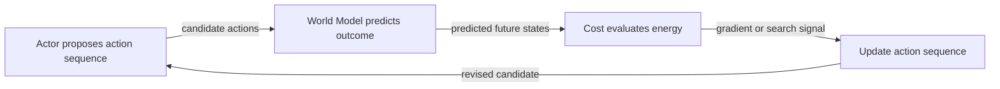

# The Actor: Optimizer and Explorer

If the Cost module already tells you how "uncomfortable" a future state would be, and the World Model already tells you what future a given action sequence leads to — who actually picks the action sequence?

That's the Actor's job, and the paper hands it three distinct responsibilities at once:

> "The role of the actor module is threefold: 1. inferring optimal action sequences that minimize the cost, given the predictions produced by the world model for Mode-2 actions. 2. producing multiple configurations of latent variables that represent the portion of the world state the agent does not know. 3. training policy networks for producing Mode-1 actions." (p.37)

Notice job #1 and job #2 sound completely different — one is about *actions*, the other about *unknown world state* — but the paper makes a surprising claim: they're the same kind of problem.

> "There is no conceptual difference between an action and a latent variable. The configurations of both sets of variables must be explored by the actor." (p.37)

The difference is just *what you're optimizing for*: for actions, you explore configurations to find the one that **minimizes** cost. For latent variables — the part of the world you can't observe — you explore configurations to represent plausible uncertainty. And in adversarial settings, like games, you flip the sign:

> "In adversarial scenarios (such as games), the latent configurations must be explored that maximize the cost." (p.37)

> Wait — isn't the Actor just a policy network, like in standard RL? Not in this design. A policy network (job #3) is *one tool* the Actor can train, used for fast Mode-1 reactions. But the Actor's main job (#1) is closer to a planner: it runs an optimization or search process *at inference time*, using the World Model and Cost as a simulator, before it ever trains a policy on the result.

## How the Actor actually finds a good action sequence

When the World Model and Cost are smooth, differentiable functions, the Actor doesn't need to search blindly — it can follow a gradient:

> "When the world model and the cost are well-behaved, the actor module can use a gradient-based optimization process to infer an optimal action sequence. To do so, it receives estimates of the gradient of the cost computed by backpropagating gradients through the cost and the unfolded world model. It uses those estimates to update the action sequence." (p.37)

"Unfolded world model" means the World Model has been run forward step-by-step over the whole proposed sequence — like unrolling an RNN — so a single backward pass can assign blame (or credit) to every action in the sequence at once.

But gradients aren't always available or trustworthy:

> "When the world model or the cost are not so well-behaved, a gradient-based search for an optimal action sequence may fail. In this case another search/planning method may be applied. If the action space is discrete or can be discretized, one can use dynamic programming methods or approximate dynamic programming methods such as beam search or Monte-Carlo tree search." (p.37)

The paper is explicit that it doesn't care which classical method you reach for here:

> "In effect, any planning method developed in the context of optimal control, robotic, or 'classical' AI may be used in this context." (p.37)

## The optimization loop

Run that loop until the cost stops improving (or you hit a compute budget), and whatever action sequence comes out the other end is the Actor's answer for "what should I do."

## From optimization to a fast reflex: training the policy network

Running gradient descent or tree search every time you need to act is slow. So once the Actor has solved a planning problem the slow way, it can hand the answer to a policy network as a training target:

> "Once an optimal action sequence is obtained through the planning / inference / optimization process, one can use the actions as targets to train a policy network. The policy network may subsequently be used to act quickly, or merely to initialize the proposed action sequence to a good starting point before the optimization phase." (p.37)

That's a nice two-for-one: the policy network can either replace planning entirely for time-critical situations, or just give planning a head start by initializing the search near a good answer instead of from scratch. And it scales:

> "Multiple policy networks can be trained for multiple tasks." (p.37)

## Exploring the unknown: latent variable configurations

The Actor's second job — picking latent variable configurations — exists because the World Model can't see everything:

> "The actor also produces configurations of latent variables. These latent variables represent the portion of the world state that the agent does not know. Ideally, the actor would systematically explore likely configurations of the latents." (p.37)

"Ideally" is doing a lot of work in that sentence — the paper immediately admits this is hard to do cleanly, and sketches the regularizer-based fallback instead of a finished answer:

> "Ideally, the regularizer for the latents, R1 and R2 in Figure 17, would represent log-priors from which the latent could be sampled. But in a similar way as the policy network, one may devise a latent amortized inference module that learns distributions of latent variables. Good distributions would produce predictions that are plausible." (p.37)

In short: rather than search over latents from scratch every time, train a network that has *learned* which latent configurations tend to be plausible — the same amortization trick used for the policy network, just applied to "what's probably true about the parts of the world I can't see" instead of "what should I do."

## The Actor's three jobs, side by side

| Job | What's being explored | Goal |
|---|---|---|
| Plan an action sequence | Action variables | Minimize cost (maximize in adversarial settings) |
| Represent uncertainty | Latent variables | Plausible, informative configurations |
| Train a policy network | Network weights | Match the optimal actions found by planning |
