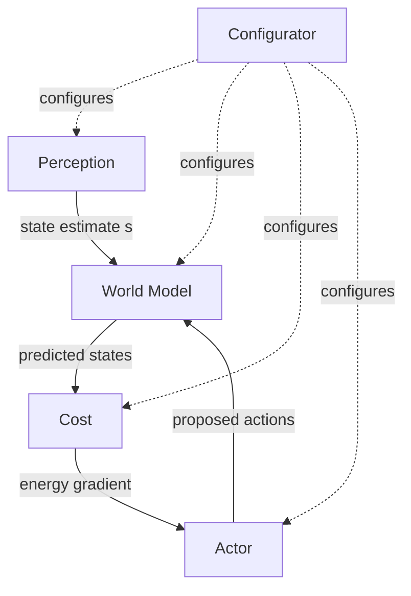

# A Modular Architecture for Intelligence

If you had to build a single agent that could drive a car, fold your laundry, and hold a conversation, would you build one giant neural network — or would you build it out of swappable parts, each with one job?

LeCun picks the second option. This lesson looks at the role of seven named modules — Perception, World Model, Cost, Actor, Critic, short-term Memory, and Configurator — and one of them, the Configurator, sits above the rest pulling strings.

## The seven modules, in plain language

| Module | What it actually does |
|---|---|
| **Perception** | Takes raw sensor signals and estimates "the current state of the world" |
| **World Model** | The "most complex piece of the architecture" — fills in missing information and predicts plausible future states |
| **Cost** | Computes a single scalar "discomfort" score called **energy** |
| **Actor** | Proposes action sequences, and sends actions to the effectors |
| **Critic** | A trainable sub-piece of Cost that predicts *future* energy |
| **Short-term Memory** | Stores past/current/future world states and their costs |
| **Configurator** | Executive control — configures all the other modules for "the task at hand" |

Notice that's not a pipeline. It's not "Perception → World Model → Cost → Actor, done." The Configurator reaches into *every* other module:

> "The configurator module takes input from all other modules and configures them for the task at hand by modulating their parameters and their attention circuits. In particular, the configurator may prime the perception, world model, and cost modules to fulfill a particular goal" (p.7).

So when you look at the wiring diagram below, read the dashed-style arrows from Configurator as "tunes the knobs of," not "sends data to."

## World Model: the "simulator" that has to handle uncertainty

The World Model isn't just a predictor — the paper gives it two distinct jobs:

> "Its role is twofold: (1) estimate missing information about the state of the world not provided by perception, (2) predict plausible future states of the world" (p.7).

And it has to do this even though the real world is messy:

> "The natural world is not completely predictable. This is particularly true if it contains other intelligent agents that are potentially adversarial. But it is often true even when the world only contains inanimate objects whose behavior is chaotic, or whose state is not fully observable" (p.7).

That's why the paper frames the World Model's open problems as exactly two questions: how to represent *multiple* plausible futures (not just one guess), and how to train the thing in the first place.

> Wait — isn't the World Model just a fancier next-frame predictor, like a video model? Not quite. A next-frame predictor only has to extrapolate pixels. This module also has to *fill in* what Perception couldn't observe directly — it's doing state estimation and forecasting at once, and it has to represent several possible futures rather than committing to one.

## Cost: "discomfort" as a number

Here's the piece that actually drives behavior. The Cost module outputs one number — energy — and the agent's entire objective reduces to one sentence:

> "The overall objective of the agent is to take actions so as to remain in states that minimize the average energy" (p.7).

That energy is built from two sub-modules, and the split matters a lot for the rest of this module:

- **Intrinsic Cost** — hard-wired, immutable, not trainable. Think pain, pleasure, hunger.
- **Trainable Critic** — learns to *predict* future intrinsic energy, so the agent doesn't have to wait to feel pain to avoid it.

We'll dig into why that split exists — and why the Intrinsic Cost module specifically must never be allowed to learn — in the next lesson.

## Actor and short-term Memory: proposing actions, remembering what happened

The Actor's job is to propose sequences of actions and ultimately push the first one out to the effectors:

> "Since the actor has access to the gradient of the estimated cost with respect to the proposed action sequence, it can compute an optimal action sequence that minimizes the estimated cost using gradient-based methods" (p.8).

That's a strong design choice: because Cost and World Model are both differentiable, you can backpropagate *through* them to figure out which actions would have been better — without ever touching the real, non-differentiable world.

Short-term Memory is the connective tissue. It is queried and updated constantly:

> "The world model can send queries to the short-term memory and receive retrieved values, or store new values of states. The critic module can be trained by retrieving past states and associated intrinsic costs from the memory" (p.7).

The paper even gives it a biological analogy: "This module can be seen as playing some of same roles as the hippocampus in vertebrates" (p.7).

## Why bother with all seven, instead of one big neural net?

Because a single end-to-end network can't easily be *retasked*. Splitting the system into modules — and putting the Configurator in charge of re-tuning them — means the same Perception, World Model, and Actor can be reused across different goals just by changing what the Configurator primes them to attend to and optimize for. That reusability is the whole point of the architecture.
