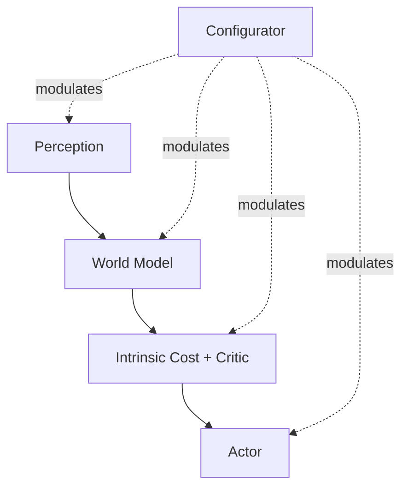

# Does Your Brain Already Have a Configurator?

The paper just spent pages admitting what's unsolved in its own architecture. Now it does something bolder: it asks whether the *solved* parts already exist inside your skull.

> "Although the proposed architecture is not specifically designed to model autonomous intelligence, reasoning, and learning in humans and other animals, one can draw some parallels. The following is somewhat speculative." (Section 8.2)

That hedge — "somewhat speculative" — matters. What follows isn't a neuroscience claim backed by experiments; it's a structural mapping the author finds suggestive. Treat it the same way.

## A module-by-module map to your own brain

> "Many of the modules in the proposed architecture have counterparts in the mammalian brain that perform similar functions." (Section 8.2.1)

| Architecture module | Proposed brain counterpart |
|---|---|
| Perception | Visual, auditory, and other sensory cortex |
| World Model + Critic | Parts of the prefrontal cortex |
| Intrinsic Cost | Basal ganglia / amygdala (reward structures) |
| Trainable Critic | Prefrontal cortex regions involved in reward prediction |
| Short-term Memory | Hippocampus |
| Configurator | Prefrontal cortex executive control / attention |
| Actor | Pre-motor cortex (motor plan encoding) |

> **Wait — is the paper claiming the brain literally runs this algorithm?** No. It's claiming the *division of labor* looks similar enough to be worth studying side by side — a hypothesis to test, not a finding to cite.

## A speculative answer to "why does consciousness feel singular?"

Here's the move that's easy to miss on a skim: the paper ties its hardware-reuse argument for the Configurator (one shared, configurable world model instead of many separate ones) to a guess about why you only ever feel like you're consciously doing *one* thing at a time.

> "The hypothesis of a single, configurable world model engine in the human brain may explain why humans can essentially perform a single 'conscious' reasoning and planning task at a time. A highly-speculative idea is that the illusion of consciousness may be a side-effect of a configurator-like module in the brain that oversees the function of the rest of brain and configures it for the task at hand." (Section 8.2.1)

And the corollary, stated just as plainly:

> "Perhaps if the brain were large enough to contain many independent, non-configurable world models, a configurator would be unnecessary, and the illusion of consciousness would disappear." (Section 8.2.1)

In other words: on this view, consciousness-as-singular-focus isn't a deep mystery requiring new physics — it might just be a side effect of resource sharing. One configurable engine forces serialization; serialization feels like "being one thing experiencing one task at a time."

## Where do emotions come from, on this model?

The paper extends the same module-mapping to affect:

> "Instantaneous emotions (e.g. pain, pleasure, hunger, etc) may be the result of brain structures that play a role similar to the Intrinsic Cost module [...] Other emotions such as fear or elation may be the result of anticipation of outcome by brain structures whose function is similar to the Trainable Critic." (Section 8.2.1)

That split matters: *immediate* feelings map to the hard-wired Intrinsic Cost (you don't learn that pain is bad), while *anticipatory* feelings map to the learned Trainable Critic (fear of a specific thing is learned from experience). The paper draws the architectural conclusion explicitly:

> "Autonomous intelligent agents of the type proposed here will inevitably possess the equivalent of emotions." (Section 8.2.1)

Not "might develop something emotion-like as a curiosity" — *inevitably*, because the cost-driven architecture is the same shape that produces emotions in animals.

## Could this be the substrate of machine common sense?

This is the paper's most ambitious speculative claim, and it starts by pointing at a gap everyone already feels:

> "It is a widely-held opinion that none of the current AI systems possess any level of common sense, even at the level that can be observed in a house cat." (Section 8.2.2)

Why not, even with today's largest models? The paper's answer is specific to *where* the knowledge comes from:

> "Large language models (LLMs) seem to possess a surprisingly large amount of background knowledge extracted from written text. But much of human common-sense knowledge is not represented in any text and results from our interaction with the physical world. Because LLMs have no direct experience with an underlying reality, the type of common-sense knowledge they exhibit is very shallow and can be disconnected from reality." (Section 8.2.2)

> **Wait — isn't reading enough text basically the same as having experience?** Not on this view. Text is a lossy, second-hand summary of physical reality, filtered through what people chose to write down. A world model trained on raw sensory streams (video, proprioception, touch) sees physical consistency directly — friction, gravity, object permanence — instead of inferring it from descriptions of friction, gravity, and object permanence.

So what *would* count as common sense, mechanically? The paper offers a working definition:

> "A possible characterization of common sense is the ability to use models of the world to fill in blanks, for example predicting the future, or more generally filling in information about the world that is unavailable from perception or from memory." (Section 8.2.2)

Under that definition, common sense isn't a separate module you bolt on — it's a *property that falls out of* having good-enough world models:

> "I speculate that common sense may emerge from learning world models that capture the self-consistency and mutual dependencies of observations in the world, allowing an agent to fill in missing information and detect violations of its world model." (Section 8.2.2)

That's the throughline connecting this whole module back to JEPA and H-JEPA: if common sense is "predict the missing part using a model trained on raw experience," then a hierarchical, self-supervised world model isn't just *useful* for planning — it's the paper's candidate mechanism for common sense itself.
