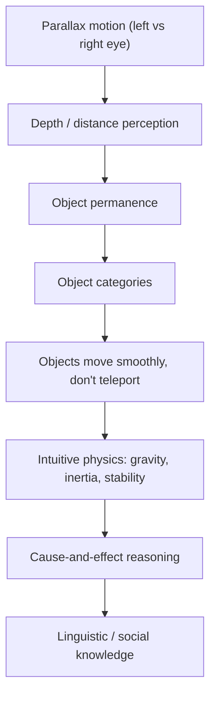
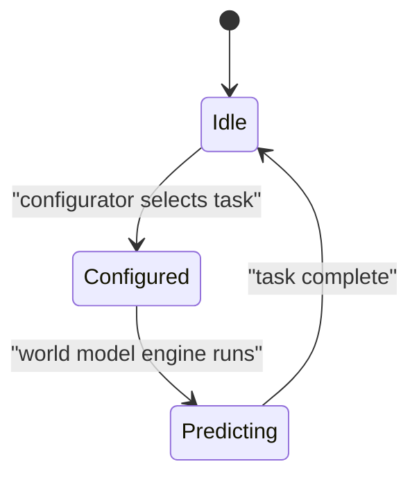
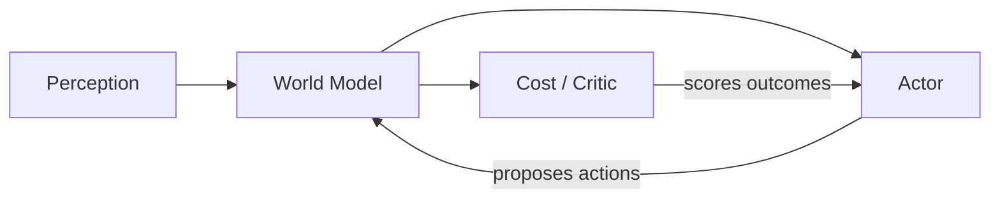

# What Is "Common Sense," Really?

You already have an intuitive answer to "what happens if I let go of this cup?" You didn't need a physics class — you needed a childhood full of watching things fall.

The paper's claim is that this isn't a vague metaphor. **Common sense can be seen as a collection of models of the world that can tell an agent what is likely, what is plausible, and what is impossible** (p.1-6). Animals build this up almost entirely "through observation and through an incomprehensibly small amount of interactions" — and it's task-independent: the same knowledge of gravity helps you catch a ball, pour a drink, or avoid a falling branch.

Once you have that knowledge, a lot becomes possible with very little extra effort:

- Learning new skills from very few trials
- Predicting the consequences of your actions
- Reasoning, planning, exploring, imagining solutions
- **Avoiding dangerous mistakes** in situations you've never seen before

> "A self-driving system for cars may require thousands of trials of reinforcement learning to learn that driving too fast in a turn will result in a bad outcome... humans can draw on their intimate knowledge of intuitive physics to predict such outcomes" (p.1-6).

This isn't a new idea, by the way — the concept of internal "world models" goes back to Craik in 1943, and forward models predicting the next world state from the current state and action have been standard in control theory (model-predictive control) since the 1950s.

> Wait — isn't "common sense" just a synonym for "knowledge"? Not quite, in this framing. It's specifically *predictive* knowledge used to fill in gaps — including filling in missing information spatially or temporally, and flagging percepts that don't match expectation as worth extra attention (possibly dangerous, possibly a learning opportunity).

## Knowledge stacks on knowledge

The really interesting part is *how* this knowledge gets built — not all at once, but in layers, starting in the first days of life:

This matches an actual developmental chart (Figure 1, credited to Emmanuel Dupoux) tracking when infants acquire concepts like object permanence, gravity, and "rational, goal-directed actions" — measured in *months* of age. The pattern: **abstract concepts are built on top of less abstract ones**, almost entirely from passive observation in the earliest weeks.

## One model, reconfigured — not a thousand separate models

Here's a question worth sitting with: can a brain really store a *separate* world model for every possible situation? The paper's answer is no.

> "One hypothesis in this paper is that animals and humans have only one world model engine somewhere in their prefrontal cortex. That world model engine is dynamically configurable for the task at hand" (p.1-6).

Why does this matter? A single, reconfigurable engine means knowledge learned in one context can transfer to another — this is the mechanism the paper proposes for **reasoning by analogy**: taking the model configured for situation A and applying it to situation B.

## The architecture, at a glance

The paper closes this section by previewing the system it's about to describe in detail (Figure 2): a **Perception** module that estimates current world state, a **World Model** that predicts future states from imagined action sequences, a **Cost** module (split into an immutable "intrinsic cost" and a trainable "critic") that scores discomfort, a **Short-Term Memory**, and an **Actor** that proposes action sequences and picks the one that minimizes predicted future cost. A **configurator** sits across all of them, tuning each module for the task at hand.

You'll meet each of these modules properly in later modules of this subject — for now, just notice the shape: **perceive, predict, evaluate, act**, all wrapped around one configurable world model.
