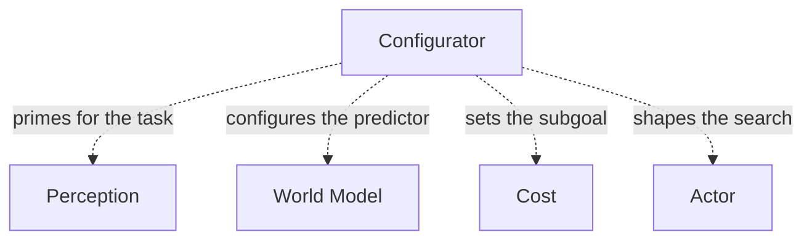

# The Configurator: Who Decides Which Task You're Solving?

Before Perception decides what to look at, before the World Model decides what to predict, before the Actor decides what to plan for — something has to decide *which task you're even doing right now*. Reading this sentence versus catching a ball versus assembling furniture all use the same brain, the same eyes, the same hands. Something switches the wiring.

That something is the Configurator:

> "The configurator is the main controller of the agent. It takes input from all other modules and modulates their parameters and connection graphs. The modulation can route signals, activate sub-networks, focus attention, etc." (p.38)

Concretely, if Perception and the World Model's predictor are built from transformer blocks, the paper proposes a clean mechanism for "modulation": just feed in more tokens.

> "In a scenario in which the predictor and the upper layers of the perception encoder are transformer blocks, the configurator outputs may constitute extra input tokens to these transformer blocks, thereby modulating their connection graphs and functions." (p.38)

> Wait — isn't this just another input to the network, same as any other? Not quite the same role. A normal input token carries *content* ("here's what I currently see"). A Configurator token carries *instructions* ("here's how to process what you see"). Same mechanism, different job — it reshapes the function the rest of the network computes rather than feeding it more data to compute over.

## Why have a Configurator at all? Two reasons

> "The configurator module is necessary for two reasons: hardware reuse, and knowledge sharing." (p.38)

| Reason | The idea |
|---|---|
| **Hardware reuse** | One circuit, reused sequentially across many tasks — valuable when parameter memory is limited |
| **Knowledge sharing** | A "generic" World Model trained for an environment can be lightly modulated for many different tasks, instead of training a separate World Model per skill |

The paper is explicit about the knowledge-sharing payoff, and equally explicit about the price you pay for it:

> "A reasonable hypothesis is that a world model trained for a given environment can be used for a range of different tasks with minor changes... This would be more data efficient and computationally efficient than having separate world models for each skill. The disadvantage is that the agent can only accomplish one task at a time." (p.38)

That trade-off — efficiency now, serial execution later — is the whole bet the architecture makes by centralizing control in one Configurator instead of running fully independent task-specific stacks.

## One controller, four modules it reaches into

## Priming Perception: the same eyes, tuned differently per task

The paper grounds this in something you already do constantly — your visual system is a different tool depending on what you're hunting for:

> "The configurator may prime the perception module for a particular task by modulating the parameters at various levels. The human perceptual system can be primed for a particular task, such as detecting an item in a cluttered drawer, detecting fruits or preys in a forest, reading, counting certain events, assembling two parts, etc." (p.38)

And the *level* of modulation depends on the task's nature:

> "For tasks that require a rapid detection of simple motifs, the configurator may modulate the weights of low-level layers in a convolutional architecture. For tasks that involve satisfying relationships between objects (such as assembling two parts with screws) the configuration may be performed by modulating tokens in high-level transformer modules." (p.38)

## Configuring the World Model's predictor: routing vs. relating

The predictor inside the World Model needs to behave very differently depending on what kind of prediction you're asking for:

> "For predictors performing short-term predictions at a low level of abstraction, configuration may mean dynamic signal routing... prediction may be reduced to local displacements of individual feature vectors... This may be advantageously implemented with local gating/routing circuits. For longer-term prediction at higher-levels of abstraction, it may be preferable to use a transformer architecture." (p.38)

Why transformers specifically for the higher-level, longer-horizon, object-based case? Permutation equivariance:

> "Transformer blocks are particularly appropriate for object-based reasoning in which objects interact. The reason is that the function of transformer blocks is equivariant to permutation. Thanks to that property, one does not need to worry about which object is assigned to which input token: the result will be identical and consistent with the input assignment." (p.38)

The paper points to existing work doing exactly this at the trajectory level — a transformer that sees an entire rollout of states, not just one step:

> "Recent work in model-based robotics have proposed to use a transformer operating at the level of an entire trajectory, imposing constraints on the attention circuits to configure the predictor for causal prediction or other tasks (Janner et al., 2021)." (p.38)

## Configuring Cost: setting the subgoal

This is, in the paper's own words, arguably the Configurator's most important job — and it's where "what task am I doing" cashes out as "what should I be minimizing right now":

> "Perhaps the most important function of the configurator is to set subgoals for the agent and to configure the cost module for this subgoal." (p.39)

Recall Cost is split into an immutable Intrinsic Cost and a Trainable Critic. The Configurator's reach into each piece is deliberately asymmetric:

> "This may be appropriate for the immutable Intrinsic Cost submodule: allowing for a complex modulation of the Intrinsic Cost may make the basic drives of the agent difficult to control, including cost terms that implement safety guardrails. In contrast, one can imagine more sophisticated architectures allowing the Trainable Critic part of the cost to be flexibly modulated." (p.39)

In other words: the Configurator is allowed to freely retask the *learned* part of Cost, but it is deliberately kept on a short leash around the *hard-wired* part — precisely because that hard-wired part is supposed to be where safety guarantees live. The same transformer trick used for predictors reappears here for relational goals:

> "If the high-level cost is formulated as a set of desired relationships between objects ('is the nut set on the screw?') one may use a transformer architecture trained to measure to what extent the state of the world diverges from the condition to be satisfied." (p.39)

## The open question the paper leaves on the table

LeCun is candid that one piece of this story is unsolved:

> "One question that is left unanswered is how the configurator can learn to decompose a complex task into a sequence of subgoals that can individually be accomplished by the agent. I shall leave this question open for future investigation." (p.39)

So: the paper tells you *what* the Configurator should do once it has a subgoal, but not *how it learns to invent the right sequence of subgoals* in the first place. That gap — automatic task decomposition — is left as homework for future research.
