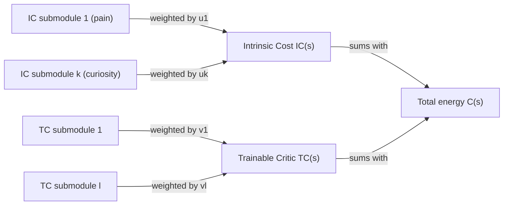
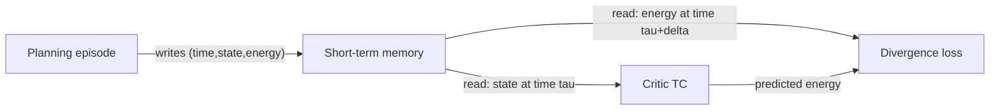

# If You Could Only Hard-Wire One Module to Never Learn, Which Would It Be?

Imagine you're designing this agent and someone says: "fine, every module can keep learning and adapting forever — except one. Pick one module that has to stay frozen, no matter what." Which one would you freeze?

LeCun's answer is the **Intrinsic Cost** module. Here's why, and what it's paired with.

## Cost splits into two pieces with opposite jobs

The Cost module isn't monolithic — it's a sum of two sub-modules with very different rules:

> "It is composed of the intrinsic cost module which is immutable IC_i(s) and the critic or Trainable Cost TC_j(s), which is trainable... C(s) = IC(s) + TC(s)" (p.13).

Each side is itself a weighted sum of smaller submodules — pain, hunger, curiosity, whatever drives you want to wire in — and the *weights* are what the Configurator gets to adjust:

> "Each submodule imparts a particular behavioral drive to the agent. The weights in the linear combination, u_i and v_j, are modulated by the configurator module and allow the agent to focus on different subgoals at different times" (p.13-14).

## Why Intrinsic Cost must be immutable

This is the safety argument of the section, and it's worth quoting in full:

> "To prevent a kind of behavioral collapse or an uncontrolled drift towards bad behaviors, the IC must be immutable and not subject to learning (nor to external modifications)" (p.14).

Think of it as the agent's nervous system for pain and pleasure — fixed at "birth," not something the agent can rewire to make itself feel good about doing something dangerous. It's deliberately compared to a brain structure: "The IC can be seen as playing a role similar to that of the amygdala in the mammalian brain" (p.14).

What goes in there? Concrete, physical drives:

> "For a robot, these terms would include obvious proprioceptive measurements corresponding to 'pain', 'hunger', and 'instinctive fears', measuring such things as external force overloads, dangerous electrical, chemical, or thermal environments, excessive power consumption, low levels of energy reserves in the power source, etc." (p.14).

Plus social and exploratory drives layered on top — "social drives such as seeking the company of humans... finding their pain unpleasant (akin to empathy)" and "curiosity, or taking actions that have an observable impact" to keep the World Model's training data diverse (p.14).

> Wait — if Intrinsic Cost never learns, how does the agent ever get smarter about what's good for it long-term? That's exactly what the Trainable Critic is for. IC tells you "this hurts right now." The critic learns to tell you "this is going to hurt later" — without you having to actually wait and feel it.

## The Critic's two jobs

> "The role of the critic (TC) is twofold: (1) to anticipate long-term outcomes with minimal use of the onerous world model, and (2) to allow the configurator to make the agent focus on accomplishing subgoals with a learned cost" (p.14).

In other words: the Critic is a *cheap shortcut* around expensive Mode-2 simulation. Instead of running the World Model forward many steps to find out a state is bad, the Critic learns to recognize "this looks bad" directly from the state — the same compile-deliberation-into-a-reflex idea from the Mode-1/Mode-2 lesson, but applied to cost estimation instead of action selection.

## How the Critic actually gets trained

The training loop runs entirely off data that the Intrinsic Cost and short-term Memory modules already produce — no separate labeling effort required.

> "During planning episodes, the intrinsic cost module stores triplets (time, state, intrinsic energy): (τ, s_τ, IC(s_τ)) into the associative short-term memory" (p.15).

Later, in a separate training pass, the Critic queries that memory to reconstruct a supervised learning problem:

> "During critic training episodes, the critic retrieves a past state vector s_τ, together with an intrinsic energy at a later time IC(s_τ+δ). In the simplest scenario, the critic adjusts its parameters to minimize a divergence measure between the target IC(s_τ+δ) and the predicted energy C(s_τ)" (p.15), for example "||IC(s_τ+δ) − TC(s_τ)||²" (p.15).

That's: take a state from the past, take the intrinsic pain/pleasure that *actually followed* it some time later, and train the Critic to predict that later number directly from the earlier state. The paper notes this is "similar to critic training methods used in such reinforcement learning approaches as A2C" (p.15) — if you've seen value functions trained in RL, this is the same move, just framed in energy terms instead of reward terms.

## Why use an objective at all, instead of just hand-coding behavior?

Section 3.2 closes by listing four ways to specify an agent's behavior — explicit programming, defining an objective to minimize, supervised imitation of an expert (training Mode-1 directly), or inverse reinforcement learning (inferring an objective from an expert, which produces a Critic). The paper argues for the objective-based approach:

> "The second method is considerably simpler to engineer than the first one, because it merely requires to design an objective, and not design a complete behavior... With an objective, the agent may adapt its behavior to satisfy the objective despite unexpected conditions and changes in the environment" (p.14-15).

That's the whole motivation for splitting Cost into IC and TC in the first place: hard-code the few things you truly never want compromised (IC), and let everything else — long-term planning, subgoal focus — emerge from minimizing a learned, adjustable objective (TC).
