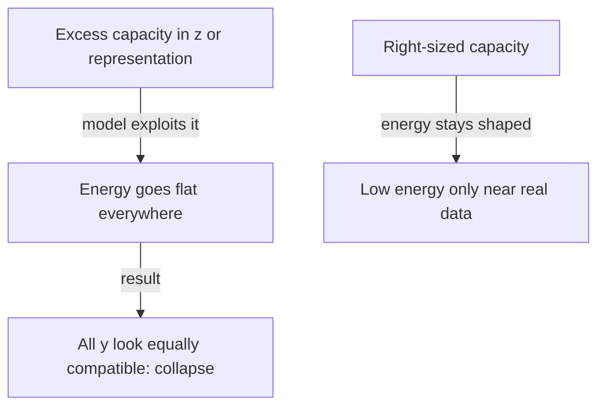
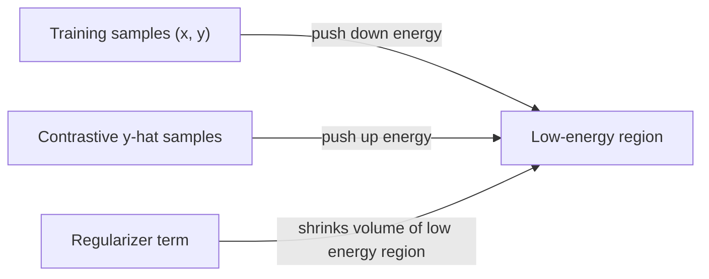

# Training Energy-Based Models Without Collapsing Them

Suppose you've built an energy function and trained it on a pile of (x, y) pairs. After training, you check it: every single y, no matter how nonsensical, gets the exact same low energy. Training "succeeded" in the sense that loss went down — but the model learned nothing. What went wrong?

This is the **collapse problem**, and avoiding it is the central challenge of training EBMs. First, an important framing point:

> "the definition of EBM does not make any reference to probabilistic modeling... the energy function is viewed as the fundamental object and is not assumed to implicitly represent the unnormalized logarithm of a probability distribution" (p.20).

EBMs are a more general framework than probability distributions — they just need the right *shape*.

## What "the right shape" means

> "Training an EBM consists in constructing an architecture... to compute the energy function Fw(x,y) parameterized with a parameter vector w. The training process must seek a w vector that gives the right shape to the energy function. For a given x from the training set, a well-trained Fw(x,y) will produce lower energies for values of y that are associated with x in the training set, and higher energies to other values of y" (p.20).

The loss functional needs to do two things:

> "minimizing this loss will make the energy of the training sample Fw(x,y) lower than the energies Fw(x, ŷ) of any ŷ different from y" (p.20).

Half of that is trivial: "Making the energy of the training sample low is easy: it is sufficient for the loss to be an increasing function of the energy, and for the energy to have a lower bound" (p.20).

The hard half is the other direction:

> "The difficult question is how to ensure that the energies of ŷ different from y are higher than the energy of y. Without a specific provision to ensure that Fw(x,y') > Fw(x,y) whenever ŷ ≠ y the energy landscape may suffer a collapse: given an x the energy landscape could become 'flat', giving essentially the same energy to all values of y" (p.20).

> Wait — isn't EBM training just normal supervised loss minimization? No. A normal supervised loss only ever sees the correct label and pushes the model toward it. An EBM loss has to additionally *defend* against the energy collapsing flat everywhere else — there's no automatic force pushing wrong answers up, so the loss design has to manufacture one.

## Which architectures are even vulnerable to collapse?

It depends entirely on the architecture's information capacity:

| Architecture | Collapse risk | Why |
|---|---|---|
| Deterministic predictor/regression | Cannot collapse | "For any x, a single ỹ is produced. The energy is zero whenever y = ỹ. Any y different from ỹ will have a higher energy, as long as D(y, ỹ) is strictly larger than zero" (p.20) |
| Generative latent-variable model | Can collapse | "can collapse when the latent variable has too much information capacity... If z has the same dimension as y, the system could very well give zero energy to the entire y space" (p.20) |
| Auto-encoder | Can collapse | "can collapse when the representation sy has too much information capacity... the AE could learn the identity function, producing a reconstruction error equal to zero over the entire y space" (p.20-21) |
| Joint Embedding Architecture | Can collapse | "can collapse when the information carried by sx and/or sy are insufficient. If the encoders ignore the inputs, and produce constant and equal codes sx = sy, the entire space will have zero energy" (p.21) |

The pattern: collapse happens whenever the model has *too much freedom* to make everything look compatible — either too expressive a latent variable, too high a capacity representation, or representations that just go constant and ignore the input.

## Two ways to keep the landscape from collapsing

There are two families of fix: **contrastive** and **regularized**.

### Contrastive methods: push down on real, pull up on fake

> "Contrastive methods consist in using a loss functional whose minimization has the effect of pushing down on the energies of training samples (x,y), and pulling up on the energies of suitably-hallucinated 'contrastive' samples (x, ŷ). The contrastive sample ŷ should be picked in such a way as to ensure that the EBM assigns higher energies to points outside the regions of high data density" (p.21).

A simple instance, the distance-dependent hinge loss:

> "L(w,x,y,ŷ) = [Fw(x,y) − Fw(x,ŷ) + μ‖y − ŷ‖²]+ ... This makes the energy grow at least quadratically with the distance to the data manifold" (p.22).

This family is everywhere in practice: "Siamese network architectures trained with pairs where x is a distorted or corrupted version of y and ŷ another random (or suitably chosen) training sample. This includes such methods as the original Siamese net, as well as more recent methods including DrLIM, PIRL, MoCO, SimCLR, CPT" (p.23), plus "Generative Adversarial Networks", "Denoising Auto-Encoders and... Masked Auto-Encoders" (p.23).

But contrastive methods have a real cost:

> "one has to design a scheme to generate or pick suitable ŷ... when y is in a high-dimensional space, and if the EBM is flexible, it may require a very large number of contrastive samples to ensure that the energy is higher in all dimensions unoccupied by the local data distribution. Because of the curse of dimensionality, in the worst case, the number of contrastive samples may grow exponentially with the dimension of the representation. This is the main reason why I will argue against contrastive methods" (p.23).

### Regularized methods: shrink the low-energy volume directly

> "Regularized methods for EBM training are much more promising in the long run than contrastive methods because they can eschew the curse of dimensionality that plagues contrastive methods. They consist in constructing a loss functional that has the effect of pushing down on the energies of training samples, and simultaneously minimizing the volume of y space to which the model associates a low energy" (p.23).

> "By minimizing this regularization term while pushing down on the energies of data points, the regions of low energy will 'shrink-wrap' the regions of high data density. The main advantage of non-contrastive regularized methods is that they are less likely than contrastive methods to fall victim to the curse of dimensionality" (p.23).

Examples cited: "sparse modeling, sparse auto-encoders, and auto-encoders with noisy latent variables, such as VAE" (p.23).

The two approaches aren't mutually exclusive: "contrastive and regularized methods are not incompatible with each other, and can be used simultaneously on the same model" (p.23).

| | Contrastive | Regularized |
|---|---|---|
| Mechanism | Push down real, pull up sampled fakes | Push down real, shrink total low-energy volume |
| Main weakness | Needs a scheme to pick good ŷ; sample count can scale exponentially with dimension | Right regularizer is architecture-dependent and not always obvious |
| Examples | Siamese nets, SimCLR, MoCo, GANs, denoising/masked autoencoders | Sparse autoencoders, VAEs |

This is exactly the tension the next module's architecture (JEPA) is designed to resolve — but that design is out of scope here.
