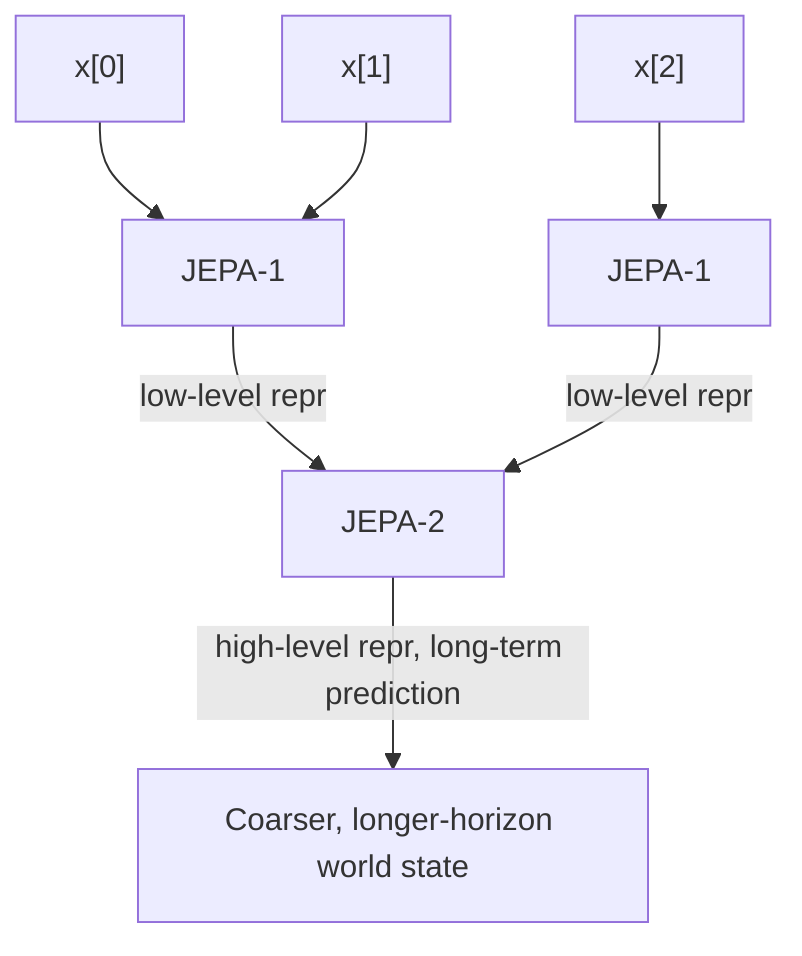

# Stacking JEPAs: One World Model, Many Time Scales

When you're driving, you can predict your car's trajectory over the next few seconds pretty accurately. Can you predict its *exact* trajectory ten minutes from now — every steering correction, every lane change? No. But you can still predict something useful at ten minutes: "I'll probably be at the office, on time." Same world, two different predictions, two different levels of detail. How does one architecture do both?

## Abstraction is what makes long-term prediction possible

A JEPA trained with a non-contrastive criterion (like VICReg) is free to throw away whatever isn't predictable:

> "When trained with VICReg and similar criteria, a JEPA can choose to train its encoders to eliminate irrelevant details of the inputs so as to make the representations more predictable. In other words, a JEPA will learn abstract representations that make the world predictable. Unpredictable details will be eliminated by the invariance properties of the encoder, or will be pushed into the predictor's latent variable."

This is presented as a sharp advantage over generative models:

> "It is important to note that generative latent-variable models are not capable of eliminating irrelevant details, other than by pushing them into a latent variable. This is because they do not produce abstract (and invariant) representations of y. This is why we advocate against the use of generative architectures."

That capacity for abstraction is exactly what licenses stacking JEPAs on top of each other:

> "Intuitively, low-level representations contain a lot of details about the input, and can be used to predict in the short term. But it may be difficult to produce accurate long-term predictions with the same level of details. Conversely high-level, abstract representation may enable long-term predictions, but at the cost of eliminating a lot of details."

## The driving example, spelled out

> "When driving a car, given a proposed sequence of actions on the steering wheel and pedals over the next several seconds, drivers can accurately predict the trajectory of their car over the same period. The details of the trajectory over longer periods are harder to predict because they may depend on other cars, traffic lights, pedestrians, and other external events that are somewhat unpredictable. But the driver can still make accurate predictions at a higher level of abstraction: ignoring the details of trajectories, other cars, traffic signals, etc, the car will probably arrive at its destination within a predictable time frame."

Notice what got dropped and what survived: the millisecond-by-millisecond trajectory is gone, but "the approximate trajectory, as drawn on a map" remains. A discrete latent can even stand in for "which route did I take."

## H-JEPA: stacking levels

> "Figure 15 shows a possible architecture for multilevel, multi-scale world state prediction. Variables x0, x1, x2 represent a sequence of observations. The first-level network, denoted JEPA-1 performs short-term predictions using low-level representations. The second-level network JEPA-2 performs longer-term predictions using higher-level representations."

> "One can envision architectures of this type with many levels, possibly using convolutional and other modules, and using temporal pooling between levels to coarse-grain the representation and perform longer-term predictions. Training can be performed level-wise or globally, using any non-contrastive method for JEPA."

> Wait — isn't this just downsampling, like pooling in a CNN? Not quite the same goal. Spatial pooling in a CNN shrinks resolution to save compute. Here, each level up the H-JEPA stack is shrinking *predictability horizon* trade-offs — discarding exactly the details that are hard to predict at that time scale, learned via the VICReg-style criteria, not a fixed downsampling rule.

## Why this matters beyond prediction

The paper claims this isn't just an engineering convenience — it's load-bearing for planning:

> "I submit that the ability to represent sequences of world states at several levels of abstraction is essential to intelligent behavior. With multi-level representations of world states and actions, a complex task can be decomposed into successively more detailed sub-tasks, instantiated into actions sequences when informed by local conditions."

And the worked example chains all the way down to muscle control:

> "For example, planning a complex task, like commuting to work, can be decomposed into driving to the train station, catching a train, etc. Driving to the train station can be decomposed into walking out of the house, starting the car, and driving. Getting out of the house requires standing up, walking to the door, opening the door, etc. This decomposition descends all the way down to millisecond-by-millisecond muscle controls, which can only be instantiated when the relevant environmental conditions are perceived."

That decomposition — long-horizon goal down to millisecond actions — is exactly the planning mechanism covered next.
