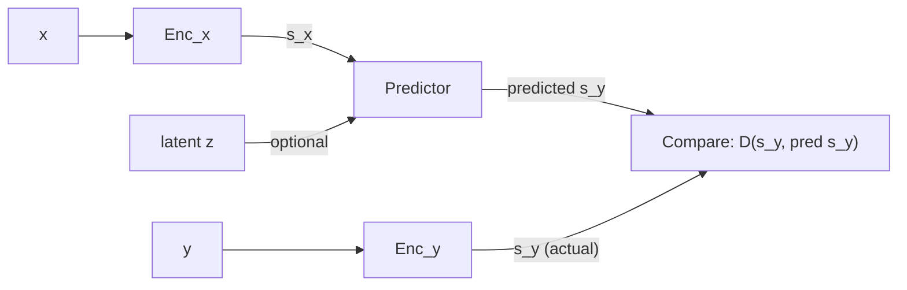

# JEPA: Predicting in Representation Space

Why predict the NEXT FRAME's pixels when most of those pixels — background, lighting, the texture on a carpet, leaves moving in the wind, ripples on a pond — are things you don't actually care about and can't predict anyway?

That's the question this section answers, and the answer is the **Joint Embedding Predictive Architecture (JEPA)** — what the paper calls "the centerpiece of this paper."

## What JEPA actually does

JEPA is "not generative in the sense that it cannot easily be used to predict y from x. It merely capture[s] the dependencies between x and y without explicitly generating predictions of y."

Instead of predicting `y` directly, it predicts `y`'s *representation*:

> "The JEPA is non-generative in that it does not actually predict y, but predicts the representation of y, sy from that of x, sx."

Two separate encoders turn the raw inputs into representations, and a predictor bridges between them:

> "The two variables x and y are fed to two encoders producing two presentations sx and sy. These two encoders may be different. They are not required to possess the same architecture nor are they required to share their parameters. This allows x and y to be different in nature (e.g. video and audio). A predictor module predicts the representation of y from the representation of x."

The energy — JEPA's measure of "how wrong is this" — is just the prediction error, measured in representation space, not pixel space:

> "The energy is simply the prediction error in representation space: E_w(x,y,z) = D(sy, Pred(sx,z))"

> Wait — isn't JEPA just a regular autoencoder? No. An autoencoder tries to *reconstruct* `y` itself — every pixel, every texture detail. JEPA never touches pixel space for `y` at all; it only ever predicts `s_y`, `y`'s representation, and lets the `y`-encoder throw away whatever it likes before the predictor even sees it.

## The payoff: an encoder allowed to forget

The reason this matters is that the `y`-encoder doesn't have to preserve everything:

> "The main advantage of JEPA is that it performs predictions in representation space, eschewing the need to predict every detail of y. This is enabled by the fact that the encoder of y may choose to produce an abstract representation from which irrelevant details have been eliminated."

And concretely, on the video case:

> "In a video prediction scenario, it is essentially impossible to predict every pixel value of every future frame. The details of the texture on a carpet, the leaves of a tree moving in the wind, or the ripples on a pond, cannot be predicted accurately, at least not over long time periods and not without consuming enormous resources. A considerable advantage of JEPA is that it can choose to ignore details of the inputs that are not easily predictable."

## Handling multiple plausible futures

A car approaching a fork in the road could go left or right — both are valid continuations of `x`. JEPA has two distinct mechanisms for representing that multiplicity:

| Mechanism | How it works | Example |
|---|---|---|
| **Encoder invariance** | `sy = Enc(y)` maps a whole *set* of different `y`'s onto the same `sy`, so they all get identical (low) energy | The encoder doesn't care about "trees bordering the road or the texture of the sidewalk" — it only keeps position/velocity/orientation |
| **Latent variable predictor** | The predictor takes a latent `z`; varying `z` over a set `Z` produces a *set* of plausible predictions `Pred(sx, Z)` | `z` is a binary variable: `z=0` → predicted left-branch representation, `z=1` → predicted right-branch representation |

Quoting the fork example directly:

> "If x is a video clip of a car approaching a fork in the road, sx and sy may represent the position, orientation, velocity and other characteristics of the car before and after the fork, respectively, ignoring irrelevant details such as the trees bordering the road or the texture of the sidewalk. z may represent whether the car takes the left branch or the right branch of the road."

So JEPA trades something away — "we lose the ability to generate outputs" — to gain something more valuable for a world model: "a powerful way to represent multi-modal dependencies between inputs and outputs."
