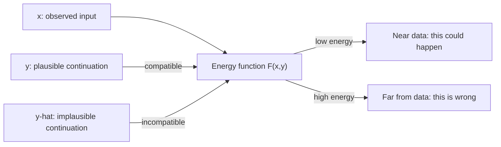
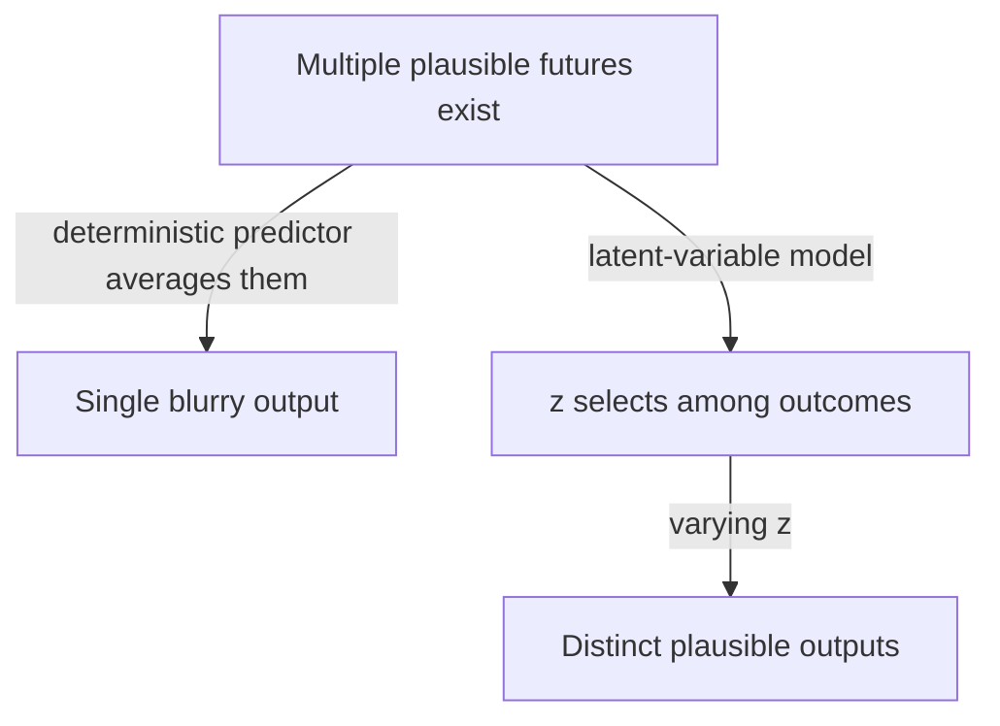
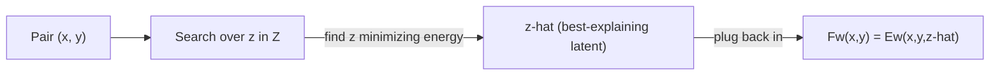

# When There's No Single Right Answer: Energy-Based Models and Latent Variables

If you watch a ball roll off a table and the video cuts out, what happens next? It hits the floor — but *where* exactly, *what angle*, *does it bounce or roll*? There isn't ONE right answer. So what should a model even predict?

This is the second of the three hard issues raised at the start of this section: "the world is not entirely predictable. Hence, the world model should be able to represent multiple plausible outcomes from a given state and (optionally) an action. This may constitute one of the most difficult challenges to which the present proposal brings a solution" (p.16).

## Scoring compatibility instead of predicting a single output

The general formulation for this is the **Energy-Based Model (EBM)**:

> "The system is a scalar-valued function F(x,y) that produces low energy values when x and y are compatible and higher values when they are not" (p.17).

| Energy | Meaning |
|---|---|
| Low | `x` and `y` are compatible / consistent — `y` is a plausible match for `x` |
| High | `x` and `y` are incompatible / inconsistent — `y` doesn't fit `x` |

"Data points are black dots. The energy function produces low energy values around the data points, and higher energies away from the regions of high data density" (p.17).

The payoff: "the EBM implicit function formulation enables the system to represent multi-modal dependencies in which multiple values of y are compatible with a given x. The set of y compatible with a given x may be a single point, multiple discrete points, a manifold, or a collection of points and manifolds" (p.17). Instead of forcing the model to commit to a single predicted `y`, it just has to correctly rank *every* candidate `y` by plausibility — and several candidates can all score low energy at once.

## So why isn't a deterministic predictor enough?

Imagine you train an ordinary regression network to predict "the next video frame" directly. With many plausible futures all valid, what does a deterministic network trained to minimize average error actually output? It averages them — producing a blurry, washed-out compromise that isn't really any of the plausible outcomes.

This is exactly the gap a **latent variable** fills.

## The latent variable: representing what x can't tell you

> "A latent variable is an input variable whose value is not observed but inferred. A latent variable can be seen as parameterizing the set of possible relationships between an x and a set of compatible y. Latent variables are used to represent information about y that cannot be extracted from x" (p.19).

Two concrete examples straight from the text:

- **Camera displacement.** "Imagine a scenario in which x is a photo of a scene, and y a photo of the same scene from a slightly different viewpoint. To tell whether x and y are indeed views from the same scene, one may need to infer the displacement of the camera between the two views" (p.19).
- **Which fork in the road.** "if x is a picture of a car coming to a fork in the road, and y is a picture of the same car a few seconds later on one of the branches of the fork, the compatibility between x and y depends on a binary latent variable that can be inferred: did the car turn left or right" (p.19).

And the general temporal-prediction framing: "the latent variable represents what cannot be predicted about y (the future) solely from x and from past observations (the past). It should contain all information that would be useful for the prediction, but is not observable, or not knowable. I may not know whether the driver in front of me will turn left or right, accelerate or brake, but I can represent those options by a latent variable" (p.19).

## How inference works: minimize over z

A **latent-variable EBM (LVEBM)** is "a parameterized energy function that depends on x, y, and z: Ew(x,y,z)" (p.19). Given a pair (x, y), inference searches for the value of z that best explains the pair — the one that makes them look most compatible:

> "the inference procedure of the EBM finds a value of the latent variable z that minimizes the energy ž = argmin_{z∈Z} Ew(x,y,z)" (p.19-20).

In the dual-viewpoint example: "inference finds the camera motion that best explains how x could be transformed into y" (p.19).

Once you've minimized over z, you can fold it away entirely and get back a plain energy over just x and y:

> "This latent-variable inference by minimization allows us to eliminate z from the energy function: Fw(x,y) = min_{z∈Z} Ew(x,y,z) = Ew(x,y, ž). Technically, Fw(x,y) should be called a zero-temperature free energy, but we will continue to call it the energy" (p.20).

> Wait — isn't a latent variable just a fancy name for "noise added to the model"? No. Noise is unstructured and discarded. A latent variable here is *inferred* to mean something specific (a camera angle, a turn direction) and the inference step is what lets the energy function explain a particular `y` rather than just blur over all of them.
