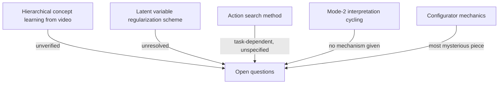

# What the Paper Admits It Doesn't Know

Most position papers spend their final pages declaring victory. This one spends them listing the ways its own architecture might not work. That's worth pausing on — it's a useful signal about how seriously to take the rest of the proposal.

> "There may be flaws and pitfalls that may appear to be unsolvable within the specifications of the proposed architecture" (p.43).

So what exactly is still open? Here's the honest list, straight from the source.

## Five unresolved questions

| # | Open question | What's actually unknown |
|---|----------------|---------------------------|
| 1 | **Can H-JEPA even be built and trained from video?** | "Could it learn the type of abstract concept hierarchy mentioned in section 4.1?" (p.43) — nobody has shown it yet |
| 2 | **How do you regularize the latent variable?** | Discrete, low-dimensional, sparse, or stochastic are all "proposed," but "it is not clear which approach will ultimately be the best" (p.43) |
| 3 | **How does the actor search for actions?** | Gradient-based search works "in principle," but when "the action space is discrete, or when the function from actions to cost is highly non smooth," you need gradient-free search instead — "dynamic programming, belief propagation, MCTS, SAT, etc." (p.43) |
| 4 | **How does Mode-2 explore multiple interpretations?** | Humans can "spontaneously cycle through alternative interpretations of a percept" (think of the Necker cube), but "no such mechanism is described here" (p.43) |
| 5 | **What does the configurator actually do, mechanically?** | "Of all the least understood aspects of the current proposal, the configurator module is the most mysterious. ... Precisely how to do that is not specified" (p.44) |

> Wait — if the configurator is "the most mysterious" piece, doesn't that undermine Mode-2 reasoning, which depends on it to set subgoals? Yes, somewhat — and the paper says so directly rather than glossing over it. This is presented as a research roadmap, not a finished blueprint.

## Even the micro-architecture is unspecified

It's not just the big conceptual gaps. The paper also admits it hasn't specified how the *modules themselves* should be built:

- The predictor "will require some sort of dynamic routing and gating circuits in its micro-architecture" — but what that circuitry looks like isn't said (p.43).
- Low-level predictors probably need to be specialized for small short-term transformations, while higher-level predictors need "more generic architectures that manipulate objects and their relationships" — "none of this is specified in the present proposal" (p.43).
- Short-term memory is supposed to work like an associative memory storing "beliefs about the state of the world between compute cycles," following ideas from Memory Networks — but "getting such an architecture to work for complex planning and control may prove difficult" (p.43-44).

## Why list your own holes?

The paper closes this section with a one-line summary that's worth holding onto:

> "This is merely a list of foreseeable questions, but many questions and problems will inevitably surface as instances of the proposed systems are put together" (p.44).

That's the tone of the whole section: this is a research agenda, with named unknowns, not a working system with loose ends. When you evaluate any big architectural proposal — this one or otherwise — the gaps the authors admit to are often more informative than the parts they're confident about.
