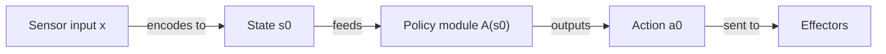
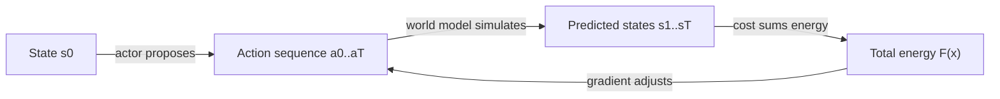
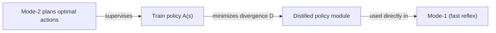

# Why You Can Catch a Ball Without Thinking, But Can't Parallel-Park Without Thinking

Catching a tossed ball: your hand just moves. No deliberation, no "let me simulate three possible hand trajectories." Parallel parking on the first try in a tight spot: you actually stop, picture the car's path, maybe even reverse and try again mentally before you touch the wheel.

LeCun's architecture has a name for each of those: **Mode-1** and **Mode-2**.

> "The first one involves no complex reasoning, and produces an action directly from the output of the perception and a possible short-term memory access. We will call it 'Mode-1', by analogy with Kahneman's 'System 1'... The second mode involves reasoning and planning through the world model and the cost... We will call it 'Mode-2' by analogy to Kahneman's 'System 2'" (p.9).

## Mode-1: reactive, and it skips the World Model entirely

Here's the part that's easy to miss: Mode-1 isn't "a simpler version of Mode-2." It's structurally different — it doesn't even touch the World Model or Cost during action selection.

> "This reactive process does not make use of the world model nor of the cost" (p.9, Fig. 3 caption).

The whole loop is: Perception produces a state, a policy module turns that state directly into an action.

> "The perception module, through an encoder module, extracts a representation of the state of the world s[0] = Enc(x)... A policy module, a component of the actor, produces an action as a function of the state a[0] = A(s[0])" (p.9-10).

The Cost module still quietly computes the energy of the state that *was* reached, and stores it in short-term memory — but that's bookkeeping, not decision-making. It happens *after* the action, not before it.

> Wait — if Mode-1 skips the Cost module, how does it ever improve? It doesn't, on its own — at least not from this loop. Mode-1 policies get good either by being trained offline (more on that below) or via slow, risky trial-and-error in the world, which the paper explicitly calls out as a downside: "gradients of the cost f[0] with respect to actions can only be estimated by polling the world with multiple perturbed actions, but that is slow and potentially dangerous" (p.10).

## Mode-2: reasoning is just running the World Model in a loop

Mode-2 is the deliberate version — and "deliberate" here has a very specific mechanical meaning: propose actions, simulate their consequences, score the consequences, adjust, repeat.

> "1. perception... 2. action proposal: the actor proposes an initial sequence of actions... 3. simulation: the world model predicts one or several likely sequence of world state representations... 4. evaluation: the cost module estimates a total cost... 5. planning: the actor proposes a new action sequence with lower cost" (p.10).

This is the same shape as **model-predictive control** from classical robotics — the paper says so directly: "This procedure is essentially what is known as Model-Predictive Control (MPC) with receding horizon in the optimal control literature. The difference with classical optimal control is that the world model and the cost function are learned" (p.11).

And because Cost and World Model are both differentiable, this search can literally be gradient descent: "gradients of the cost are back-propagated through the compute graph to the action variables" (p.10) — or, if the action space is discrete, dynamic programming or tree search instead.

## "Reasoning" gets redefined as energy minimization

This is the conceptual punchline of the section. The paper isn't using "reasoning" the way a logic textbook would:

> "We use the term 'reasoning' in a broad sense here to mean constraint satisfaction (or energy minimization). Many types of reasoning can be viewed as forms of energy minimization" (p.9).

So "thinking hard about a problem" in this architecture literally means: running the World Model forward under different proposed actions, and gradient-descending on the energy those actions produce. No symbols, no logic rules required — though the paper notes this view does subsume classical probabilistic reasoning too, since "the proposed architecture is, in fact, a factor graph in which the cost modules are log factors" (p.13).

## From Mode-2 to Mode-1: compiling deliberation into a reflex

Mode-2 isn't free. It "mobilizes all the resources of the agent" and "can only be used for a single task at a time" (p.12) — you can't model-predictive-control your way through two unrelated problems simultaneously. Mode-1, by contrast, is cheap and parallelizable: "the agent may possess multiple policy modules working simultaneously, each specialized for a particular set of tasks" (p.12).

So the architecture has a built-in way to turn expensive deliberation into a cheap reflex — distillation:

> "The system first operates in Mode-2 and produces an optimal sequence of actions... Then the parameters of the policy module are adjusted to minimize a divergence D(â[t], A(s[t])) between the optimal action and the output of the policy module... This results in a policy module that performs amortized inference" (p.12).

This is "practice makes perfect" formalized: you laboriously plan your parallel park the first ten times (Mode-2), and eventually your hands just know what to do without conscious simulation (Mode-1). The paper's own framing: "This process allows the agent to use the full power of its world model and reasoning capabilities to acquire new skills that are then 'compiled' into a reactive policy module that no longer requires careful planning" (p.12).

The distilled policy isn't even limited to replacing Mode-2 — it can also *jump-start* it, by proposing the first guess at an action sequence "to initialize the action sequence prior to Mode-2 inference and thereby accelerate the optimization" (p.11).
