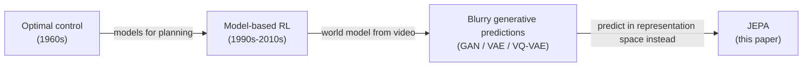

# Where Does This Idea Actually Come From?

If you've made it this far, you might be wondering: is any of this — modular architectures, world models, energy-based learning, joint embeddings — actually new? The paper is refreshingly upfront about the answer.

> "Most of the ideas presented in the paper are not new, and have been discussed at length in various forms in cognitive science, neuroscience, optimal control, robotics, AI, and machine learning, particularly in reinforcement learning." (Section 7)

So what *is* new? The paper names exactly four contributions:

> "Perhaps the main original contributions of the paper reside in: an overall cognitive architecture in which all modules are differentiable and many of them are trainable [...] H-JEPA: a non-generative hierarchical architecture for predictive world models that learn representations at multiple levels of abstraction and multiple time scales [...] a family of non-contrastive self-supervised learning paradigm that produces representations that are simultaneously informative and predictable [...] A way to use H-JEPA as the basis of predictive world models for hierarchical planning under uncertainty." (Section 7)

> **Wait — if none of the individual pieces are new, what's the contribution?** The synthesis. Model-based control, hierarchical planning, and self-supervised joint embeddings have each been studied for decades, mostly separately. The claim here is about how they fit together end-to-end and differentiably — not that any single piece is novel in isolation.

## Model-based control and planning: an old idea with a long tail

Using a learned model to plan actions isn't new — it goes back to optimal control in the 1960s:

> "The use of models in optimal control goes back to the early days with the Kelley-Bryson method." (Section 7.1)

Using *neural networks* as that model is also old — early 1990s. What's changed recently is the move to learning world models directly from raw video, which is much harder than learning from clean state vectors:

> "A difficult setting is one in which the main input is visual, and a world model must be learned from video. Early attempts to train predictive models without latent variables from simple video produced blurry predictions." (Section 7.1)

That "blurry predictions" problem is the latent-variable problem from earlier in the paper, showing up again in the literature: GANs, VAEs, and VQ-VAE are all prior attempts to fix it generatively.

Where does this paper's approach diverge? It rejects the generative route entirely:

> "Unlike the proposed JEPA, these models are generative. The key issue of how to represent uncertainty in the prediction remains." (Section 7.1)

And it notes hierarchical planning specifically is still an open problem across the field, citing only a handful of prior attempts (Wayne & Abbott's stacked forward models, Hafner et al.'s Director system) before landing on its own claim:

> "Hierarchical planning is a largely unsolved problem." (Section 7.1)

## Energy-based and joint-embedding methods: a 30-year-old idea getting non-contrastive

The second related-work thread covers the EBM/JEA lineage this paper's training method descends from. The earliest joint-embedding work is decades old:

> "The first non-contrastive JEA was (Becker and Hinton, 1992) [...] Perhaps the first contrastive method for JEA is the so-called 'Siamese Network' (Bromley et al., 1994). This was trained contrastively for the purpose of verifying signatures handwritten on a pen tablet." (Section 7.2)

Contrastive joint embedding then went quiet for over a decade before exploding back into relevance with modern self-supervised learning:

> "The idea of JEA remained largely untouched for over a decade, until it was revived [...] With the emergence of SSL approaches, the use of JEA trained contrastively has exploded in the last few years with methods such as PIRL, MoCo and MoCo-v2, and SimCLR." (Section 7.2)

But this paper's own method — VICReg, from "Designing and Training the World Model" — sits in a smaller, more recent, *non-contrastive* family:

> "The class of non-contrastive methods advocated in the present proposal prevent collapse by maximizing the information content of the embeddings. This includes Barlow Twins, VICReg, whitening-based methods, and Maximum Coding Rate Reduction methods." (Section 7.2)

| Lineage | Examples | How collapse is prevented |
|---|---|---|
| Contrastive JEA | Siamese Networks, MoCo, SimCLR | Negative pairs pushed apart |
| Non-contrastive JEA (this paper's family) | Barlow Twins, VICReg, BYOL | Information-maximizing regularizers on the embeddings themselves |

## Human and animal cognition: borrowed evidence, not borrowed mechanisms

The final related-work thread is cognitive science — used here as *motivation and evidence*, not as a source of algorithms. Two findings stand out:

> "Young children quickly learn abstract concepts [...] and models that allow them to navigate, to form goals, and to plan complex action sequences to fulfill them." (Section 7.3)

> "There is evidence that people construct simplified representations of the world for planning in which irrelevant details are abstracted away." (Section 7.3)

That second sentence is the human evidence for exactly the H-JEPA claim from the previous module: abstraction isn't a computational shortcut invented for convenience, it's how biological planners already work.

One more thread worth flagging: the paper explicitly declines to claim its architecture explains consciousness, while noting a loose structural parallel:

> "I will not speculate about whether some version of the proposed architecture could possess a property assimilable to consciousness, but will only mention the work of Dehaene and collaborators who have proposed two types of consciousness that they call C1 and C2 [...] C2 requires a self-monitoring ability, perhaps assimilable to what the configurator module needs to do in the present proposal." (Section 7.3)

That's a deliberately hedged claim — "perhaps assimilable to," not "is." Worth remembering before the paper's own Discussion section pushes further into how far this architecture's claims should reasonably extend.
