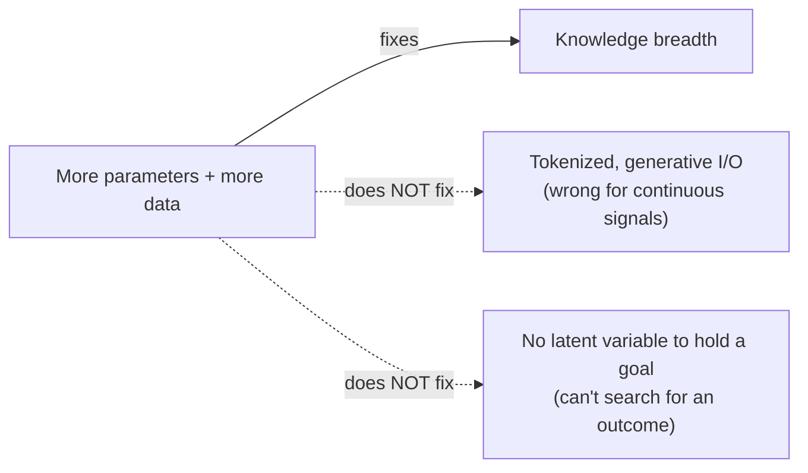

# Three Popular Shortcuts to Intelligence — and Why the Paper Rejects All Three

Imagine three different engineers, each convinced they already know the one trick that gets to human-level AI:

> "The surprising power of large transformer architectures trained to predict text and other modalities have led some to claim that we merely need to scale up those models. The surprising power of reinforcement learning for games and other simple environments have led other to claim that reward is enough. Finally, the limitations of current deep-learning systems when it comes to reasoning have led some to claim that deep learning systems need to be augmented by hard-wired symbol manipulation." (Section 8.3)

Three popular bets: *scale wins*, *reward is enough*, *you need hand-coded symbols*. This module walks through why the paper takes a position against the first two outright, and a more nuanced position on the third.

## Bet #1: "Just scale up the transformer"

The author states his position bluntly:

> "My position in this debate is that I do not believe that scaling is enough for two main reasons." (Section 8.3.1)

**Reason one — the input representation is wrong for the job.** Today's large models work by chopping input into discrete tokens and generating plausible continuations:

> "Current models operate on 'tokenized' data and are generative [...] this works well for text, which is already a sequence of discrete tokens, [but] it is less suitable for continuous, high dimensional signals such as video." (Section 8.3.1)

That's the latent-variable/blurriness problem from the JEPA module, reappearing at the scale of entire foundation models:

> "This approach doesn't work for high-dimensional continuous modalities, such as video. To represent such data, it is necessary to eliminate irrelevant information about the variable to be modeled through an encoder, as in the JEPA." (Section 8.3.1)

**Reason two — there's nowhere to put a goal.** A model that only ever predicts "the most likely next token" has no slot for "but I want this specific outcome":

> "Current models are only capable of very limited forms of reasoning. The absence of abstract latent variables in these models precludes the exploration of multiple interpretations of a percept and the search for optimal courses of action to achieve a goal. In fact, dynamically specifying a goal in such models is essentially impossible." (Section 8.3.1)

> **Wait — but LLMs clearly got smarter as they got bigger, didn't they?** Yes, on the axis of knowledge breadth from text. The paper's claim is narrower: scale fixes *how much* the model knows, not *how* it represents continuous reality or *whether* it can pursue a specified goal. Those are architectural properties, not data-volume properties.

## Bet #2: "Reward is enough"

Here the paper picks a direct fight, naming the position paper it's responding to (Silver et al., 2021, titled "Reward is Enough"):

> "Contrary to the title of a recent position paper by Silver et al., the reward plays a relatively minor role in this scenario." (Section 8.3.2)

Why? Because this architecture deliberately minimizes how much it relies on reward signal in the first place:

> "The proposed architecture is designed to minimize the number of actions a system needs to take in the real world to learn a task. It does so by learning a world model that captures as much knowledge about the world as possible without taking actions in the world." (Section 8.3.2)

The paper draws a sharp efficiency contrast between reward-driven and model-driven learning:

> "Model-free RL is extremely sample-inefficient [...] requiring very large numbers of trials to learn a skill. Scalar rewards provide low-information feedback to a learning system." (Section 8.3.2)

A single scalar reward at the end of a long episode is a thin signal — most of a self-driving car's training shouldn't come from "you crashed, -1," it should come from a world model that already understands physics, traffic, and momentum *before* any reward ever fires. Whose job is most of the learning, then?

> "Most of the parameters in the systems are trained to predict large amounts of observations in the world." (Section 8.3.2)

| | Model-free RL | This paper's approach |
|---|---|---|
| Main learning signal | Scalar reward, sparse | Predicting world states, dense and constant |
| Sample efficiency | Low — many trials needed | High — most learning needs no actions at all |
| Role of reward | Drives almost all learning | Shapes a small slice (the cost), on top of an already-competent world model |

## Bet #3: "Reasoning needs hard-wired symbols"

The third camp says deep nets can't really reason, so you need to bolt on classical symbolic logic. The paper's answer isn't "no" — it's "you can get the *behavior* of symbolic reasoning out of search and optimization, without hard-coding the symbols":

> "In the proposed architecture, reasoning comes down to energy minimization or constraint satisfaction by the actor using various search methods to find a suitable combination of actions and latent variables." (Section 8.3.3)

Whether that search looks "symbolic" or "continuous" depends on the *level of abstraction*, not on whether symbols were hard-wired in:

> "There may be situations where the predictor output changes quickly as a function of the action, and where the action space is essentially discontinuous. This is likely to occur at high levels of abstractions where choices are more likely to be qualitative. A high-level decision for a self-driving car may correspond to 'turning left or right at the fork', while the low-level version would be a sequence of wheel angles." (Section 8.3.3)

"Turn left or right" *looks* like a discrete symbol — but on this view it's a discrete region of a learned, continuous abstraction space, not a token from a hand-built symbol table. The paper's stated goal is to make even that discrete-feeling choice tractable with continuous (gradient-based) search wherever possible:

> "The efficiency advantage of gradient-based search methods over gradient-free search methods motivates us to find ways for the world-model training procedure to find hierarchical representations with which the planning/reasoning problem constitutes a continuous relaxation of an otherwise discrete problem." (Section 8.3.3)

And the paper closes this whole debate with real intellectual honesty rather than a victory lap:

> "A remaining question is whether the type of reasoning proposed here can encompass all forms of reasoning that humans and animals are capable of." (Section 8.3.3)

That's the pattern across all three bets in this module: not "my approach solves it, theirs doesn't" but "here's specifically what each shortcut is missing, and here's the open question my own approach still hasn't closed."
