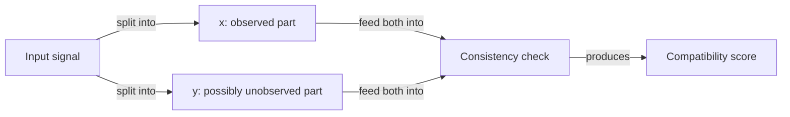
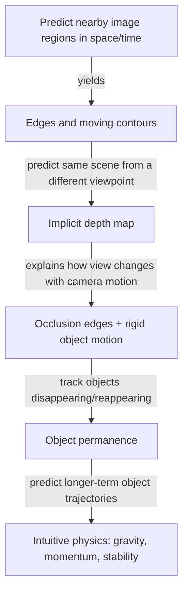

# Fill in the Blanks: How Self-Supervised Learning Builds a World Model

Here's a question: if you watch a video clip and someone hands you a *second* clip, how would you check whether the second one is a believable continuation of the first — without anyone telling you the "right answer"?

That's the whole game. LeCun frames training a world model as "a prototypical example of Self-Supervised Learning (SSL), whose basic idea is pattern completion" (p.16). No labels, no human telling you what comes next — just consistency-checking between parts of your own input.

> "The prediction of future inputs (or temporarily unobserved inputs) is a special case of pattern completion. In this work, the primary purpose of the world model is seen as predicting future representations of the state of the world" (p.16).

## x and y: the two halves of the puzzle

SSL splits an input into an observed part and a possibly-unobserved part:

| Symbol | What it is | Video example |
|---|---|---|
| `x` | the observed part of the input | the first video clip (past + present) |
| `y` | the part that's possibly unobserved | the second video clip (the future) |

"Concretely, this often comes down to training a system to tell us if various parts of its input are consistent with each other" (p.17). For video: "the system is given two video clips, and must tell us to what degree the second video clip is a plausible continuation of the first one" (p.17). For pattern completion generally: "the system is given part of an input (image, text, audio signal) together with a proposal for the rest of the input, and tells us whether the proposal is a plausible completion of the first part" (p.17).

## Why not just predict y from x directly?

This is the crucial design choice, and it's easy to miss why it matters.

> "Importantly, we do not impose that the model be able to predict y from x. The reason is that there may be an infinite number of y that are compatible with a given x. In a video prediction setting, there is an infinite number of video clips that are plausible continuations of a given clip" (p.17).

Trying to *generate* the one true future is often "difficult, or intractable" (p.17) — there isn't one true future to generate. So instead of asking "what exactly happens next," SSL asks the much easier question: "is this proposed continuation plausible or not?"

> "But it seems less inconvenient to merely ask the system to tell us if a proposed y is compatible with a given x" (p.17).

## What this buys you: representations, not just predictions

The deeper goal isn't the compatibility score itself — it's what training to produce that score forces the system to learn. The general learning principle:

> "given two inputs x and y, learn two functions that compute representations sx = gx(x) and sy = gy(y) such that (1) sx and sy are maximally informative about x and y and (2) sy can easily be predicted from sx. This principle ensures a trade-off between making the evolution of the world predictable in the representation space, and capturing as much information as possible about the world state in the representation" (p.17).

That trade-off — informative *and* predictable — is the whole tension SSL has to balance. Throw away too much information and your representation is predictable but useless. Keep everything and predictability collapses.

## From pixels to physics: a hierarchy of concepts for free

What's remarkable is what LeCun hypothesizes falls out of this for free, just by training on video to make nearby things predictable from each other:

Step by step, in the paper's own words:

- "Learning a representation of a small image region such that it is predictable from neighboring regions surrounding it in space and time would cause the system to extract local edges and contours in images, and to detect moving contours in videos" (p.17).
- "Learning a representation of images such that the representation of a scene from one viewpoint is predictable from the representation of the same scene from a slightly different viewpoint would cause the system to implicitly represent a depth map" (p.17-18).
- "Once the notion of depth has been learned, it would become simple for the system to identify occlusion edges, as well as the collective motion of regions belonging to a rigid object" (p.18).
- "Once the notion of object emerges in the representation, concepts like object permanence may become easy to learn: objects that disappear behind others due to parallax motion will invariably reappear" (p.18).
- "The distinction between inanimate and animate object would follow: inanimate object are those whose trajectories are easily predictable. Intuitive physics concepts such as stability, gravity, momentum, may follow by training the system to perform longer-term predictions at the object representation level" (p.18).

The headline claim: "through predictions at increasingly abstract levels of representation and increasingly long time scales, more and more complex concepts about how the world works may be acquired in a hierarchical fashion" (p.18).

> Wait — isn't "learn concepts through prediction" just an old idea repackaged? Partly, yes — LeCun says as much: "the idea that abstract concepts can be learned through prediction is an old one, formulated in various way by many authors in cognitive science, neuroscience, and AI over several decades" (p.18). What's new here isn't the idea, it's a concrete proposal for *how* to do it — which is exactly what the rest of this module (and the next, on JEPA) works out.
