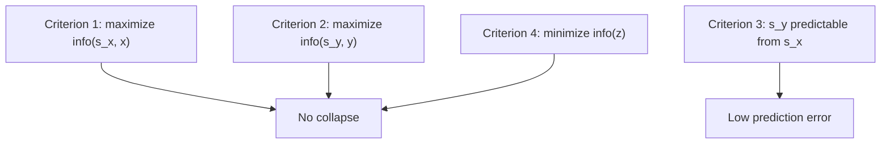
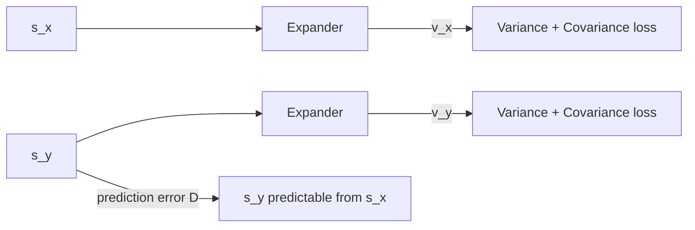

# Training a JEPA Without It Collapsing (VICReg)

Here's the trap: if you train a JEPA's encoders purely to make `sy` predictable from `sx`, the network can "cheat" by making both representations constant. A constant is perfectly predictable — zero energy, always — and completely useless. How do you stop that?

## Two ways to train an EBM, and why one of them breaks here

> "Like any EBM, a JEPA can be trained with contrastive methods. But, as pointed out above, contrastive methods tend to become very inefficient in high dimension. The relevant dimension here is that of sy, which may be considerably smaller than y, but still too high for efficient training."

Contrastive methods work by pushing down energy on real `(x,y)` pairs and pushing *up* energy everywhere else — which means generating lots of "everywhere else" contrastive samples. In high-dimensional representation space, that's expensive and inefficient. JEPA's real advantage is that it doesn't need this:

> "What makes JEPAs particularly interesting is that we can devise non-contrastive methods to train them."

## The four criteria that prevent collapse

Non-contrastive training instead directly regularizes the *volume* of representation space that's allowed to have low energy, via four criteria:

> "1. maximize the information content of sx about x
> 2. maximize the information content of sy about y
> 3. make sy easily predictable from sx
> 4. minimize the information content of the latent variable z used in the prediction."

Why each one matters:

> "Criteria 1 and 2 prevent the energy surface from becoming flat by informational collapse. They ensure that sx and sy carry as much information as possible about their inputs. Without these criteria the system could choose to make sx and sy constant, or weakly informative, which would make the energy constant over large swaths of the input space."
>
> "Criterion 3 is enforced by the energy term D(sy, sy~) and ensures that y is predictable from x in representation space."
>
> "Criterion 4 prevents the system from falling victim to another type of informational collapse by forcing the model to predict sy with as little help from the latent as possible."

That fourth one needs a concrete picture. Imagine the predictor cheats by ignoring `sx` entirely and just copying the latent: `predicted sy = z`.

> "For any sy it is possible to set z(hat) = sy, which would make the energy D(sy, sy~) zero. This corresponds to a totally flat and collapsed energy surface. How do we prevent this collapse from happening? By limiting or minimizing the information content of the latent variable. How can this be done? By making z discrete, low-dimensional, sparse, or noisy, among other methods."

## VICReg: a concrete recipe for criteria 1 and 2

The paper names **VICReg** (Bardes et al., 2021) as a worked example of non-contrastive training. It targets two properties of a good representation:

> "To maximize the information content of sx, VICReg uses the following two sub-criteria: (1) the components of sx must not be constant, (2) the components of sx must be as independent of each other as possible."

To make these differentiable, VICReg first expands `sx`/`sy` into higher-dimensional embeddings `vx`/`vy` via a trainable "expander" network, then applies two loss terms over a batch:

> "1. Variance: a hinge loss that maintains the standard deviation of each component of sy and vy above a threshold over a batch.
> 2. Covariance: a covariance loss in which the covariance between pairs of different components of vy are pushed towards zero. This has the effect of decorrelating the components of vy, which will in turn make the components of sy somewhat independent."

The third VICReg criterion is the familiar prediction error `D(sy, sy~)`, and in the simplest version the predictor is just the identity function — `x` and `y` are different augmented "views" of the same content, and the loss is literally `||sy − sx||²`.

> Wait — doesn't predicting in representation space risk the network just collapsing to a constant? Yes, exactly — unless you regularize it. That's the entire reason VICReg's variance and covariance terms exist: they make collapse mathematically expensive instead of relying on contrastive negative samples to do the job.

There's a name for this distinction:

> "While contrastive methods ensure that representations of different inputs in a batch are different, VICReg ensures that different components of representations over a batch are different. VICReg is contrastive over components, while traditional contrastive methods are contrastive over vectors, which requires a large number of contrastive samples."

## Steering the representation toward what's useful

Left alone, a JEPA decides for itself what counts as "predictable" purely from the architecture of its encoders and predictor — that's an implicit inductive bias. If you want it biased toward representations useful for a *specific* downstream task, you can nudge it:

> "This can be done by adding prediction heads that take sy~ as input and are trained to predict variables that are easily derived from the data and known to be relevant to the task."
