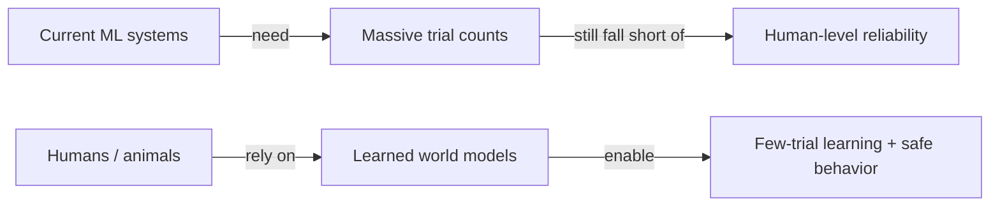

# Why Can't Machines Learn Like a Teenager Learns to Drive?

Here's a question that should bother you: an adolescent learns to drive a car in about 20 hours of practice. A toddler picks up language from a "small exposure" to speech. Most adults can walk into a situation they've never seen before and just... handle it.

Now compare that to your best self-driving system. It's been fed "enormous amounts of supervisory data from human experts," run through "millions of reinforcement learning trials in virtual environments," and had "hundreds of behaviors" hand-coded into it by engineers — and it's *still* nowhere near as reliable as a human driver (p.1-6).

That gap is the whole motivation for this paper. Something humans and animals have, current AI systems don't.

> "The answer may lie in the ability of humans and many animals to learn world models, internal models of how the world works" (p.1-6).

## The three challenges on the table

LeCun frames the gap as three concrete research problems AI has to solve:

| # | Challenge | Why it's hard |
|---|-----------|----------------|
| 1 | Learn to represent, predict, and act largely **by observation** | "Interactions in the real world are expensive and dangerous" — you can't learn to drive by crashing thousands of times |
| 2 | Reason and plan in a way that's **compatible with gradient-based learning** | Our best learning tools need differentiable architectures, which clashes with classic logic-based symbolic reasoning |
| 3 | Represent percepts and actions **hierarchically**, at multiple levels of abstraction and timescales | Long-term planning means decomposing a complex action into a sequence of simpler ones |

> Wait — isn't this just "AI needs more data"? No. The claim isn't that current systems are *under-trained*; it's that they're missing a different *kind* of knowledge — a general-purpose model of how the world behaves — that lets humans skip almost all the trial-and-error in the first place.

## So what's actually proposed?

The paper's headline contributions, in plain terms:

1. An overall cognitive architecture where every module is differentiable (trainable end-to-end).
2. **JEPA** and **Hierarchical JEPA**: a non-generative way to build predictive world models that learn representations at multiple levels.
3. A non-contrastive self-supervised training method that produces representations that are both informative and predictable.
4. A way to use H-JEPA to do hierarchical planning under uncertainty.

You don't need to understand JEPA yet — that's later modules. Right now, just hold onto the shape of the problem: **observation-driven learning, gradient-friendly reasoning, and hierarchy.** Everything else in this subject builds toward solving those three.
