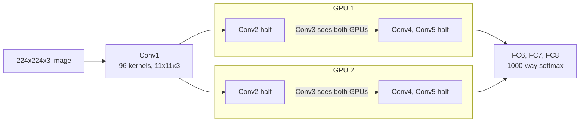

# Four Tricks That Made the Network Trainable

Eight layers with weights — five convolutional, three fully-connected, ending in a 1000-way softmax. That's the headline shape (Section 3, Figure 2). But the shape alone wasn't new; CNNs had looked roughly like this for years. What's new is four smaller decisions, each independently measured, that together made a network this size trainable on the hardware available.

## 1. ReLU instead of tanh/sigmoid

The standard neuron nonlinearities of the time saturate: `tanh(x)` and `(1+e^-x)^-1` flatten out for large `|x|`, so gradients vanish and learning crawls. The paper's alternative is almost insultingly simple: `f(x) = max(0, x)` — a Rectified Linear Unit. Because it doesn't saturate for positive inputs, gradient descent moves faster through it. On a four-layer CNN on CIFAR-10, ReLU networks reached 25% training error roughly six times faster than an equivalent tanh network with no regularization (Section 3.1, Figure 1).

> **Wait — isn't a non-saturating unit going to blow up?** Only if nothing keeps it in check. That's exactly the job of the next trick.

## 2. Splitting the net across two GPUs

A single GTX 580 had 3GB of memory — not enough for a network this size. Rather than shrink the network, the authors split it: half the kernels live on each GPU, and "the GPUs communicate only in certain layers" (Section 3.2). Layer 3 sees both GPUs' outputs from layer 2; layer 4 only sees the same-GPU half of layer 3. This isn't free — it's a constrained connectivity pattern chosen by cross-validation — but it measurably worked: it cut top-1 and top-5 error by 1.7% and 1.2% versus a single-GPU net with half as many kernels per layer, while training in about the same wall-clock time.

## 3. Local Response Normalization

ReLUs don't strictly need input normalization to avoid saturating — but the authors found a normalization scheme still "aids generalization" (Section 3.3). After applying ReLU in certain layers, each neuron's activity is divided down based on the summed squared activity of *neighboring kernel maps at the same spatial position* — a form of lateral inhibition, where strongly-active kernels suppress their neighbors' relative response. This is brightness normalization, not contrast normalization (no mean is subtracted). Applied with `k=2, n=5, α=10⁻⁴, β=0.75`, it reduced top-1/top-5 error by 1.4%/1.2%.

## 4. Overlapping pooling

Standard max-pooling tiles the input with non-overlapping windows: a stride `s` equal to the window size `z`. The paper instead uses `s=2, z=3` — each pooling window overlaps its neighbor. Output dimensions stay the same as non-overlapping `s=2, z=2` pooling, but error dropped 0.4%/0.3%, and the authors observed overlapping pooling makes the network "slightly more difficult to overfit" (Section 3.4).

## Putting it together

> **A second look at the full Figure 2 architecture**

| Layer | What it does |
|---|---|
| Conv1 | 96 kernels, 11×11×3, stride 4, over a 224×224×3 input |
| Conv2 | 256 kernels, 5×5×48, on the normalized+pooled Conv1 output |
| Conv3 | 384 kernels, 3×3×256 — only layer that crosses both GPUs freely |
| Conv4 | 384 kernels, 3×3×192, same-GPU only |
| Conv5 | 256 kernels, 3×3×192, same-GPU only, followed by max-pooling |
| FC6, FC7 | 4096 neurons each |
| FC8 | 1000-way softmax |

ReLU follows every convolutional and fully-connected layer; response normalization follows Conv1 and Conv2; max-pooling follows both normalization layers and Conv5.
