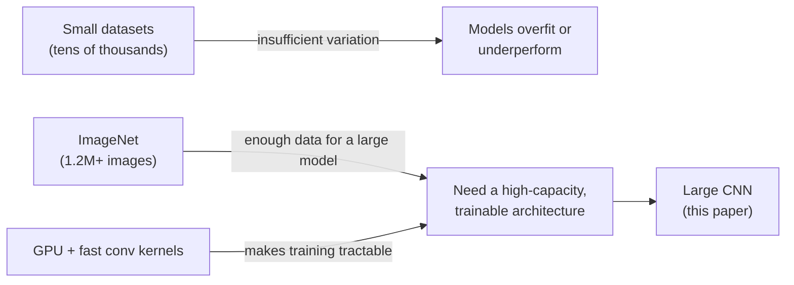

# Why a Bigger Net Needed a Bigger Dataset

Picture trying to teach someone every object in the world from a few hundred examples each. That was object recognition before 2012: benchmark datasets like NORB, Caltech-101/256, and CIFAR-10/100 topped out "on the order of tens of thousands of images." Simple tasks could be solved that way — but real-world images vary wildly in pose, lighting, occlusion, and clutter, and a model trained on a few thousand examples per class never sees enough of that variation to generalize.

> **Wait — doesn't more data always help?** Only if you have a model with enough capacity to use it, and enough compute to train that model. Before 2012, both pieces were missing: nobody had assembled a labeled dataset large enough, and CNNs big enough to exploit it were "prohibitively expensive" to train on the hardware of the day.

ImageNet changed the data side of the equation: "over 15 million labeled high-resolution images in over 22,000 categories" (Section 2), with the ILSVRC subset alone offering 1.2 million training images across 1,000 classes. That's orders of magnitude past CIFAR or Caltech.

| Dataset | Scale |
|---|---|
| CIFAR-10/100, Caltech-101/256, NORB | tens of thousands of images |
| ImageNet (full) | 15M+ images, 22,000 categories |
| ILSVRC subset (used in this paper) | 1.2M training images, 1,000 classes |

## Why a CNN, specifically

A plain feedforward network with as many parameters as a CNN would need far more training data to avoid overfitting, because it makes no assumptions about images. Convolutional neural networks build in two assumptions that happen to be true for natural images — "stationarity of statistics and locality of pixel dependencies" (Section 1) — so a CNN has "much fewer connections and parameters" than a fully-connected net of the same size, and is correspondingly easier to train. The capacity is still controllable by varying depth and width, so a CNN scales toward the model size that 1.2M images can support.

## Why now, specifically 2012

CNNs of this character had existed since the late 1980s. What was missing was a way to actually fit one to ImageNet's scale in tractable time. The paper's answer: "current GPUs, paired with a highly-optimized implementation of 2D convolution, are powerful enough to facilitate the training of interestingly-large CNNs" (Section 1) — and the network described took five to six days on two GTX 580 GPUs (3GB each), which would have been untrainable on CPUs of the era.

The result: a network with 60 million parameters and 650,000 neurons — eight learned layers, five convolutional and three fully connected — that achieved a top-5 error rate of 17.0% on ILSVRC-2010, far below the 28.2% from the best prior sparse-coding approach, and won ILSVRC-2012 outright with 15.3% top-5 error against a 26.2% runner-up.
