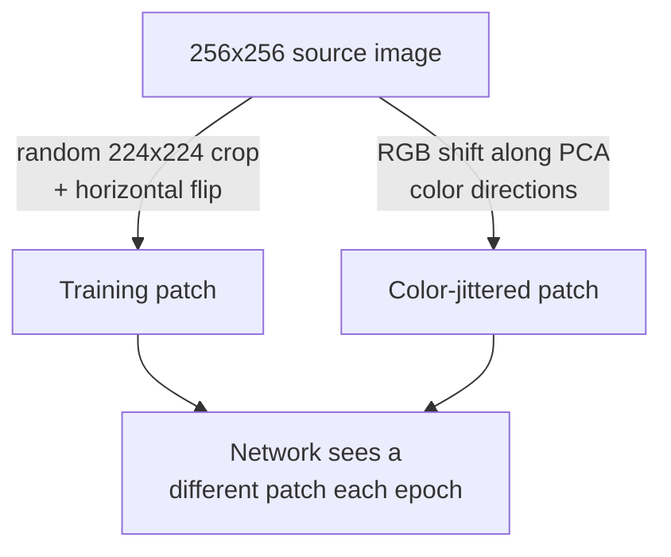

# 60 Million Parameters, 1.2 Million Images

Do the ratio in your head: 60 million weights to fit, 1.2 million training examples. Each example imposes roughly 10 bits of constraint on the label mapping — nowhere near enough to pin down 60 million parameters without serious overfitting (Section 4). The paper leans on two techniques to close that gap, and both are notable for costing almost nothing extra in compute.

## Trick 1: Make more data, for free

Rather than collecting more images, the network trains on cheap, label-preserving transformations of the images it already has.

**Translations and reflections.** Each training image is downsampled to 256×256. Instead of always feeding the network the same central crop, the paper extracts random 224×224 patches (and their horizontal mirror images) — generated on the CPU while the GPU trains on the previous batch, so it's "computationally free." This inflates the effective training set by a factor of 2048. At test time, the network doesn't gamble on one crop: it evaluates the four corner patches, the center patch, and all five mirrored, then averages the ten softmax outputs.

**RGB intensity jitter.** The second augmentation perturbs color rather than geometry: PCA is run once over all RGB pixel values in the training set, and each image gets a random perturbation along those principal color-variation directions (scaled by the corresponding eigenvalues and a per-image random draw). The intuition: an object's identity shouldn't change because the lighting tints it slightly differently. This alone cut top-1 error by over 1%.

> **Wait — without augmentation, couldn't you just train on more epochs?** No — more epochs over the *same* fixed crops just memorizes them faster. The paper states plainly: "without this scheme, our network suffers from substantial overfitting, which would have forced us to use much smaller networks" (Section 4.1). Augmentation isn't a speed trick; it's what makes a network this large viable at all.

## Trick 2: Dropout

Ensembling many separately-trained models is a well-known way to cut test error, but training even one of these networks takes days — training many is out of reach. Dropout approximates the benefit of an ensemble at roughly 2× the training cost of a single model: on every forward pass, each hidden neuron in the first two fully-connected layers is zeroed out with probability 0.5. The dropped neurons don't contribute to that pass's forward computation or its backward gradient, so the network effectively samples a different sub-architecture on every presentation of an input — but all those sampled sub-architectures share the same weights.

Why does this fight overfitting? A neuron can't "rely on the presence of particular other neurons" being active, so it's pushed to learn features that are useful in combination with many different random subsets of the rest of the network — discouraging the kind of over-specialized co-adaptation that memorizes training noise. At test time, all neurons are kept active but their outputs are halved — a cheap approximation to averaging over the exponentially many dropout sub-networks.

The cost: "dropout roughly doubles the number of iterations required to converge" (Section 4.2). Without it, the paper reports substantial overfitting in the fully-connected layers.
