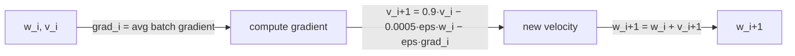

# The Update Rule That Trained for Five Days Straight

Architecture and regularization get the spotlight, but Section 5 spells out exactly how the weights moved on every step — and it's a small, fully specified formula, not a vague "we used SGD."

## Stochastic gradient descent with momentum and weight decay

Batch size 128, momentum 0.9, weight decay 0.0005. The update rule for a weight `w` at iteration `i` is:

```
v[i+1] = 0.9 * v[i] - 0.0005 * eps * w[i] - eps * grad[i]
w[i+1] = w[i] + v[i+1]
```

where `v` is the momentum (velocity) term, `eps` is the learning rate, and `grad[i]` is the average gradient of the loss with respect to `w`, evaluated at `w[i]` over the current mini-batch.

> **Wait — weight decay is just regularization, right?** Not only. The paper is explicit that "this small amount of weight decay was important for the model to learn. In other words, weight decay here is not merely a regularizer: it reduces the model's training error" (Section 5). Shrinking the weights slightly on every step kept training itself moving, not just generalization.

Two more concrete choices worth noticing:

- **Initialization.** Weights start from a zero-mean Gaussian with standard deviation 0.01. Biases in Conv2, Conv4, Conv5, and all fully-connected hidden layers start at the constant 1 — "this initialization accelerates the early stages of learning by providing the ReLUs with positive inputs." Every other bias starts at 0.
- **Learning-rate schedule.** A single learning rate is shared across all layers, starting at 0.01, and manually divided by 10 whenever validation error stopped improving. It was reduced three times before training ended, over roughly 90 passes through the 1.2 million training images — five to six days on two GTX 580 GPUs.



This is the kind of relationship you can actually compute by hand — given a weight, a gradient, and the current velocity, the next state is fully determined. The code challenge below asks you to implement it.
