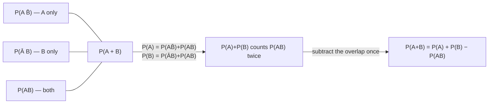
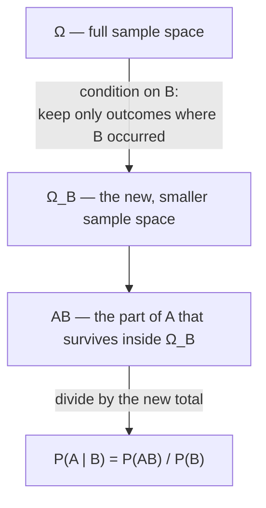

# The addition and multiplication rules

Now that an event can be rewritten as a sum or product of simpler events (last lesson), two rules turn that rewrite into a probability.

## Rule 1 — addition, for mutually exclusive events

> "The probability of the sum of two mutually exclusive events is equal to the sum of the probabilities of those events." — *Ch. 2, §2.0, axiom*

```
A·B = ∅  ⟹  P(A + B) = P(A) + P(B)
```

This generalises to any number of pairwise-incompatible events — finite or countably infinite:

```
P(A₁ + A₂ + ... + Aₙ) = P(A₁) + P(A₂) + ... + P(Aₙ)
```

Two consequences you'll use everywhere:

- **Complete group:** if `A₁, ..., Aₙ` are pairwise disjoint *and* their sum is `Ω`, then `ΣP(Aᵢ) = 1`.
- **Complements:** `A` and `Ā` are disjoint and their sum is `Ω`, so `P(A) + P(Ā) = 1`.

## Rule 1, generalised — addition for *compatible* events

If `A` and `B` *can* occur together, naively adding `P(A)` and `P(B)` double-counts the overlap `AB`. Split `A + B` into three mutually exclusive pieces — "`A` only", "`B` only", and "both":



```
P(A + B) = P(A) + P(B) − P(AB)
```

For three events, the same idea (now subtracting *and re-adding* deeper overlaps) gives:

```
P(A+B+C) = P(A)+P(B)+P(C) − P(AB) − P(AC) − P(BC) + P(ABC)
```

This is the **inclusion–exclusion** pattern: add singles, subtract pairs, add back the triple. It generalises to any number of events, alternating signs by how many sets overlap.

## Conditional probability — shrinking the sample space

`P(A | B)` is the probability of `A` *given that `B` has already happened*. "Advancing a hypothesis that `B` has occurred is equivalent to changing the conditions of the experiment" — you throw away every outcome outside `B` and renormalise:



```
P(A | B) = P(AB) / P(B)          P(B | A) = P(AB) / P(A)
```

## Rule 2 — multiplication

Rearranging the conditional-probability formula gives the multiplication rule:

```
P(AB) = P(A) · P(B | A) = P(B) · P(A | B)
```

> "The probability of the product of two events ... is equal to the probability of one of them ... multiplied by the conditional probability of the other, provided that the first event has occurred."

It generalises by peeling off one event at a time:

```
P(A₁A₂...Aₙ) = P(A₁) · P(A₂|A₁) · P(A₃|A₁A₂) · ... · P(Aₙ|A₁A₂...Aₙ₋₁)
```

This is exactly how you'll compute "draw without replacement" probabilities: each successive draw's probability is conditioned on everything drawn so far.

## Independence

`A` and `B` are **independent** if knowing one occurred doesn't change the probability of the other:

```
P(A | B) = P(A)      (equivalently  P(B | A) = P(B))
```

For independent events the multiplication rule simplifies — drop the conditioning:

```
P(AB) = P(A) · P(B)
```

Several events are independent **"in their totality"** if the occurrence of *any subset* of them doesn't affect the probabilities of the others; then

```
P(A₁A₂...Aₙ) = P(A₁)·P(A₂)·...·P(Aₙ)
```

**Where this bites:** "drawn at once" vs. "drawn one after another, replacing each time" look different but are the same independence question — replacing a ball restores the original probabilities, making successive draws independent; *not* replacing makes them dependent (the multiplication rule's conditional factors actually change).

*(Wentzel & Ovcharov, Ch. 2, §2.0 and problems 2.2, 2.3, 2.9–2.18, 2.55.)*
