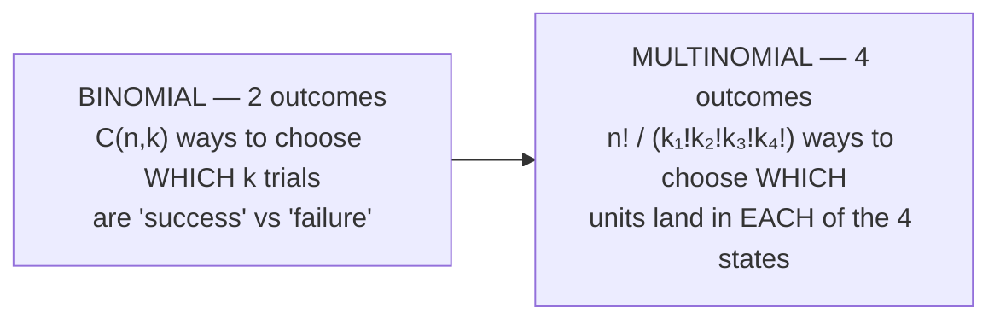
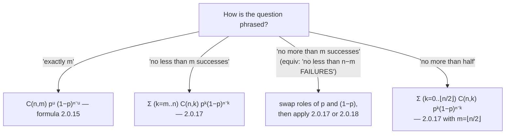

# The binomial formula at work — and where it generalizes

Lesson 3 gave you `P_{m,n} = C(n,m)pᵘqⁿ⁻ᵘ` and its "at least"/"at most" relatives (2.0.15–2.0.18). This closing lesson applies that toolkit to concrete numeric scenarios — and pushes it in three new directions: **more than two outcomes per trial**, **non-identical probabilities**, and **two different counting scales nested together**.

## From binomial to multinomial: more than 2 outcomes

Every binomial problem so far has had exactly 2 outcomes per trial (success/failure, distorted/not). What if a unit can end up in **4** different states — good order (`p₁`), needs adjustment (`p₂`), needs repair (`p₃`), or out of order (`p₄`), with `p₁+p₂+p₃+p₄=1`?

For "exactly one unit needs repair, the rest need adjustment" (`n` units total): choose *which one* unit is the repair-needer — `C(n,1)=n` ways — then multiply by `p₃·p₂ⁿ⁻¹` (one factor per unit, multiplication rule). For "exactly 2 adjust, 1 repair, rest good" out of `n` units, the count of arrangements becomes the **multinomial coefficient** `n!/(2!·1!·(n−3)!)` — the same "count the arrangements, multiply by the per-arrangement probability" idea from Lesson 3, just with more categories to assign.

## Recognizing which binomial-tail formula fits

A single scenario (`n` independent trials, each "distorted" with probability `p`) can be asked about in many ways. Match the *phrasing* to the *formula*:

The arithmetic never changes — only *which* count (successes? failures? a half-threshold?) goes into the sum's limits. When a "device functions" probability is built as "0 failures OR 1 failure OR 2 failures", that's the addition rule applied to three mutually-exclusive "exactly k" terms — sum them directly rather than reaching for a tail formula.

## Two independent binomials → multiply their probabilities

If two *separate* instruments each undergo independent trials (instrument 1 has `n₁` units each failing with probability `g₁`; instrument 2 has `n₂` units, probability `g₂`), then "`m₁` fail in instrument 1 **and** `m₂` fail in instrument 2" is the **product** of two binomial probabilities — independence again, just with each factor now itself a binomial probability rather than a single `p` or `q`.

## When the trial probabilities differ (revisited)

Lesson 5 generalized "1−qⁿ" to "1−∏qᵢ" for *non-identical* probabilities. The same generalization applies to "**exactly k** successes out of n": when the `n` trials have *different* probabilities `p₁,...,pₙ`, "exactly k successes" is a sum over **every way to choose which k trials succeed**, each term a product of `k` different `pᵢ`'s and `(n−k)` different `(1−pᵢ)`'s — `C(n,k)pᵏqⁿ⁻ᵏ` is the special case where all the `pᵢ` happen to be equal (every term in the sum collapses to the same value, so you just count the terms).

## A surprising comparison: more trials at the same ratio

With an evenly-matched opponent (`p=1/2` each game), is "win **at least 3 of 4** games" more or less likely than "win **at least 5 of 8**"? Both represent "win more than half" — but they are **not** equally likely. Compute both sums from `Σ C(n,k)(1/2)ⁿ` over the relevant `k` range and compare directly; don't assume "same ratio ⟹ same probability". This is the same caution as the "build failure intuition" principle: a formula that *looks* like it should generalize by simple scaling often doesn't.

## What breaks if you average the probabilities first?

An instrument has `n` units with *different* failure probabilities `p₁,...,pₙ`. The exact failure probability is `R = 1 − ∏(1−pᵢ)`. If you instead **average** the `pᵢ` into a single `p̄` and compute `R̃ = 1 − (1−p̄)ⁿ`, is `R̃` an over- or under-estimate of `R`? By the AM–GM inequality (the geometric mean of positive numbers never exceeds their arithmetic mean), `∏(1−pᵢ) ≤ (1−p̄)ⁿ`, so `R ≥ R̃`. **Averaging the inputs before plugging into a "1−∏q" formula systematically underestimates the failure probability** — a concrete instance of Jensen's inequality, and a warning against "replace the distribution with its mean" shortcuts.

## The capstone: nesting binomial thresholds at two scales

A message has `n` symbols; each symbol is *repeated* `m` times for reliability, and is "recognized" at the receiving end only if it arrives correctly **at least `k` of the `m` times** (a binomial-tail probability, formula 2.0.17 — call it `P(A)`). For the *whole message* to be recognized, **every one of the `n` symbols** must individually be recognized — `[P(A)]ⁿ`, the series "all must succeed" pattern from the reliability lesson. And for "no more than `l` symbols are distorted in the message", treat "symbol distorted" (probability `1−P(A)`) as a single trial and apply the binomial-tail formula **again**, this time across the `n` symbols. Two binomial computations, at two different scales, exactly mirroring problem 2.40's nested "1−qⁿ" from earlier in the chapter — except both levels are now binomial thresholds rather than "at least one".

*(Wentzel & Ovcharov, Ch. 2, §2.0 [formulas 2.0.15–2.0.18] and problems 2.76–2.94.)*
