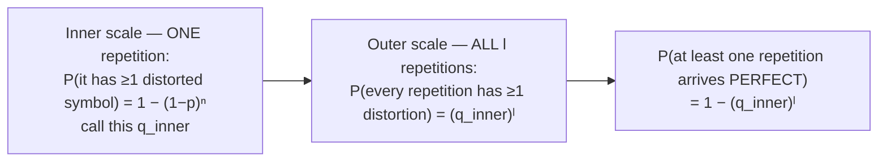
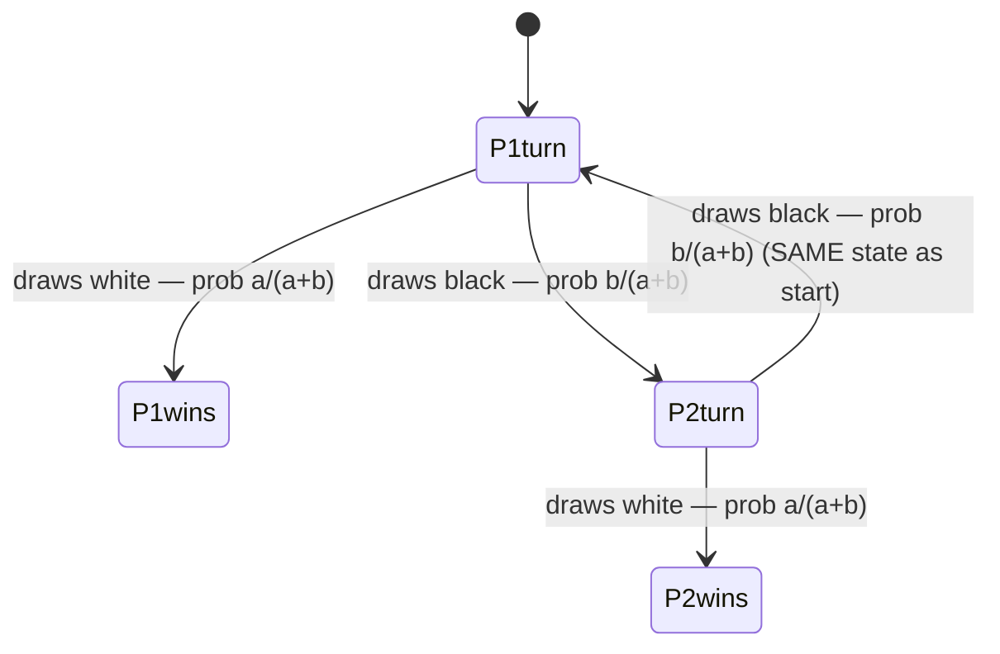

# Composing the rules: nesting, logs, and recursive games

You now have a complete toolkit: algebra of events, addition, multiplication, conditional probability, and the binomial formula. Real scenarios rarely use just one of these — they **stack** them. This lesson is about three composition patterns that show up constantly in applied work.

## Pattern 1 — nesting "1 − qⁿ"

You met `P(at least one success in n tries) = 1 − qⁿ`. Now apply it **twice**, at two different scales. Example: a message of `n` symbols, each independently distorted with probability `p`, is repeated `l` times in full.



The trick is recognising the **two scales**: symbols-within-a-message, and repetitions-of-the-message. Compute the inner probability first, treat it as a single number, then apply the same "1 − qⁿ" shape again on the outside.

## Pattern 2 — solving for n (or l) with logarithms

Sometimes the problem gives you a target probability `β` and asks: *how many trials are enough?* Starting from `1 − qᴺ ≥ β`:

```
qᴺ ≤ 1 − β
N · log(q) ≤ log(1 − β)
N ≥ log(1 − β) / log(q)        (since log q < 0, the inequality flips)
```

This is the only place in the chapter where you solve *for* the trial count rather than *given* it — watch the inequality flip when you divide by the negative `log(q)`.

## Pattern 3 — recursive ("repeat until") games

Some games don't have a fixed number of trials — they repeat until someone wins. If a "miss by everyone" round leaves the game in **exactly the same state** it started in, you can write a self-referential equation for the win probability.

Example: an urn with `a` white and `b` black balls; two players alternately draw one ball *with replacement* (the urn is restirred each time), and the first to draw white wins.



Let `R₁ = P(player 1 eventually wins)`. From `P1turn`, either player 1 wins immediately (`a/(a+b)`), or both players draw black (probability `(b/(a+b))²`) and the game returns to the **identical** `P1turn` state — so the remaining probability of player 1 winning from there is again `R₁`:

```
R₁ = a/(a+b) + [b/(a+b)]² · R₁
```

Solve this *algebraic* equation for `R₁` — there's no infinite sum to evaluate term-by-term. **Without replacement**, this trick doesn't apply: the urn composition changes every draw, so the game can never return to an identical state, and it's guaranteed to terminate within a bounded number of draws — direct enumeration works instead.

## The recurring strategic move: split by "which one"

Across many of this lesson's problems, the cleanest path is: **identify what distinguishes the sub-cases of the event you want** (which aircraft was hit, which fighter survived, which repetition succeeded), write each sub-case as a product of independent pieces (multiplication rule), confirm the sub-cases can't overlap, and add them (addition rule). When a later problem tweaks one rule of a scenario (e.g. "the surviving fighter now disengages instead of firing back"), re-trace which of your sub-case probabilities actually depended on that rule — often only one or two do.

*(Wentzel & Ovcharov, Ch. 2, problems 2.37–2.49.)*
